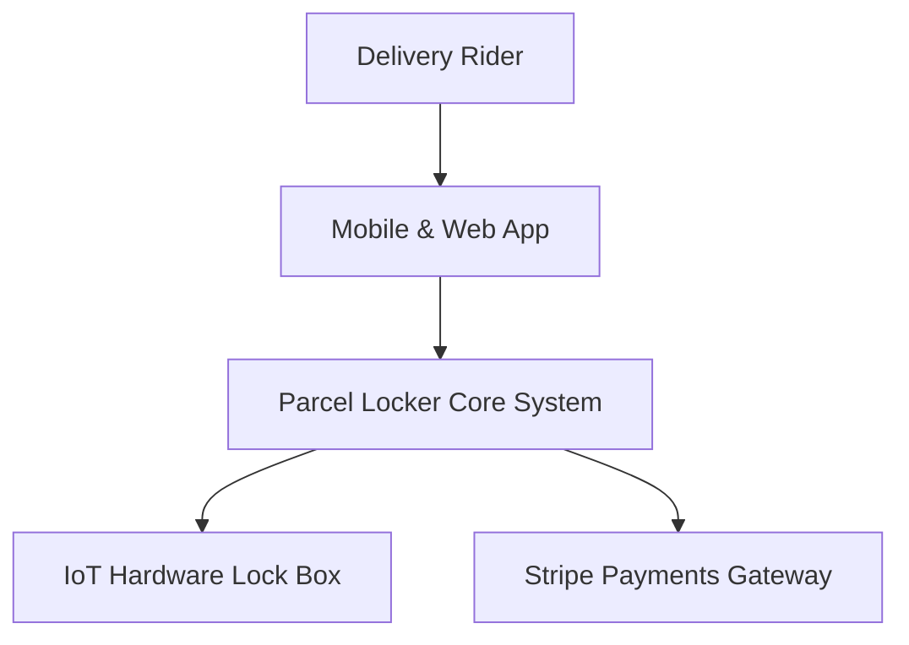
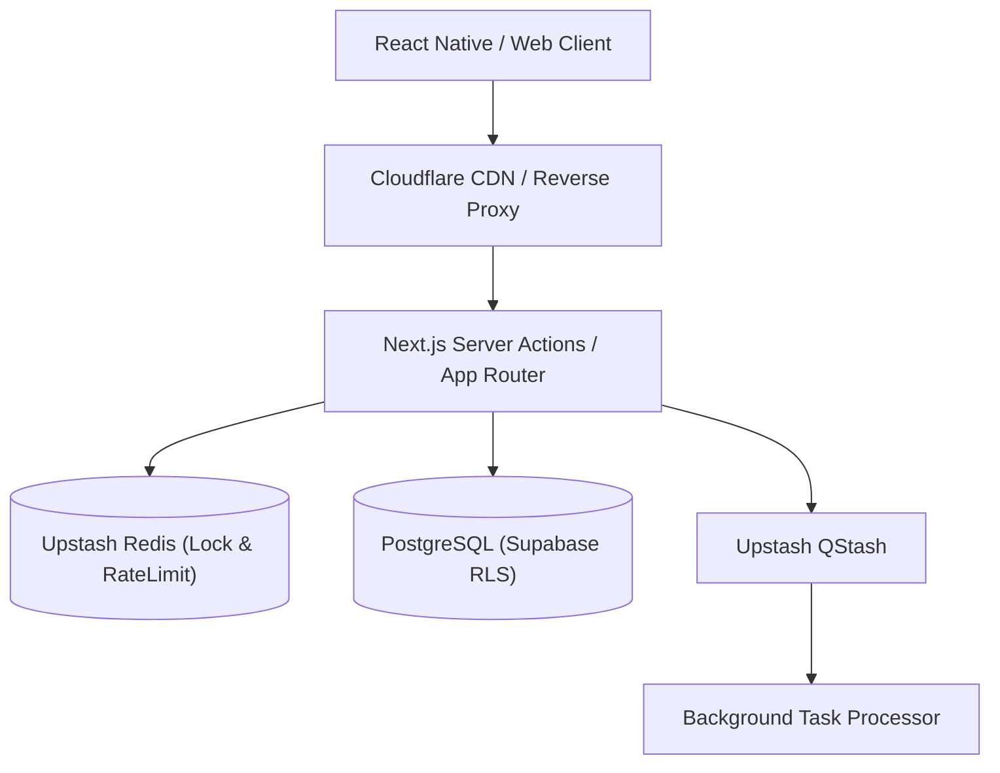

# Ultimate Systems Architecture Workflow (10/10 Master Engine)

This workflow guides the end-to-end design, domain boundary modeling, data flow specification, and architectural documentation of scalable distributed systems.

```
                                      [SYSTEM ARCHITECTURE INITIATIVE]
                                                     │
                          ┌──────────────────────────┴──────────────────────────┐
                          ▼                                                     ▼
              [PHASE 1: DOMAIN-DRIVEN DESIGN (DDD)]                 [PHASE 2: C4 VISUAL ARCHITECTURE]
              ├─ Core vs Subdomain Context Boundaries               ├─ Level 1: System Context Diagram
              ├─ Ubiquitous Language & Invariants                   ├─ Level 2: Container Diagram
              └─ Anti-Corruption Layers (ACL)                       └─ Level 3: Component Flow Diagram
                          │
                          ▼
        ┌─────────────────────────────────────────────────────────────────────────────┐
        │                 PHASE 3: ASYNCHRONOUS EVENT-DRIVEN ARCHITECTURES (EDA)      │
        │  • Transactional Outbox • Idempotent Consumers • QStash / Kafka Pipelines   │
        └──────────────────────────────────────┬──────────────────────────────────────┘
                                               ▼
                                  [PHASE 4: IMMUTABLE ADR RECORDING & GOVERNANCE]
                    ┌──────────────────────────┼──────────────────────────┐
                    ▼                          ▼                          ▼
            ┌──────────────┐           ┌──────────────┐           ┌──────────────┐
            │ 📜 ADR LOG   │           │ 🎯 TRADE-OFF │           │ 🔒 FAILURE   │
            │ docs/adr/    │           │ Pros vs Cons │           │ Bulkheads    │
            └──────────────┘           └──────────────┘           └──────────────┘
```

---

## 🏛️ Iron Laws of Systems Architecture

1. **Explicit Context Boundaries**: Subsystems must define strict boundaries; cross-context communication must use Anti-Corruption Layers (ACL) or published domain events.
2. **Transactional Outbox for Distributed Events**: State mutations and event publishing MUST be written to the same transactional boundary.
3. **Immutable ADR Lifecycle**: Once an Architecture Decision Record is `Accepted`, its content is permanent. Revisions require creating a new ADR that explicitly marks the former `Superseded`.
4. **C4 Model Visual Grounding**: System proposals must provide Mermaid diagrams across C4 Level 1 (Context), Level 2 (Container), and Level 3 (Component).
5. **Defensive Failure Domains (Bulkheads)**: Critical subsystems must not share threadpools, memory partitions, or connection limits with non-critical background jobs.

---

## 🔬 The 4-Phase Architecture Pipeline

### Phase 1: Domain Modeling & Bounded Contexts
- Establish Ubiquitous Language shared between engineering and product.
- Segregate domains:
  - **Core Domain:** Unique competitive differentiator (e.g. smart parcel locker dispatch engine).
  - **Supporting Domain:** Custom capabilities supporting the core (e.g. rider geofence verification).
  - **Generic Domain:** Standard off-the-shelf capabilities (e.g. Stripe billing, Auth0 auth).

### Phase 2: C4 Model Visual Diagrams (Mermaid)

#### Level 1: System Context


#### Level 2: Container Architecture


### Phase 3: Event-Driven Design & Outbox Pattern
```sql
-- Transactional Outbox Table
CREATE TABLE outbox_events (
  id UUID PRIMARY KEY DEFAULT gen_random_uuid(),
  aggregate_type TEXT NOT NULL,
  aggregate_id TEXT NOT NULL,
  event_type TEXT NOT NULL,
  payload JSONB NOT NULL,
  created_at TIMESTAMPTZ NOT NULL DEFAULT now(),
  processed_at TIMESTAMPTZ
);
```

### Phase 4: Architecture Decision Record (ADR) Template
```markdown
# ADR-0004: Adoption of PgBouncer Transaction Pooling on Port 6543

## Status
Accepted

## Context
Serverless Next.js Server Actions open transient connections, exhausting the PostgreSQL connection pool limit.

## Decision
Enforce PgBouncer in transaction mode (port 6543) with `connection_limit=1` for all runtime queries, maintaining port 5432 strictly for Prisma migrations via `DIRECT_URL`.

## Consequences
- **Positive:** Eliminates database connection saturation under high concurrent QPS.
- **Negative:** Prepared statements are disabled in transaction mode.
```
