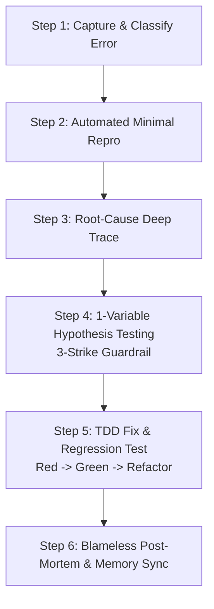

# Ultimate Debugging & Root-Cause Analysis Workflow (10/10 Master Engine)

This workflow is the definitive 10/10 technical troubleshooting and incident resolution system. It combines the incident mitigation speed of **Google SRE**, the distributed tracing of **OpenTelemetry**, the multi-source intelligence of the **Hexa-Engine** (Firecrawl PR triage, Jina deep passages), the mathematical precision of **`git bisect` binary search**, the financial replay safety of **Stripe**, and the test-driven discipline of **TDD**.

```
                                      [SYSTEM ERROR / INCIDENT ALERT]
                                                     │
                          ┌──────────────────────────┴──────────────────────────┐
                          ▼                                                     ▼
              [LOOP 1: TRIAGE & MITIGATE]                           [HEXA-ENGINE ERROR TRIAGE]
              ├─ 1. Rollback Release / Toggle Flag                  ├─ Firecrawl (Merged PRs)
              ├─ 2. Shed Load & Open Circuit Breakers               ├─ Jina (Deep In-Body Passages)
              └─ "STOP THE BLEEDING FIRST"                          └─ Tavily/Exa/Linkup/Bright Data
                          │
                          ▼
        ┌─────────────────────────────────────────────────────────────────────────────┐
        │                      SCIENTIFIC ROOT-CAUSE ISOLATION                        │
        │  • 1-Variable Hypothesis Testing • 3-Strike Reboot • Automated Git Bisect   │
        └──────────────────────────────────────┬──────────────────────────────────────┘
                                               ▼
                                  [DEEP DIAGNOSTIC SUITE]
                    ┌──────────────────────────┼──────────────────────────┐
                    ▼                          ▼                          ▼
            ┌──────────────┐           ┌──────────────┐           ┌──────────────┐
            │ 📡 TRACING   │           │ 🔒 LOCK TREE │           │ 🧠 V8 HEAP   │
            │ OTel W3C Id  │           │ DB Deadlocks │           │ Leaks & Mem  │
            └──────────────┘           └──────────────┘           └──────────────┘
                                               │
                                               ▼
                               [TDD REGRESSION PROTECTION & FIX]
                    Red (Automated Repro Test) ──► Green (Minimal Ponytail Fix)
                    ──► Refactor & Verify ──► Blameless 5-Whys Post-Mortem
```

---

## 🏛️ Iron Laws of Systematic Debugging

1. **THE IRON LAW**: Do not write ANY fix until the root cause is fully understood and verified. Symptom patching creates more bugs.
2. **Mitigate First, Root-Cause Second (Google SRE Standard)**: During active production incidents, stop user-facing bleeding first (rollback commit, toggle feature flag, shed load) before spending hours investigating root causes.
3. **One Variable at a Time**: When testing a hypothesis, change exactly ONE thing. If the fix fails, revert immediately before testing the next hypothesis.
4. **3-Strike Reboot**: If 3 consecutive fix attempts fail, STOP coding. Return to first principles and re-examine dataflow boundaries. The bug is not where you think it is.
5. **Automated Reproduction First**: If you cannot reproduce it in an automated script, test case, or Playwright run, you cannot safely claim to fix it.
6. **No "Magic" Fixes**: If the error disappears without you understanding why, you have not fixed the bug; you have merely masked it.
7. **High-Cardinality Traceability (OpenTelemetry Standard)**: Every log, exception, and span MUST carry high-cardinality metadata (`trace_id`, `span_id`, `user_id`, `commit_sha`, `feature_flags`).
8. **Idempotent Retry Guarantee (Stripe Standard)**: Any fix involving network calls, billing, or background jobs MUST enforce idempotency keys to prevent duplicate execution during retries.
9. **Zero Silent Swallowing**: Catch blocks MUST log, report, or rethrow with contextual metadata. Empty `catch(e) {}` is an immediate blocking defect.
10. **Full Jitter Exponential Backoff**: Retries MUST implement AWS Full Jitter: $\text{Sleep} = \text{random}(0, \min(\text{max\_delay}, \text{base\_delay} \times 2^{\text{attempt}}))$.

---

## 🔄 Google SRE 4-Loop Incident Protocol

```
┌─────────────────┐       ┌─────────────────┐       ┌─────────────────┐       ┌─────────────────┐
│ Loop 1: Triage  │  ──►  │ Loop 2: Mitigate│  ──►  │Loop 3: Investigate  ──► │ Loop 4: Resolve │
│ Blast & SLO     │       │ Stop Bleeding   │       │ 4 Golden Signals│       │ TDD & Postmortem│
└─────────────────┘       └─────────────────┘       └─────────────────┘       └─────────────────┘
```

1. **Loop 1 (Triage & Impact Assessment)**:
   - Check SLO error budget burn rate. Determine scope (single-tenant vs global, regional vs edge).
2. **Loop 2 (Mitigate — "Stop the Bleeding")**:
   - (A) Roll back to previous verified release: `git revert [commit_hash]`
   - (B) Toggle off offending feature flag via Upstash Redis.
   - (C) Shed non-critical traffic and trip circuit breakers.
3. **Loop 3 (Investigate — 4 Golden Signals)**:
   - *Latency:* Inspect $p50, p95, p99$ response times.
   - *Traffic:* Check QPS surges or drops.
   - *Errors:* Monitor HTTP 5xx vs 4xx rates.
   - *Saturation:* Check CPU, V8 memory heap, and DB connection pool saturation.
4. **Loop 4 (Resolve & Blameless Post-Mortem)**:
   - Write failing automated reproduction test, implement minimal fix, and log 5-Whys post-mortem.

---

## 🔍 Hexa-Engine Error Triage Integration

When confronting undocumented errors, obscure framework edge cases, or platform-specific crashes, execute parallel searches across the Hexa-Engine stack:

```markdown
### Hexa-Engine Error Triage Query Blueprint
- **Firecrawl Developer Search (`data.developer`)**:
  `firecrawl_search` with `categories: ["developer"]` and query: `"[exact_error_string]" "[framework_name]"`
  *Target: Merged GitHub PRs, closed issues, and maintainer workaround commits.*
- **Jina Deep In-Body Search (`search_web_deep`)**:
  `search_web_deep` with query: `"[exact_error_string]" root cause fix`
  *Target: In-depth technical blog passages (~100 words) extracted directly from page bodies.*
- **Tavily Advanced Search (`tavily_search`)**:
  `tavily_search` with `include_domains: ["github.com", "docs.rs", "developer.apple.com"]`
  *Target: Official SDK issue trackers and canonical documentation.*
- **Bright Data Web Unlocker**:
  *Target: Protected developer forums or enterprise issue portals returning Cloudflare 403 blocks.*
```

---

## ⚡ Mathematical Bug Isolation via `git bisect`

When a bug was introduced between a known good commit and the current bad commit, use binary search to isolate the regression in $\le \log_2(N)$ steps:

```bash
# 1. Start the bisect session
git bisect start

# 2. Mark current commit as bad
git bisect bad HEAD

# 3. Mark last known good release/commit
git bisect good v1.4.0 # or specific commit hash

# 4. Automate the search via test script
git bisect run npm test -- test/unit/suspect.test.ts

# 5. When git bisect identifies the exact breaking commit, reset state
git bisect reset
```

---

## 🔒 Database Deadlock & Lock Tree Diagnostic Protocol

When queries hang or throw `deadlock detected` errors under PostgreSQL/Supabase:

### 1. Identify Blocking and Blocked Queries (Postgres Lock Tree)
```sql
-- Execute via supabase-mcp-server / execute_sql:
SELECT 
    blocked_locks.pid     AS blocked_pid,
    blocked_activity.usename  AS blocked_user,
    blocking_locks.pid    AS blocking_pid,
    blocking_activity.usename AS blocking_user,
    blocked_activity.query    AS blocked_statement,
    blocking_activity.query   AS blocking_statement,
    now() - blocked_activity.query_start AS waiting_duration
FROM  pg_catalog.pg_locks         blocked_locks
JOIN pg_catalog.pg_stat_activity blocked_activity ON blocked_activity.pid = blocked_locks.pid
JOIN pg_catalog.pg_locks         blocking_locks 
    ON blocking_locks.locktype = blocked_locks.locktype
    AND blocking_locks.database IS NOT DISTINCT FROM blocked_locks.database
    AND blocking_locks.relation IS NOT DISTINCT FROM blocked_locks.relation
    AND blocking_locks.page IS NOT DISTINCT FROM blocked_locks.page
    AND blocking_locks.tuple IS NOT DISTINCT FROM blocked_locks.tuple
    AND blocking_locks.virtualxid IS NOT DISTINCT FROM blocked_locks.virtualxid
    AND blocking_locks.transactionid IS NOT DISTINCT FROM blocked_locks.transactionid
    AND blocking_locks.classid IS NOT DISTINCT FROM blocked_locks.classid
    AND blocking_locks.objid IS NOT DISTINCT FROM blocked_locks.objid
    AND blocking_locks.objsubid IS NOT DISTINCT FROM blocked_locks.objsubid
    AND blocking_locks.pid != blocked_locks.pid
JOIN pg_catalog.pg_stat_activity blocking_activity ON blocking_activity.pid = blocking_locks.pid
WHERE NOT blocked_locks.granted;
```

### 2. Terminate the Blocking Query Safely
```sql
-- Gracefully cancel query:
SELECT pg_cancel_backend(blocking_pid);

-- Or terminate connection if unyielding:
SELECT pg_terminate_backend(blocking_pid);
```

---

## 🧠 V8 Memory Leak & Heap Delta Diagnostic Recipe

When diagnosing Node.js Out-Of-Memory (OOM) crashes or leaking closures:

### 1. Heap Snapshot Capture Utility
```typescript
import v8 from 'node:v8';
import fs from 'node:fs';

export function captureHeapSnapshot(tag: string): string {
  const snapshotStream = v8.getHeapSnapshot();
  const filePath = `./scratch/heap-${tag}-${Date.now()}.heapsnapshot`;
  const fileStream = fs.createWriteStream(filePath);
  snapshotStream.pipe(fileStream);
  return filePath;
}

export function logHeapSpaceStats() {
  const stats = v8.getHeapSpaceStatistics();
  console.log(JSON.stringify(stats, null, 2));
}
```

### 2. Delta Analysis Protocol
1. Take **Snapshot 1** immediately after startup initialization.
2. Execute **1000 simulated requests** using load runner.
3. Take **Snapshot 2**. Compare retainers in Chrome DevTools to locate uncollected event listeners, unbounded Map caches, or global closures.

---

## 🧪 The 6-Step TDD Fix Pipeline



### Step 1: Capture & Classify
- Record stack trace, payload, environment parameters, and commit hash.
- Classify: Compile, Runtime, Logic, Visual/UI, Network, Database, or Performance.

### Step 2: Automated Minimal Repro
- Reduce to single test case (Vitest/Jest, Playwright spec, or SQL reproduction query).
- Verify the reproduction test fails consistently.

### Step 3: Root-Cause Investigation (Deep Trace)
- Trace dataflow backwards using `sequentialthinking`.
- Check common culprits: null propagation, off-by-one, stale closures, missing DB indexes, RLS deny.

### Step 4: Hypothesis Testing (1-Variable Scientific Method)
- Formulate 2–5 ranked hypotheses ($H_1, H_2, H_3$).
- Test $H_1$ with the smallest possible edit.
- If it fails: **Revert completely** before testing $H_2$.
- **3-Strike Rule**: If 3 hypotheses fail, STOP. Re-trace the problem space from scratch.

### Step 5: TDD Fix & Regression Protection
- **Red Phase**: Failing regression test confirmed.
- **Green Phase**: Minimal, elegant `ponytail` fix applied.
- **Refactor Phase**: Clean up code, remove temporary instrumentation logging, verify full test suite passes.

### Step 6: Post-Mortem & Memory Graph Sync
- Write 5-Whys post-mortem.
- Persist root cause and fix pattern to `memory` graph (`create_entities`, `add_observations`).

---

## 📝 Production Incident Post-Mortem Template

```markdown
# 🚨 Incident Post-Mortem: [INC-ID] - [Brief Title]

## 1. Executive Summary
- **Severity**: [P0 / P1 / P2 / P3]
- **Time to Detect (TTD)**: [N minutes] | **Time to Mitigate (TTM)**: [N minutes] | **Time to Resolve (TTR)**: [N hours]
- **Customer Blast Radius**: [N% of active sessions / affected endpoints]

## 2. Immediate Mitigation Action Taken
- [e.g., Reverted commit abc1234 / Toggled feature flag `flag:new-engine:enabled` to false]

## 3. Root Cause Analysis (5 Whys)
1. **Why did the failure occur?** -> [Answer]
2. **Why was that condition present?** -> [Answer]
3. **Why did tests not catch it?** -> [Answer]
4. **Why was the architecture susceptible?** -> [Answer]
5. **Why was there no automated fail-safe?** -> [Answer]

## 4. Permanent Corrective Actions & Prevention Gate
- [ ] Automated regression test merged: [`test/api/auth.test.ts`](file:///test/api/auth.test.ts)
- [ ] Database index / check constraint added: [`prisma/schema.prisma`](file:///prisma/schema.prisma)
- [ ] OpenTelemetry SLI alert threshold configured in Datadog/CloudWatch
- [ ] Post-mortem lessons persisted to project memory graph
```
