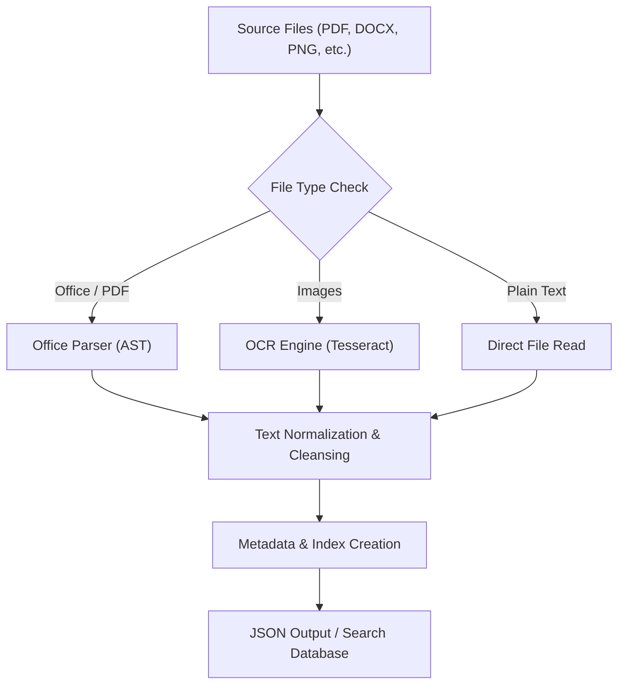

# Ultimate Document Intelligence & Scraper Workflow
## The Architect's Bible: Processing, Scraping, and Structuring Document Corpora

This workflow defines the standards, pipelines, and algorithms for parsing, extracting, and understanding structured and unstructured data from mixed-media documents (Microsoft Office, OpenDocument, PDFs, plain text, and scanned images). It is built for telematics specifications analysis, invoice scraping, and indexing large document repositories for AI search systems.

---

## 1. The Core Directives of Document Intelligence

1.  **Do Not Assume Formatting Consistency:** Layout rules differ across document versions. Always parse documents into a format-agnostic **Abstract Syntax Tree (AST)** first before flattening to plain text or markdown.
2.  **Streaming over Buffering:** For large PDF and spreadsheet files, read streams in chunks rather than buffering the entire file into RAM. A single 100MB spreadsheet can expand to 1.5GB of objects in heap memory.
3.  **Graceful OCR Fallback:** If a PDF file yields zero text characters upon extraction, automatically route it to an OCR processing queue (e.g., Tesseract) to extract text from scanned images.
4.  **Preserve Tabular Semantics:** Table grids in PDFs and Word documents contain structural relationships. Do not extract them as flat text; convert them to standardized CSV or Markdown tables to maintain column alignments.
5.  **Clean Layout Noise:** Strip headers, page numbers, footers, and margins to prevent pagination text from corrupting semantic sentences or LLM prompt boundaries.

---

## 2. The 5-Phase Document Processing Pipeline



### Phase 1: File Discovery & Format Triage
1.  **Format Mapping:** Scan files recursively and route them based on file extensions:
    *   *Office/PDF:* `.pdf`, `.docx`, `.pptx`, `.xlsx`, `.odt`, `.ods`, `.rtf` -> **Office Parser**
    *   *Scanned/Image:* `.png`, `.jpg`, `.jpeg`, `.tiff` -> **OCR Engine**
    *   *Structured Text:* `.txt`, `.csv`, `.json`, `.xml`, `.md` -> **Text Reader**
2.  **Size Auditing:** Skip or partition files exceeding 50MB for asynchronous background processing to prevent blocking the main execution thread.

### Phase 2: Structural Parsing & AST Generation
1.  **Office Documents (Word/PowerPoint/PDF):** Extract hierarchical nodes representing headings, lists, tables, paragraphs, and attachments.
2.  **Excel/Spreadsheets:** Map worksheets to JSON arrays of rows. Convert formulas to their calculated static values.
3.  **Image OCR Processing:** Apply image pre-processing (grayscale conversion, thresholding, noise reduction) before running OCR engines (like Tesseract) to maximize text recognition accuracy.

### Phase 3: Text Normalization & Cleansing
1.  **Unicode Sanitization:** Convert quotes (`&#x201C;` / `&#x201D;`), apostrophes (`&#x2019;`), and dashes to standard ASCII representations.
2.  **Regex Cleansing:** Strip double-spaces, trailing whitespaces, and empty rows.
3.  **Structural Rebuilding:** Reassemble split hyphenated words at the end of text lines.

### Phase 4: Metadata Scraping
Extract and store document metadata fields:
*   `author` / `creator`
*   `creationDate` / `modificationDate`
*   `pagesCount` / `slideCount` / `sheetNames`
*   `fileSize` / `hashChecksum`

### Phase 5: Semantic Chunking & Indexing (RAG-Ready)
1.  **Fixed-Size Chunking:** Slice text into overlapping windows (e.g., 500 characters with 10% overlap) for basic semantic searches.
2.  **Structural Chunking:** Split chunks at natural structural boundaries (e.g., page breaks, table ends, heading changes) to keep context cohesive.
3.  **Persistence:** Write parsed indices into a searchable local cache or vector database.

---

## 3. Reference Implementations

### 3.1 Office Text Extraction (Node.js & TypeScript)
```typescript
import { parseOffice } from 'officeparser';

export async function extractText(filePath: string): Promise<string> {
  const ast = await parseOffice(filePath, {
    extractAttachments: false,
    ocr: true
  });
  return ast.toText(); // Returns clean plain text
}
```

### 3.2 Local Image OCR (Node.js & Tesseract.js)
```typescript
import Tesseract from 'tesseract.js';

export async function extractOcr(imagePath: string): Promise<string> {
  const result = await Tesseract.recognize(imagePath, 'eng');
  return result.data.text; // Returns raw text parsed from image
}
```

---

## 4. Verification & QA Checklist

- [ ] Verify that all text formats are converted to UTF-8 before storage.
- [ ] Ensure image OCR files are rotated upright before sending to Tesseract.
- [ ] Check table conversions: verify that table row count matches the original document structure.
- [ ] Confirm metadata extraction successfully scrapes creation timestamp.
- [ ] Prevent file descriptor leaks: ensure all read streams are closed on parsing completion.
