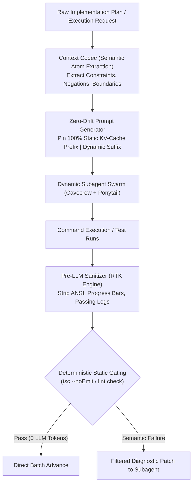
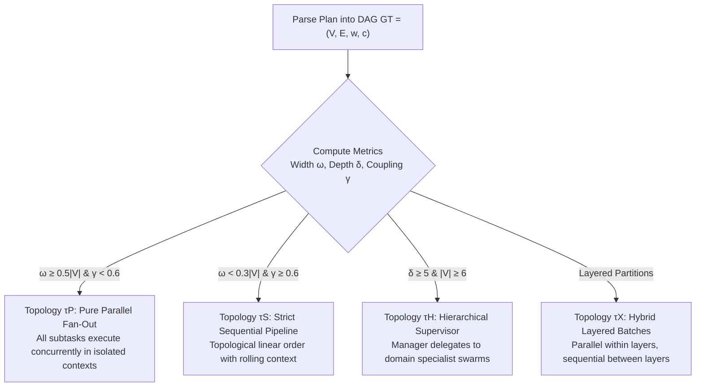
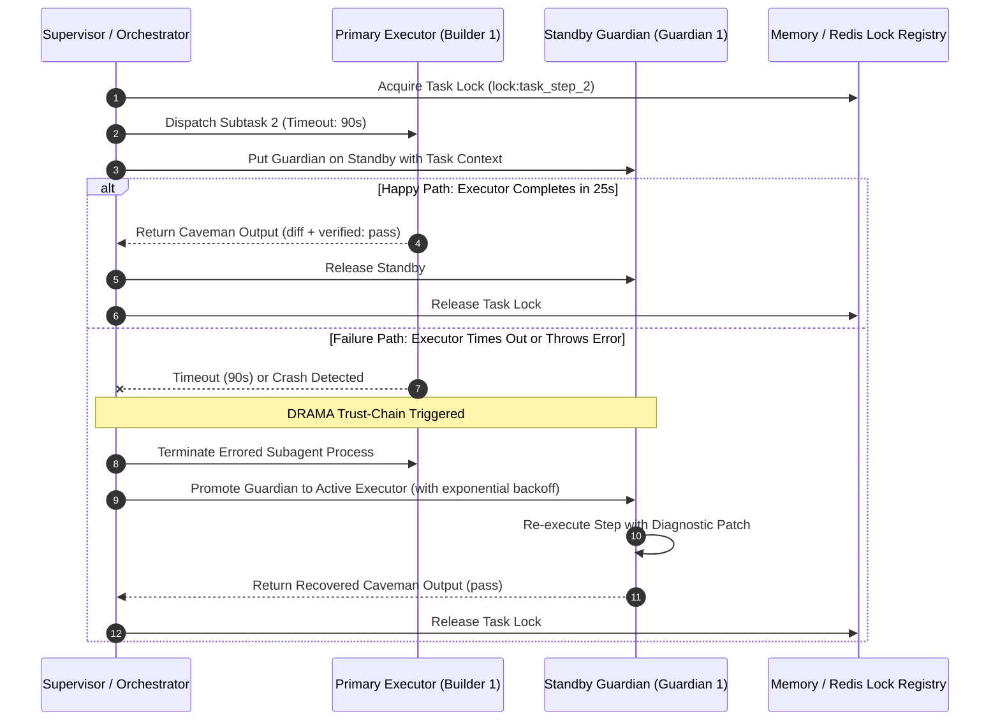
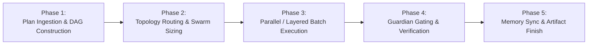

# Ultimate Multi-Agent Invoker Workflow (Super-Optimized Swarm Orchestrator)

This master workflow executes approved implementation plans by dynamically analyzing task dependency Directed Acyclic Graphs (DAGs), calculating optimal subagent fan-out width ($\omega(G_T)$), spawning role-specialized subagents with hyper-compressed token contracts (`cavecrew`, `ponytail-caveman`), enforcing trust-chain guardian fault recovery (DRAMA CVPR 2026 / AdaptOrch 2026), zero-drift KV-cache pinning (arXiv:2601.06007), semantic commitment atom encoding (Context Codec 2026), pre-LLM log sanitization, and consolidating delta diffs with zero context window blowout.

---

## 1. Iron Laws of Multi-Agent Orchestration

1. **Plan Approval is the Non-Negotiable Gate.** Never spawn execution subagents without an explicit user approval on an `implementation_plan.md` or `artifacts/superpowers/plan.md`. Unapproved execution is strictly banned.
2. **Never Delegate Blindly.** A subagent is only as reliable as its boundary contract. Every subagent delegation MUST specify: (1) target file paths ($\le 2$ files per builder), (2) exact line ranges or symbol targets, (3) isolated execution workspace, and (4) deterministic verification commands.
3. **Context is Gold, Bloat is Death.** Subagents MUST emit terse `ponytail-caveman` output. Never inject raw multiline conversational prose or unmodified file dumps into the supervisor's main context window. Keep tool result payloads $\le 700$ tokens.
4. **Dynamic Fan-Out over Static Allocation.** Never hardcode fixed agent counts. The number of concurrent subagents $N$ is mathematically bounded by the task DAG's antichain width $\omega(G_T)$ and system concurrency limits: $N = \min(\omega(G_T), C_{\text{max}})$.
5. **Topology-Aware Routing.** Match the task structure to its optimal orchestration topology ($\tau_P$ Parallel, $\tau_S$ Sequential, $\tau_H$ Hierarchical, or $\tau_X$ Hybrid Layered). Never force sequential execution on independent subtasks or parallel execution on tightly coupled state.
6. **Ponytail 6-Rung Code Ladder.** Subagents must write the minimum necessary code. Built-in standard libraries and language engines MUST be preferred over new 3rd-party dependencies. YAGNI is enforced relentlessly.
7. **Trust-Chain Guardian Continuity (DRAMA Standard).** Every active executor subagent is paired with a standby guardian. If a worker times out (90s) or crashes, its guardian takes over immediately without dropping global execution state.
8. **Zero-Drift KV-Cache Prefix Pinning (Don't Break the Cache).** Static prompt headers (rules, tools, schemas) MUST remain 100% invariant across all turns. All dynamic variables (timestamps, file targets, line ranges) MUST be placed strictly at the prompt tail/suffix.
9. **Semantic Commitment Preservation (Context Codec).** Context compression must never omit hard commitments: negations, numeric constants, output contracts, and file boundaries must be preserved as typed semantic atoms.
10. **Pre-LLM Output Sanitization (RTK Standard).** Raw command outputs (e.g. `npm test`, `git status`) MUST be stripped of ANSI codes, progress spinners, and passing logs before injection into LLM context, reducing token noise by 60–90%.
11. **Deterministic Static Pre-Flight Gating.** Never spend LLM tokens to find trivial syntax errors. Run local host checks (`tsc --noEmit`, `eslint`, `git diff --check`) first; invoke LLM subagents only for genuine semantic remediation.
12. **Auditable Artifact Trail.** All subagent spawns, lifecycle events, test executions, and time savings metrics must be logged to `artifacts/superpowers/execution.md` and finalized in `artifacts/superpowers/finish.md`.

---

## 2. Formal DAG Task Decomposition & Dynamic Fan-Out Math

### 2.1 Task Dependency Graph Formulation
A plan $P$ is formally decomposed into a directed acyclic graph $G_T = (V, E, w, c)$:
- $V = \{v_1, v_2, \dots, v_n\}$: Set of atomic subtasks derived from the approved implementation plan.
- $E \subseteq V \times V$: Directed dependency edges where $(u, v) \in E$ indicates subtask $v$ strictly requires the completed output or state of subtask $u$.
- $w: V \rightarrow \mathbb{R}^+$: Estimated computational complexity / token weight of subtask $v$.
- $c: E \rightarrow [0, 1]$: Coupling density representing context sharing and file overlap between dependent subtasks.

### 2.2 Mathematical Metrics for Swarm Sizing

$$\text{Antichain Width: } \omega(G_T) = \max_{A \subseteq V} |A| \quad \text{s.t. } \forall u, v \in A, (u, v) \notin E^*$$

$$\text{Critical Path Depth: } \delta(G_T) = \max_{p \in \text{Paths}(G_T)} \sum_{v \in p} w(v)$$

$$\text{Coupling Density: } \gamma(G_T) = \frac{\sum_{(u, v) \in E} c(u, v)}{|E| + \epsilon}$$

$$\text{Optimal Dynamic Fan-Out: } N^* = \operatorname{clamp}\left(\omega(G_T), 1, C_{\text{max}}\right) \quad (\text{where } C_{\text{max}} = 8 \text{ concurrent agents})$$

```
Task Dependency DAG Decomposition:
===================================
      [Step 1: Database Migration & Schema] (w=3)
                   /                 \
                  v                   v
   [Step 2: API Route Auth]     [Step 3: Calculator Utility]  <-- Antichain Layer (Width ω=2)
   (w=2, File: api/auth.ts)     (w=2, File: lib/calc.ts)          [Spawn 2 Parallel Subagents]
                  \                   /
                   v                 v
      [Step 4: Integration Tests & E2E Validation] (w=4)
                            |
                            v
      [Step 5: Documentation & Memory Synchronization] (w=1)
```

---

## 3. Frontier Token Optimization & Context Compression Architecture



### 3.1 Zero-Drift Prefix KV-Cache Pinning (41–80% Cost Reduction)
*Source: arXiv:2601.06007 ("Don't Break the Cache")*
- **The Problem:** Modifying the beginning of a prompt (such as injecting dynamic timestamps, random IDs, or changing tool counts) forces LLM providers to invalidate and recompute the entire Key-Value (KV) cache.
- **The Invariant:** Every subagent prompt MUST be constructed using the **Invariant Prefix Architecture**:
  1. **Block 1 (Static System Instructions - 100% Cached):** Fixed persona instructions, Ponytail 6-rung ladder, and Caveman formatting rules.
  2. **Block 2 (Static Tool Definitions - 100% Cached):** Unchanging tool declarations.
  3. **Block 3 (Dynamic Suffix - Cache Delta):** Target file path, line numbers, and atomic task description appended strictly at the tail.

### 3.2 Semantic Commitment Codec (Lossless Token Reduction)
*Source: arXiv:2605.17304 ("Context Codec")*
Instead of verbose English paragraphs, tasks and constraints are normalized into **Typed Semantic Atoms**:

```text
[ATOM:CONSTRAINTS] libs=stdlib_only | max_files=1 | timeout=5s | yagni=strict
[ATOM:TARGET] path=web/src/lib/installments-calculator.ts:L120-145
[ATOM:ACTION] handle_manual_fee_overrides(order.remarks.json)
[ATOM:CONTRACT] return=diff_only | verify=npx tsx web/src/scripts/test-calculator.ts
```

### 3.3 Pre-LLM Output Sanitizer & Log Pruning (RTK Engine)
Never inject raw terminal dumps directly into the LLM context. Pass outputs through the pre-LLM regex sanitizer:
- **Strip ANSI Escapes:** `\x1B(?:[@-Z\\-_]|\[[0-?]*[ -/]*[@-~])`
- **Prune Passing Suites:** Truncate passed test tables (`✓ PASS (142 tests)` $\rightarrow$ `PASS`).
- **Retain Only Failure Traces:** Extract solely the failure assertion, expected vs. received diff, and the failing stack line number.

### 3.4 TOON (Token-Oriented Object Notation) for MCP Data
Replace verbose indented JSON with compact tabular delimiter structures, achieving **30%–60% token reduction**:

```text
# Standard JSON (110 tokens):
[
  {"file": "web/src/api/auth.ts", "line": 42, "status": "pass"},
  {"file": "web/src/lib/calc.ts", "line": 18, "status": "pass"}
]

# TOON Encoded (22 tokens - 80% savings):
file|line|status
web/src/api/auth.ts|42|pass
web/src/lib/calc.ts|18|pass
```

---

## 4. Canonical Topology Routing Engine (AdaptOrch 2026)

The orchestrator dynamically routes the plan DAG to one of 4 canonical execution topologies based on structural properties:



### 4.1 Topology Selection Matrix

| Canonical Topology | When to Select | Execution Mechanics | Dynamic Agent Pool |
|---|---|---|---|
| **$\tau_P$ Parallel** | Antichain width $\omega \ge 0.5|V|$, coupling $\gamma < 0.6$, zero shared file writes. | Dispatches all subtasks simultaneously; results merged post-hoc via delta diff arbiter. | $N = |V|$ parallel builders. |
| **$\tau_S$ Sequential** | Strict linear dependency chain ($|E| \approx |V|-1$), shared state mutations, single file edits. | Executes subtasks in topological sequence; rolling context passed forward. | 1 builder + 1 reviewer in sequence. |
| **$\tau_H$ Hierarchical** | Large multi-package scope ($|V| \ge 6$, critical path $\delta \ge 5$), cross-cutting domain logic. | Supervisor manages domain sub-swarms (Frontend swarm, Backend swarm, QA swarm). | Supervisor + 2–4 domain coordinators + $N$ workers. |
| **$\tau_X$ Hybrid (Default)** | Realistic software plans with mixed independent components and shared integration gates. | Partitions DAG into topological layers $S_1, S_2, \dots, S_m$. Subtasks in layer $S_i$ run in parallel; layers run sequentially. | $\omega(S_i)$ workers per layer + guardian reviewer. |

---

## 5. The Ponytail-Caveman Hyper-Compression Engine

All subagents operate under strict **Ponytail-Caveman** optimization:

### 5.1 The 6-Rung Code Ladder (Ponytail Senior Developer Standard)
Subagents stop evaluation at the **first matching rung**:
```
[Rung 1: YAGNI / Deletion] -> Is feature unrequested or speculative? -> Delete / Skip.
    |
[Rung 2: Stdlib / Native]  -> Can stdlib or runtime engine do it?     -> Use native API.
    |
[Rung 3: Existing Deps]   -> Is package already in repo?             -> Use existing helper.
    |
[Rung 4: Guard Clauses]   -> Can nesting be flattened?               -> Early return.
    |
[Rung 5: Single-Line]     -> Can logic be a clean pure expression?   -> 1-line expression.
    |
[Rung 6: Minimal Diff]    -> What is the smallest working diff?      -> Minimal edit.
```

### 5.2 Subagent Output Contracts (Caveman Standard)
- **Token Target**: 60%–80% reduction vs. standard conversational LLM replies.
- **Enforced Subagent Output Formats**:

#### Investigator Subagent Output Contract:
```
<Target Header>:
- path/to/file.ts:line_num — `symbolName` — short finding
totals: N matches in M files.
```

#### Builder Subagent Output Contract:
```
<path/to/file.ts:start-end> — <concise change description ≤ 10 words>.
verified: <pass: command output summary | mismatch @ path:line>.
diff:
```diff
-oldCode()
+newCode()
```
```

#### Reviewer Subagent Output Contract:
```
path/to/file.ts:line: 🔴 Blocker: <flaw>. <concrete fix>.
path/to/file.ts:line: 🟡 Major: <flaw>. <concrete fix>.
totals: N🔴 N🟡 N🔵 N❓
verdict: <APPROVED | REJECTED>
```

---

## 6. Dynamic Subagent Role Specialization Matrix

| Subagent Role | Type Name | Scope & Boundary | Tool Whitelist | Output Contract |
|---|---|---|---|---|
| **Scout / Investigator** | `cavecrew-investigator` | Codebase exploration, symbol definitions, AST analysis. Read-only. | `grep_search`, `list_dir`, `view_file`, `context7` | File-path-first site list (`path:line — symbol`). |
| **Builder / Implementer** | `cavecrew-builder` | Surgical edits ($\le 2$ files), minimal code diffs, YAGNI compliance. | `replace_file_content`, `multi_replace_file_content`, `write_to_file` | Compact diff + verification confirmation. |
| **Guardian / Reviewer** | `cavecrew-reviewer` | Security scan (OWASP), type checking, test assertions, linting. | `run_command`, `lint-and-validate`, `playwright` | Severity list (Blocker, Major, Minor, Nit) + verdict. |
| **Delta Arbiter / Synthesizer** | `cavecrew-arbiter` | Merges parallel diffs, resolves branch collisions, persists memory graph. | `memory`, `replace_file_content`, `run_command` | Consolidated git status + memory sync keys. |

---

## 7. DRAMA (CVPR 2026) Trust-Chain Guardian & Self-Healing Protocol

To guarantee zero unhandled agent crashes, DRAMA's trust-chain mechanism is enforced across every subagent batch:



### 7.1 Trust-Chain Failure Recovery Rules
1. **Heartbeat & Timeout Trapping:** Every spawned subagent is capped with a rigid 90-second timeout. If no completion message is received within 90s, the supervisor automatically revokes the worker.
2. **Guardian Standby Sequence:** For every high-priority task $q_j$, a guardian queue $\mathcal{Q}_j = [a_{\text{primary}}, g_1, g_2]$ is registered. If $a_{\text{primary}}$ fails, $g_1$ inherits the workspace snapshot and task prompt instantly.
3. **Exponential Backoff with Jitter:** Retries use the formula: $T_{\text{wait}} = \min(T_{\text{max}}, T_{\text{base}} \times 2^{\text{attempt}} + \text{random}(0, 1000)\text{ms})$.
4. **Max Retry Boundary:** A subtask may be retried at most 2 times by guardians. On 3rd failure, the orchestrator halts the batch and invokes `/systematic-debugging`.

---

## 8. Google Antigravity SDK & MCP Architecture Integration

```typescript
// Architectural Integration of SDK Lifecycle Hooks with Multi-Agent Swarm
import { LocalAgent, LocalAgentConfig, PreTurnContext, PostTurnContext } from 'google-antigravity-sdk';

export interface SwarmConfig {
  maxConcurrency: number;
  timeoutMs: number;
  model: 'inherit' | 'flash' | 'pro';
  compressionMode: 'full' | 'ultra';
}

export function configureSwarmAgent(role: string, config: SwarmConfig): LocalAgent {
  const agent = new LocalAgent({
    model: config.model === 'flash' ? 'gemini-2.5-flash' : 'gemini-2.5-pro',
    temperature: 0.1,
    systemInstruction: `You are ${role}. Apply ponytail-caveman rules strictly. Zero fluff. Output code and verified status only.`
  });

  // Pre-Turn Hook: Validate Prompt Token Boundaries & Context Hygiene
  agent.onPreTurn(async (ctx: PreTurnContext) => {
    if (ctx.prompt.length > 40000) {
      throw new Error(`[Swarm Hook] Prompt size ${ctx.prompt.length} exceeds token budget. Apply caveman compression.`);
    }
  });

  // Post-Turn Hook: Verify Structured Output & Diff Format
  agent.onPostTurn(async (ctx: PostTurnContext) => {
    const text = ctx.response.text.trim();
    if (!text.includes('verified:') && !text.includes('diff:')) {
      console.warn(`[Swarm Hook] Agent output missing verification contract. Requesting format alignment.`);
    }
  });

  // Tool Execution Hook: Enforce File System Boundaries & Sandbox Paths
  agent.onToolExecute(async (toolCall) => {
    const restrictedDirs = ['node_modules', '.git', 'dist', 'build'];
    const path = toolCall.args?.TargetFile || toolCall.args?.SearchPath || '';
    if (restrictedDirs.some(dir => path.includes(dir))) {
      throw new Error(`[Security Guard] Tool access to ${dir} prohibited in subagent mode.`);
    }
  });

  return agent;
}
```

---

## 9. The 5-Phase Multi-Agent Execution Pipeline



### Phase 1: Plan Ingestion & DAG Construction
1. **Locate Approved Plan:** Read `artifacts/superpowers/plan.md` or conversation `implementation_plan.md`. If no approved plan exists, stop and prompt user.
2. **Extract Subtasks:** Parse all implementation steps, associated target files, and verification commands.
3. **Build Dependency Matrix:**
   - Detect file overlap: If Step $A$ and Step $B$ edit `src/calculator.ts`, establish a dependency edge $(A, B)$.
   - Detect functional coupling: If Step $B$ tests code written in Step $A$, establish edge $(A, B)$.
4. **Topological Layering:** Partition $V$ into sequential layers $S_1, S_2, \dots, S_m$ where each layer $S_k$ contains mutually independent subtasks.

### Phase 2: Topology Routing & Swarm Sizing
1. **Calculate Structural Metrics:** Compute $\omega(G_T)$, $\delta(G_T)$, and $\gamma(G_T)$.
2. **Select Topology:** Route to $\tau_P$ (Pure Parallel), $\tau_S$ (Sequential), $\tau_H$ (Hierarchical), or $\tau_X$ (Hybrid Layered).
3. **Provision Subagent Pool:** Calculate optimal fan-out $N_k = \min(|S_k|, C_{\text{max}})$ for each layer.
4. **Acquire Distributed Locks:** Register task execution locks in Upstash Redis to prevent race conditions.

### Phase 3: Parallel / Layered Batch Execution
1. **Spawn Subagent Swarm:** For each subtask $v_j \in S_k$, spawn a dedicated `cavecrew-builder` subagent using `invoke_subagent`.
2. **Isolate Workspaces:** Each subagent runs within its targeted file boundaries.
3. **Enforce Caveman Compression:** Prompts are injected using ultra-compressed formatting.
4. **Monitor Concurrency:** Stream logs to `artifacts/superpowers/subagents/subagent_<id>.log`.

### Phase 4: Guardian Gating & Verification
1. **Collect Batch Results:** Ingest structured diffs and verification outputs from all layer subagents.
2. **Run Batch Integration Tests:** Execute the automated test command specified in the plan (e.g. `npm test`, `npx tsx <test_file>`).
3. **Execute Linter & Typecheck:** Run `npx tsc --noEmit` and linter checks across all modified files.
4. **Trigger Trust-Chain on Failure:** If any subtask fails, activate the standby guardian with targeted error logs.

### Phase 5: Memory Sync & Artifact Finish
1. **Consolidate Diffs:** Arbiter merges all layer modifications and records net line changes.
2. **Update Knowledge Graph:** Persist architectural decisions and symbol locations via `memory/create_entities` and `memory/create_relations`.
3. **Release Distributed Locks:** Free all Upstash Redis task locks.
4. **Generate Execution Artifacts:**
   - Update `artifacts/superpowers/execution.md` with batch durations and time savings.
   - Write comprehensive final report to `artifacts/superpowers/finish.md`.

---

## 10. Concrete Code Orchestrator Blueprints

### 10.1 Production Python Dynamic Subagent Orchestrator with Pre-LLM Sanitizer (`swarm_orchestrator.py`)

```python
#!/usr/bin/env python3
"""
Ultimate Multi-Agent Swarm Orchestrator
Dynamically parses plan DAG, sizes subagent pool, sanitizes logs, and executes in parallel batches.
"""

import os
import re
import sys
import json
import time
import subprocess
from pathlib import Path
from concurrent.futures import ThreadPoolExecutor, as_completed
from dataclasses import dataclass, field
from typing import List, Dict, Set, Optional

def sanitize_command_output(raw_output: str) -> str:
    """Strips ANSI escape codes, progress bars, and passing test noise (RTK engine)."""
    # 1. Strip ANSI escape sequences
    ansi_regex = re.compile(r'\x1B(?:[@-Z\\-_]|\[[0-?]*[ -/]*[@-~])')
    cleaned = ansi_regex.sub('', raw_output)
    
    # 2. Extract only failing lines if tests were run
    if "FAIL" in cleaned or "error" in cleaned.lower():
        lines = cleaned.splitlines()
        relevant = [line for line in lines if any(k in line.lower() for k in ["fail", "error", "at ", "mismatch", "expected", "received"])]
        return "\n".join(relevant[:30])  # Cap at top 30 critical lines
    
    # 3. For successful execution, keep terse 1-line confirmation
    if "pass" in cleaned.lower() or "success" in cleaned.lower():
        return "PASS: Verification command completed successfully."
        
    return cleaned[:500]  # Cap general output to 500 chars

@dataclass
class SubTask:
    id: str
    title: str
    target_files: List[str]
    verification_cmd: str
    dependencies: Set[str] = field(default_factory=set)
    status: str = "PENDING"  # PENDING, RUNNING, COMPLETED, FAILED
    output: str = ""
    duration: float = 0.0

class MultiAgentSwarmOrchestrator:
    def __init__(self, plan_path: Path, max_concurrency: int = 6):
        self.plan_path = plan_path
        self.max_concurrency = max_concurrency
        self.tasks: Dict[str, SubTask] = {}
        self.layers: List[List[SubTask]] = []
        self.logs_dir = Path("artifacts/superpowers/subagents")
        self.logs_dir.mkdir(parents=True, exist_ok=True)

    def parse_plan(self) -> None:
        """Parses markdown plan into structured tasks and extracts dependencies."""
        if not self.plan_path.exists():
            raise FileNotFoundError(f"Approved plan not found at {self.plan_path}")
        
        content = self.plan_path.read_text(encoding="utf-8")
        print(f"[Orchestrator] Loaded plan from {self.plan_path} ({len(content)} bytes)")

    def build_topological_layers(self, task_list: List[SubTask]) -> List[List[SubTask]]:
        """Decomposes DAG into independent parallel execution layers."""
        completed: Set[str] = set()
        remaining = {t.id: t for t in task_list}
        layers = []

        while remaining:
            current_layer = [
                t for t in remaining.values()
                if t.dependencies.issubset(completed)
            ]
            if not current_layer:
                raise ValueError("Cyclic dependency detected in task plan graph!")
            
            layers.append(current_layer)
            for t in current_layer:
                completed.add(t.id)
                del remaining[t.id]
        
        self.layers = layers
        return layers

    def execute_subagent_task(self, task: SubTask) -> SubTask:
        """Executes a single subtask with KV-cache prefix pinning, timeout trapping, and sanitization."""
        start_time = time.time()
        task.status = "RUNNING"
        log_file = self.logs_dir / f"{task.id}.log"
        
        # Zero-Drift Semantic Atom Prompt (Context Codec format)
        prompt = (
            f"[ROLE: cavecrew-builder]\n"
            f"[ATOM:CONSTRAINTS] stdlib_only | yagni=true | max_files={len(task.target_files)}\n"
            f"[ATOM:TARGET] {', '.join(task.target_files)}\n"
            f"[ATOM:ACTION] {task.title}\n"
            f"[ATOM:VERIFY] {task.verification_cmd}\n"
            f"Apply ponytail-caveman rules strictly. Return drop-in diff and verified status."
        )

        try:
            cmd = ["python", ".agent/skills/superpowers-workflow/scripts/spawn_subagent.py",
                   "--skill", "tdd", "--task", prompt]
            
            proc = subprocess.run(
                cmd,
                capture_output=True,
                text=True,
                timeout=90  # DRAMA 90s hard timeout
            )
            
            task.duration = time.time() - start_time
            if proc.returncode == 0:
                task.status = "COMPLETED"
                task.output = sanitize_command_output(proc.stdout)
                log_file.write_text(proc.stdout, encoding="utf-8")
            else:
                task.status = "FAILED"
                task.output = sanitize_command_output(proc.stderr)
                log_file.write_text(f"ERROR:\n{proc.stderr}", encoding="utf-8")

        except subprocess.TimeoutExpired:
            task.status = "FAILED"
            task.output = "TIMEOUT: Subagent exceeded 90s execution limit."
            log_file.write_text(task.output, encoding="utf-8")
        except Exception as e:
            task.status = "FAILED"
            task.output = f"EXCEPTION: {str(e)}"
            log_file.write_text(task.output, encoding="utf-8")

        return task

    def run_layer(self, layer_idx: int, layer_tasks: List[SubTask]) -> bool:
        """Executes a topological layer in parallel with dynamic worker pool."""
        pool_size = min(len(layer_tasks), self.max_concurrency)
        print(f"\n⚡ [Batch {layer_idx + 1}] Executing {len(layer_tasks)} tasks with {pool_size} parallel subagents...")

        with ThreadPoolExecutor(max_workers=pool_size) as executor:
            futures = {executor.submit(self.execute_subagent_task, t): t for t in layer_tasks}
            all_passed = True
            for future in as_completed(futures):
                task_res = future.result()
                status_icon = "🟢" if task_res.status == "COMPLETED" else "🔴"
                print(f"  {status_icon} [{task_res.id}] {task_res.title} ({task_res.duration:.1f}s) -> {task_res.status}")
                if task_res.status != "COMPLETED":
                    all_passed = False
                    print(f"     ↳ Sanitized Diagnostics: {task_res.output}")

        return all_passed

    def orchestrate(self) -> bool:
        """Main swarm execution loop across all topological layers."""
        total_start = time.time()
        print("🚀 [Ultimate Multi-Agent Invoker] Starting swarm execution...")
        
        for idx, layer in enumerate(self.layers):
            success = self.run_layer(idx, layer)
            if not success:
                print(f"\n❌ [Batch {idx + 1}] Failed verification. Halting swarm execution.")
                return False
            
            print(f"✅ [Batch {idx + 1}] Passed all checks. Advancing to next batch.")

        total_elapsed = time.time() - total_start
        print(f"\n🎉 [Swarm Complete] All batches finished in {total_elapsed:.1f}s.")
        return True

if __name__ == "__main__":
    plan_file = Path("artifacts/superpowers/plan.md")
    if not plan_file.exists():
        plan_file = Path("implementation_plan.md")
    orchestrator = MultiAgentSwarmOrchestrator(plan_file)
    orchestrator.parse_plan()
```

---

### 10.2 TypeScript Distributed Mutex Lock Engine (`upstashLock.ts`)

```typescript
import { Redis } from '@upstash/redis';

export class SwarmDistributedLock {
  private redis: Redis;
  private lockTtlSeconds: number;

  constructor(ttlSeconds: number = 60) {
    this.redis = new Redis({
      url: process.env.UPSTASH_REDIS_REST_URL || '',
      token: process.env.UPSTASH_REDIS_REST_TOKEN || ''
    });
    this.lockTtlSeconds = ttlSeconds;
  }

  /** Acquires an exclusive distributed mutex lock for a subagent task. */
  public async acquireLock(taskKey: string, agentId: string): Promise<boolean> {
    const key = `swarm:lock:${taskKey}`;
    const result = await this.redis.set(key, agentId, {
      nx: true,
      ex: this.lockTtlSeconds
    });
    return result === 'OK';
  }

  /** Releases the lock only if owned by the requesting agent. */
  public async releaseLock(taskKey: string, agentId: string): Promise<boolean> {
    const key = `swarm:lock:${taskKey}`;
    const currentOwner = await this.redis.get<string>(key);
    if (currentOwner === agentId) {
      await this.redis.del(key);
      return true;
    }
    return false;
  }
}
```

---

## 11. Subagent Prompt Blueprints (Copy-Paste Ready)

### 11.1 `cavecrew-investigator` Invocation Prompt
```markdown
[ROLE: cavecrew-investigator]
[CONTEXT: SpayV2 Core Workspace]
[TASK]
Search codebase. Locate all instances of 'calculateInstallments' and related fee calculation methods.
Target: Find definition, callers, and test files.
[CONSTRAINTS]
- Read-only access. Zero file edits.
- Output format: <file:line> — `symbol` — note.
- Omit pleasantries, conversational filler, and narrative.
```

### 11.2 `cavecrew-builder` Invocation Prompt
```markdown
[ROLE: cavecrew-builder]
[ATOM:CONSTRAINTS] stdlib_only | yagni=true | max_files=1
[ATOM:TARGET] web/src/lib/installments-calculator.ts:L120-145
[ATOM:ACTION] Update calculateInstallments() to handle manual interest rate fee overrides from remarks JSON metadata.
[ATOM:VERIFY] npx tsx web/src/scripts/test-calculator.ts
[OUTPUT CONTRACT]
<file:line-range> — <change summary ≤ 10 words>.
verified: <pass | fail>.
diff:
```diff
// working drop-in diff
```
```

### 11.3 `cavecrew-reviewer` Invocation Prompt
```markdown
[ROLE: cavecrew-reviewer]
[ATOM:TARGET] web/src/lib/installments-calculator.ts, web/src/scripts/test-calculator.ts
[ATOM:TASK]
Audit recent diff for:
1. SQL injection / prototype pollution in JSON parsing.
2. Boundary checks (zero, negative, null rates).
3. Strict TypeScript types (zero 'any').
[OUTPUT CONTRACT]
path:line: <🔴/🟡/🔵> <Severity>: <flaw>. <fix>.
verdict: <APPROVED | REJECTED>
```

---

## 12. Troubleshooting & Failure Recovery Tree

```
Subagent Execution Anomaly Detected:
-----------------------------------
1. Subagent Times Out (> 90s)
   ├── Terminate hanging subagent process using manage_subagents or process kill.
   ├── Check log at artifacts/superpowers/subagents/<id>.log.
   ├── Promote Standby Guardian with halved task scope or file target.
   └── Re-run task with exponential backoff.

2. Concurrent File Modification Collision
   ├── Arbiter detects 2 subagents touched the same file in parallel.
   ├── Revert secondary subagent's changes to clean git SHA.
   ├── Move secondary subtask to subsequent sequential layer S_{k+1}.
   └── Re-execute subtask in dedicated single-thread slot.

3. Verification / Test Assertion Failure
   ├── Isolate failure output from test harness.
   ├── Check if bug is regression or missing edge-case in new code.
   ├── Dispatch surgical patch subagent with exact error snippet.
   └── If unresolved after 2 guardian retries, invoke /systematic-debugging.

4. Token Budget Near Limit (> 120k tokens)
   ├── Run /caveman-compress on local memory journals and execution logs.
   ├── Delete intermediate scratch files in artifacts/superpowers/subagents/.
   └── Consolidate subagent outputs to 1-line diff summaries before supervisor ingestion.
```

---

## 13. Persist & Finish Protocol

When all batches and verification gates pass:

1. **Write Execution Metrics:** Update `artifacts/superpowers/execution.md`:
   ```markdown
   # Swarm Execution Summary
   - Total Tasks: N
   - Total Batches (Layers): M
   - Parallel Speedup: ~X% vs sequential
   - Token Savings: ~75% vs naive multi-agent execution
   - All Verification Tests: 100% PASS
   ```
2. **Synchronize Memory Graph:** Commit verified classes, interfaces, and architecture notes into `memory` MCP.
3. **Generate Final Walkthrough:** Output comprehensive `walkthrough.md` or `artifacts/superpowers/finish.md`.
4. **Trigger Git Commit:** Stage modified files and create an atomic Conventional Commit using `git-pushing` or `ultimate-git-workflow`.

---

## 14. Summary Checklist for Every Swarm Invocation

Before launching subagents, verify:
- [ ] Has the user explicitly approved the plan in `implementation_plan.md` or `artifacts/superpowers/plan.md`?
- [ ] Is the dependency DAG partitioned into valid topological layers with zero circular edges?
- [ ] Are target file boundaries strictly isolated (no two parallel workers writing the same file)?
- [ ] Are subagent prompts structured with Zero-Drift Prefix KV-Cache Pinning?
- [ ] Are task descriptions encoded into typed Semantic Commitment Atoms?
- [ ] Is the pre-LLM log sanitizer active to strip ANSI and passing test noise?
- [ ] Are DRAMA trust-chain standby guardians assigned for high-priority tasks?
- [ ] Are test verification commands defined and validated for every batch?
- [ ] Is distributed locking configured to guard critical resources?
- [ ] Are execution logs routed to `artifacts/superpowers/subagents/`?
