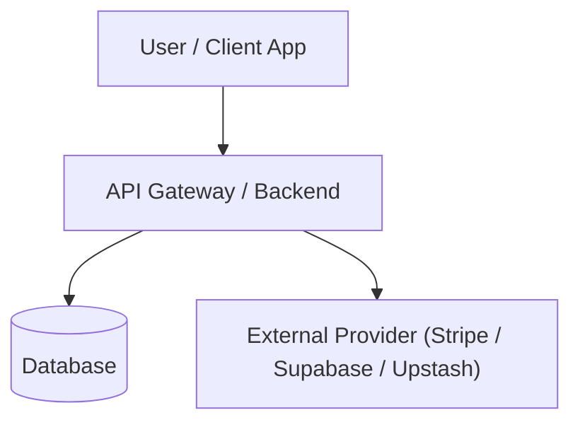
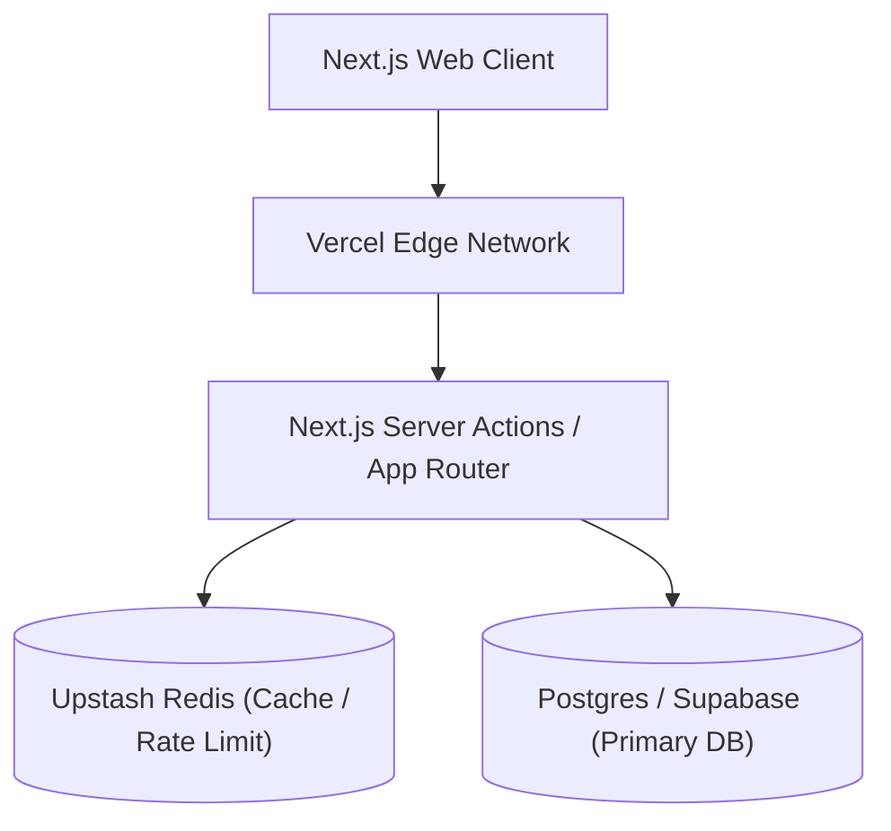

# Ultimate Planning Workflow

This workflow drives systematic planning and architectural design. It guarantees that changes are well-structured, risks are mitigated, steps are atomic, and every step is verifiable before proceeding. This is the bridge between brainstorming and implementation.

---

## Iron Laws

1. **No Big Bangs.** Every implementation step must be completable in 2–10 minutes. If a step takes longer, break it down further.
2. **Every Step Is Verifiable.** If you cannot define a concrete verification command or check for a step, the step is too vague. Refine it.
3. **Plan Before Code.** For any change involving >2 files, >1 database table, or >1 API endpoint, create a plan first. Unplanned multi-file changes are bugs waiting to happen.
4. **Dependencies First.** Steps must be ordered so that dependencies (shared types, database schema, utility functions) are built before consumers.
5. **Rollback Is Part of the Plan.** Every plan must define what happens if the change fails. "Revert the commit" is acceptable. "We'll figure it out" is not.
6. **No Speculative Code.** Adhere to `ponytail` YAGNI. Do not plan abstractions for future/unneeded capabilities.
7. **Three-Approach & Dual-Engine Independent Submission Rule.** For complex architecture decisions, execute research using BOTH Tavily and Exa web search engines simultaneously. **Tavily and Exa must EACH submit their own independent version of proposed findings and architecture options.** Compare Tavily's submission side-by-side against Exa's submission in a comparison matrix to evaluate trade-offs, alternative patterns, and edge cases before choosing the final planning target.
8. **Never Skip Local Verification.** No code is pushed to remote branches without passing local compilation and testing checks.
9. **Single-Responsibility Steps.** A single planning step should focus on a single responsibility (e.g. either DB, or API, or UI — never mix all three in one step).
10. **Rollbacks Are Normal Operations (Google SRE Principle).** Every non-trivial plan MUST define feature-free schema migrations, feature-flag toggles (`Expand/Contract Pattern`), and executable rollback commands *before* code is written.
11. **RFC 2119 Keyword Precision.** Requirements and constraints MUST use normative RFC 2119 keywords (`MUST`, `MUST NOT`, `SHOULD`, `SHOULD NOT`, `MAY`) to remove ambiguity.
12. **Mandatory Alternative Trade-Off Analysis (Google Design Doc Standard).** Every architectural decision MUST evaluate at least 2 alternative options with an explicit pros/cons trade-off matrix before selecting the target approach.

---

## Industry-Grade Document Taxonomy & Selection Tree (Google, Uber, AWS, Stripe)

Select the appropriate planning document based on scope, lifetime, and audience:

| Document Type | Primary Purpose | Scope & Lifetime | Key Companies | Target Audience |
|---|---|---|---|---|
| **RFC (Request for Comments)** | Proposal & org-wide feedback gathering | Multi-team / Strategic (Archived post-decision) | Uber, IETF, Rust, Stripe | Engineering org, Leadership |
| **ADR (Architectural Decision Record)** | Permanent immutable log of 1 architectural choice | Repository-scoped / Permanent (`docs/adr/`) | AWS, ThoughtWorks, GitHub | Current & future maintainers |
| **Design Doc (Google Style)** | Detailed technical design & trade-off analysis | Project-scoped / Living doc during dev | Google, Meta, Airbnb | Team leads, Peer reviewers |
| **Implementation Plan (Task Spec)** | Atomic, step-by-step verifiable checklist | Task-scoped / Completed in 1–5 days | Stripe, Slack, Hudl | Implementing engineer |

### Document Selection Decision Tree
```
[Is the scope multi-team or high-impact?]
├── YES ──> Write RFC (Request for Comments) ──> Approval ──> Write Design Doc
└── NO  ──> Is it an architectural decision (DB, framework, API protocol)?
            ├── YES ──> Write ADR (Architecture Decision Record)
            └── NO  ──> Is implementation multi-step/complex (>2 files)?
                        ├── YES ──> Write Implementation Plan (Task Spec)
                        └── NO  ──> Trivial task (Direct edit + verify)
```

---

## Cross-Cutting Checkpoint Protocol (Google SRE & Enterprise Standard)

Every Design Doc and Implementation Plan MUST explicitly pass these 4 cross-cutting checkpoints before execution:

### 1. Security Checkpoint
- Input validation & sanitization defined at boundaries.
- Authentication & authorization (RLS policies, RBAC roles) verified.
- Zero secrets or API keys hardcoded in code or committed to git.

### 2. Privacy & Data Compliance Checkpoint
- PII (Personally Identifiable Information) handling declared.
- Audit trails & data retention limits defined.
- GDPR/CCPA data deletion compliance verified.

### 3. Observability & Telemetry Checkpoint
- Structured JSON logging with correlation IDs implemented.
- Error rates, latency metrics, and SLI/SLO tracking points defined.
- Sentry/Datadog exception capture boundaries placed.

### 4. Reliability & Fail-Safe Checkpoint
- Graceful degradation paths defined (fallback cache, circuit breakers).
- Backpressure handling and request rate-limiting configured.
- Timeout limits specified for all external HTTP/gRPC calls.

---

## Amazon Working Backwards PR/FAQ Framework (Amazon Standard)

For Critical or Complex features, ground technical planning in customer outcome and edge-case clarity by including a PR/FAQ section before detailing system architecture:

### 1. The Press Release (PR)
- **Heading:** 1-sentence product announcement written as if it is launch day.
- **Summary:** Who is the customer, what problem was solved, and why is this solution superior to alternatives?
- **Quote:** Customer testimonial statement describing the value delivered.

### 2. Frequently Asked Questions (FAQ)
- **External Customer FAQs:** Edge-case behavior, security/privacy protection, pricing impact, migration steps.
- **Internal Engineering FAQs:** Third-party dependency risks, performance latency impact, operational maintenance cost, rollback complexity.

---

## C4 Model Visual System Architecture Protocol (C4 Standard)

Include explicit Mermaid diagrams in Design Docs and Implementation Plans at the appropriate C4 abstraction level:

### Level 1: System Context Diagram


### Level 2: Container Diagram


---

## FMEA Risk Matrix & Blast Radius Containment (Failure Mode & Effects Analysis)

Calculate the **Risk Priority Number (RPN)** for every technical risk:
$$\text{RPN} = \text{Severity (1--5)} \times \text{Likelihood (1--5)} \times \text{Detection Difficulty (1--5)}$$

| RPN Score | Risk Level | Mandatory Mitigation Required |
|---|---|---|
| **1 – 15** | Low Risk | Standard unit tests and local verification. |
| **16 – 35** | Moderate Risk | Staging dry-run, feature flag gating, integration tests. |
| **36 – 125** | High/Critical Risk | Canary deployment, automated circuit breaker, DB `Expand/Contract` schema, zero-downtime rollback script. |

---

## DAG (Directed Acyclic Graph) Agent Task Decomposition & Parallel Execution

For multi-file or multi-agent projects, structure implementation steps as a topologically sorted Directed Acyclic Graph (DAG) to maximize parallel execution speed while avoiding file-race conflicts:

```
    ┌──────────────────────┐         ┌──────────────────────┐
    │ Task 1A: DB Schema   │         │ Task 1B: Type Defs   │  <-- Rank 1 (Parallel Read/Contract)
    └──────────┬───────────┘         └──────────┬───────────┘
               │                                │
               └────────────────┬───────────────┘
                                ▼
                    ┌──────────────────────┐
                    │ Task 2: API Contract │                    <-- Rank 2 (Sequential Core Boundary)
                    └──────────┬───────────┘
                                │
               ┌────────────────┴───────────────┐
               ▼                                ▼
    ┌──────────────────────┐         ┌──────────────────────┐
    │ Task 3A: Client UI   │         │ Task 3B: Server Hook │  <-- Rank 3 (Parallel Feature Execution)
    └──────────┬───────────┘         └──────────┬───────────┘
               │                                │
               └────────────────┬───────────────┘
                                ▼
                    ┌──────────────────────┐
                    │ Task 4: E2E QA Test  │                    <-- Rank 4 (Parallel Verification & Docs)
                    └──────────────────────┘
```

### Parallel Execution Rules for AI Agents
1. **Zero File-Race Rule:** Never place two concurrent subagents in the same rank if they write to the same target file path.
2. **Rank 1 Fan-Out:** Maximize rank 1 parallelism for read-only research, schema compilation, and type stub generation.
3. **Diamond Merges:** Combine parallel outputs into clear sequential contract boundaries before fanning out feature work.

Before writing down steps, classify the task to determine the appropriate depth of planning and validation required:

| Complexity | Criteria | Planning Output | Verification Requirements |
|---|---|---|---|
| **Trivial** | Touch 1 file; CSS tweaks; comment updates. | Direct implementation (no plan artifact required). | Manual visual check or single file linting. |
| **Simple** | Touch 1–2 files; logic updates; new simple function. | Simple markdown plan in scratchpad. | Local unit test execution; build check. |
| **Medium** | Touch 3–5 files; new components; logic flows. | Formal `implementation_plan.md` artifact. | Full unit test coverage; local manual verification. |
| **Complex** | Touch 6+ files; database changes; API routes. | Complete `implementation_plan.md` + ADR. | E2E browser tests (`playwright`); migration tests. |
| **Critical** | Touches Auth; permissions; billing; key infrastructure. | Multi-agent brainstorm + full ADR. | Third-party audit; staging dry-run; rollbacks. |

---

## Plan Quality Rubric

Every plan must be evaluated against this rubric before implementation starts:

| Category | High Quality | Low Quality (Flag These) |
|---|---|---|
| **Atomicity** | Each step touches 1–2 files and is completable in <10 mins. | Steps touch 5+ files or are grouped by file instead of logical flow. |
| **Verifiability** | Exact commands (curl, npm test, prisma query) listed for every step. | "Check if it works" or "Manual review" as the only verification. |
| **Ordering** | Lower-tier dependencies built and verified before upper consumers. | UI pages planned before database schemas are migrated. |
| **Rollback Safety** | Concrete rollback commands (git, prisma, feature flags) defined per step. | Rollback is left blank or says "N/A" for logic changes. |
| **Scope Capture** | Exact list of file paths to touch is documented in each step. | Vague folders or wildcard file targets (e.g., `src/**/*.ts`). |

---

## Step Sequencing Logic & Dependency Rules

When building the step sequence, map tasks using a strict **bottom-up dependency hierarchy**. Lower-tier blocks must be fully verified before upper-tier consumers are written:

```
        ┌──────────────────────────────────────────────┐
        │          Phase 5: Client Telemetry           │
        └──────────────────────┬───────────────────────┘
                               ▼
        ┌──────────────────────────────────────────────┐
        │           Phase 4: Frontend UI/UX            │
        └──────────────────────┬───────────────────────┘
                               ▼
        ┌──────────────────────────────────────────────┐
        │            Phase 3: Backend APIs             │
        └──────────────────────┬───────────────────────┘
                               ▼
        ┌──────────────────────────────────────────────┐
        │      Phase 2: Security & RLS Policies        │
        └──────────────────────┬───────────────────────┘
                               ▼
        ┌──────────────────────────────────────────────┐
        │         Phase 1: Database Schemas            │
        └──────────────────────────────────────────────┘
```

1. **Phase 1 (Database Schemas):** Define tables, columns, constraints, and relationships.
2. **Phase 2 (Security):** Apply RLS policies, role bindings, and VPC parameters.
3. **Phase 3 (APIs):** Implement server-side controllers, serializers, request validations, and mock interfaces.
4. **Phase 4 (Frontend UI/UX):** Scaffold client layout, tokens mapping, animations, and local assets hooks.
5. **Phase 5 (Telemetry):** Wire up analytics counters, debug log hooks, and error page fallbacks.

---

## Branching & Environment Strategy

Ensure the implementation plan specifies which git branch and hosting environment corresponds to each verification phase:

*   **Feature Branch (`feature/*`):** Local sandbox development. Verification is executed locally via terminal test runners and manual browser tests.
*   **Staging Branch (`staging` / PR preview):** Deployments triggered on PR creation. Enforce automatic linting, type safety checks, and visual snapshot validations (`playwright`).
*   **Main Branch (`main` / Production):** Direct deployment only after successful PR reviews, integration checks, and staging sign-off.

---

## Detailed Rollback Implementation Guidelines

When defining rollback commands inside steps, ensure the instructions are direct, concrete, and non-speculative:

### 1. Database Migrations (PostgreSQL/Prisma)
*   *Action:* Downward migrations must be defined inside SQL files.
*   *Rollback command:* `npx prisma migrate resolve --rolled-back [migration_id]` or `psql -f prisma/migrations/[migration_id]/rollback.sql`

### 2. Git Version Control Rollback
*   *Action:* Discard working directory updates or revert commits.
*   *Rollback commands:*
    *   Discard uncommitted edits in a file: `git checkout HEAD -- [file_path]`
    *   Revert the last local commit: `git revert HEAD --no-edit`
    *   Hard reset local workspace to origin status: `git reset --hard origin/[branch_name]`

### 3. Serverless Environment Variables
*   *Action:* Toggle feature flags to isolate broken APIs.
*   *Rollback command:* Update feature flag values via Upstash Redis console or run custom deployment CLI commands to restore previous env settings.

---

## Git Rollback & Recovery Command Matrix

| Scenario | Target Command | Impact |
|---|---|---|
| Discard uncommitted edits in a single file | `git checkout HEAD -- [file_path]` | Safe. Only resets targeted file. |
| Discard all uncommitted changes in workspace | `git reset --hard HEAD` | **Destructive.** Overwrites all uncommitted files. |
| Revert a specific commit already pushed | `git revert [commit_hash] --no-edit` | Safe. Creates a new commit undoing the changes. |
| Revert the last N commits locally | `git reset --hard HEAD~N` | **Destructive.** Deletes local history. |
| Prune local branches deleted on remote origin | `git fetch --prune` | Safe. Cleans up branch listings. |

---

## Database Migration Strategy (Expand/Contract Pattern)

When planning destructive database schema updates (e.g. renaming columns or changing relationships), utilize the **Expand/Contract (Add/Copy/Drop) Pattern** to prevent service downtime during deployment:

### 1. Expand Phase (Add Column)
*   *Plan:* Add the new column as nullable. Keep the old column intact.
*   *Action:* Write a migration file that adds `new_column_name` but retains `old_column_name`.

### 2. Transition Phase (Copy Data & Write to Both)
*   *Plan:* Update backend controllers to write queries to both the old and new columns. Run a background script to backfill existing rows.
*   *Action:*
    ```typescript
    // In API routes:
    await db.users.update({
      where: { id },
      data: {
        old_column_name: value, // Backward compatibility
        new_column_name: value  // Target state
      }
    });
    ```

### 3. Contract Phase (Read New, Drop Old)
*   *Plan:* Update all read queries to reference `new_column_name`. Once verified, write a final migration dropping `old_column_name`.
*   *Action:* Run final schema update and remove double-write fallback code.

---

## Feature Flag Implementation Pattern (Upstash Redis)

For high-risk features (e.g., locking telemetry updates or Stripe billing gates), plan a feature flag check to isolate runtime logic.

### 1. Verification Logic
```typescript
import { Redis } from '@upstash/redis';

const redis = Redis.fromEnv();

export async function isFeatureEnabled(featureKey: string, userId?: string): Promise<boolean> {
  // 1. Check global feature flag status
  const globalStatus = await redis.get(`flag:${featureKey}:enabled`);
  if (globalStatus === 'true') return true;
  
  // 2. Check user-specific rollout allowlist
  if (userId) {
    const isUserAllowed = await redis.sismember(`flag:${featureKey}:allowlist`, userId);
    if (isUserAllowed) return true;
  }
  
  return false;
}
```

### 2. Usage in Server Action Routing
```typescript
import { isFeatureEnabled } from '@/lib/feature-flags';

export async function POST(req: Request) {
  const { userId } = await auth();
  const useNewTelemetry = await isFeatureEnabled('new-telemetry-engine', userId);
  
  if (useNewTelemetry) {
    return processNewTelemetry(req);
  }
  
  return processLegacyTelemetry(req);
}
```

---

## Verification Command Design Patterns

For every implementation step, provide an automated shell check to verify correctness:

### 1. File Modification Check
Verify files exist and contain required keywords using `grep` or powershell:
*   *Command:* `Select-String -Path "./src/utils/math.ts" -Pattern "export function haversine"`

### 2. Compilation and Type Checks
Ensure the code builds cleanly:
*   *Command:* `npx tsc --noEmit` or `npm run build`

### 3. Database Table and Schema Querying
Check if a new table or constraint has been correctly registered:
*   *Command:* `npx prisma db pull` or query the meta table:
    ```bash
    psql -d $DATABASE_URL -c "SELECT column_name, data_type FROM information_schema.columns WHERE table_name = 'deliveries';"
    ```

### 4. API Response Verification
Run local fetches against endpoints:
*   *Command:* `curl -i -X POST -H "Content-Type: application/json" -d '{"otp":"123456"}' http://localhost:3000/api/deliveries/unlock`

---

## PostgreSQL Migration Rollback Script Example

When a migration must be reverted, utilize a structured SQL rollback script:

```sql
-- migration_rollback.sql
-- Revert the add_lock_and_geofence_columns migration

-- 1. Drop check constraint on deliveries
ALTER TABLE deliveries DROP CONSTRAINT IF EXISTS check_otp_length;

-- 2. Drop columns
ALTER TABLE deliveries 
  DROP COLUMN IF EXISTS otp_code,
  DROP COLUMN IF EXISTS lock_state,
  DROP COLUMN IF EXISTS geofence_lat,
  DROP COLUMN IF EXISTS geofence_lng;

-- 3. Drop lock_state enum type if created
DROP TYPE IF EXISTS lock_state_enum;
```

---

## Complete Real-world Plan Case Study: Lock Controller

### The Goal
Implement a geofenced lock controller that unlocks a physical parcel box when a rider is within 50 meters of the delivery destination and enters a valid 6-digit OTP code.

### Step 1: Database Migration (shadow shadow dry-run)
*   **Files:** `prisma/schema.prisma`, `prisma/migrations/...`
*   **Change:** Add `otp_code` (length 6 check constraint), `lock_state` (enum LOCKED/UNLOCKED), and `geofence_lat`/`geofence_lng` columns to `deliveries` table.
*   **Verify:**
    `npx prisma migrate dev --name add_lock_and_geofence_columns`
*   **Rollback:**
    `npx prisma migrate resolve --rolled-back [migration_name]`

### Step 2: Backend API Controller
*   **Files:** `app/api/deliveries/unlock/route.ts`
*   **Change:** Implement the unlocking HTTP handler. Checks: (1) Rider authentication, (2) Rider's current GPS distance to target destination via Haversine calculation (<50m), (3) OTP verification matching DB hash. Triggers camera capture, then sets box state to `UNLOCKED` in Firebase RTDB.
*   **Verify:**
    `npm run test -- test/api/unlock.test.ts`
*   **Rollback:** Delete `app/api/deliveries/unlock/route.ts` and revert router config changes.

### Step 3: Firebase RTDB Synchronizer Hook
*   **Files:** `hooks/use-box-lock.ts`
*   **Change:** Web client hook that subscribes to `/boxes/{mac_address}/lock` node in Firebase RTDB. Updates local UI state when Firebase state toggles from `LOCKED` to `UNLOCKED`.
*   **Verify:** Run simulated rider coordinates script `scripts/sim-rider.ts` and verify local console displays State transition.
*   **Rollback:** Revert git change for `hooks/use-box-lock.ts`.

### Step 4: UI Tracking Page OTP Reveal Card
*   **Files:** `app/track/[token]/page.tsx`
*   **Change:** Renders the OTP card component only if the distance check passes or status is `ARRIVED`. Uses Tailwind scale animation on reveal.
*   **Verify:** Run E2E test `npx playwright test test/e2e/otp-reveal.spec.ts`
*   **Rollback:** `git checkout HEAD -- app/track/[token]/page.tsx`

---

## Pre-Release Deployment Checklist

Before requesting staging deployment or merging the PR, verify the following checks are complete:

- [ ] All unit, integration, and visual regression tests pass locally.
- [ ] Database migrations are backwards-compatible (expand/contract schema followed).
- [ ] Build script compiles cleanly with strict TypeScript compilation checks.
- [ ] Environmental variable definitions are documented in `.env.example`.
- [ ] No API keys, credentials, or private credentials are included in the git diff.
- [ ] Rollback steps are tested and verified as recoverable.

---

## Post-Deployment Verification Protocol

Once the feature has been deployed to the target environment, execute the following smoke checks to verify live runtime behavior:

- [ ] **API Endpoint Health Check:** Verify the endpoint returns correct status codes on valid/invalid credentials.
- [ ] **Database Connection Pool Check:** Inspect database telemetry to verify connection limits aren't leaked.
- [ ] **Visual Layout Stability Audit:** Verify no Cumulative Layout Shifts occur when loading skeletons hydrate.
- [ ] **Cross-Browser Verification:** Verify visual layout behaves identically on Chrome (Webkit) and Firefox (Gecko).
- [ ] **Telemetry Loop Check:** Verify error triggers write clean, redacted audit trails to the backend log collector.

---

## Plan Output Template

```markdown
## Plan: [Feature Name]

### Goal
[1-sentence goal statement]

### Scope
- Files: [count] | DB changes: [yes/no] | API changes: [yes/no] | Security: [yes/no]

### Dual-Engine Research Comparison
| Dimension | Tavily Version Submission | Exa Version Submission | Selected Path |
|---|---|---|---|
| Strategy / Architecture | [Tavily findings & options] | [Exa findings & options] | [Chosen architecture] |
| API / Schema Design | [Tavily API specs] | [Exa API specs] | [Verified standard] |
| Risks & Mitigation | [Tavily flagged risks] | [Exa flagged risks] | [Mitigated approach] |

### Steps
- [ ] Step 1: [Name] — Files: [paths] — Verify: [command]
- [ ] Step 2: [Name] — Files: [paths] — Verify: [command]
- [ ] Step 3: [Name] — Files: [paths] — Verify: [command]

### Risk Register
| Risk | Likelihood | Impact | Mitigation |
|---|---|---|---|
| [R1] | [L/M/H] | [L/M/H/C] | [Action] |

### Rollback Plan
[How to revert if the plan fails]

### Verification
- [ ] All tests pass
- [ ] Build compiles
- [ ] Staging deploy succeeds
- [ ] Smoke test passes
```

---

## Planning Guardrails

- **No Speculative Code:** Adhere to `ponytail` YAGNI. Do not plan abstractions for future/unneeded capabilities.
- **Verification-First:** Every step in the checklist must be testable immediately. If a step cannot be verified, break it down further.
- **Risk Escalation:** Changes to security, database, billing, or auth### 5. Immutable ADR Lifecycle (AWS & Google Cloud Architecture)
- **Status Lifecycle:** `Proposed` $\rightarrow$ `Accepted` | `Rejected` | `Superseded`.
- **Immutability Invariant:** Once an ADR is marked `Accepted`, its text is **immutable**. Future changes require authoring a new ADR that explicitly marks the old ADR as `Superseded: [ADR-00X]`.

### 6. LaunchDarkly Multi-Phase Rollout & Feature Flag Decoupling Protocol
- **Deployment vs. Release Decoupling:** Deploy code disabled behind a feature flag first; toggle live release independently.
- **Phased Dual-Write Migration:**
  1. *Phase 1 (Dual Write):* Write to both old and new data stores simultaneously.
  2. *Phase 2 (Shadow Read):* Read from new data store in background, logging diffs without surfacing errors.
  3. *Phase 3 (Live Cutover):* Flip primary read flag to new data store with zero-downtime instant rollback capability.
  4. *Phase 4 (Deprecate):* Sunset old storage after 7-day zero-error warranty window.

To verify that your implementation plan is correct and robust before writing any code:

1. **Schema Check:** Open `prisma/schema.prisma` or database layout files. Mentally execute the new table migrations. Do they violate foreign key policies or constraints?
2. **Type Walkthrough:** Trace input parameters from your new API handler through service files to the DB layer. Ensure type definitions (`interface`, `type`) match at every boundary.
3. **Rollback Verification:** For each database migration or git change, check if the rollback command will successfully restore the database structure and branch to its previous clean state without dropping unrelated tables or data.
4. **Mock Assessment:** Check if mock scopes in your tests are too permissive. Ensure mocks only isolate external APIs, not internal functions.

### Plan Review Gate
A plan must receive explicit approval from a peer or lead engineer before writing any production code if:
- The change involves >1 database table schema alteration.
- The change modifies public API contracts (endpoints, parameters, headers).
- The change handles critical operations (financial transactions, raw authentication data, privacy encryption).
- The change introduces a new third-party dependency.

*Note: For all approved plans, register the plan state and associated tasks in `task.md` to track progress sequentially during implementation.*


---

## Anti-Patterns (Reject These)

| Anti-Pattern | Why It's Wrong | Do This Instead |
|---|---|---|
| "We'll plan as we go" | Reactive, miss dependencies | Plan the full sequence before coding |
| Steps without verification | Can't tell if a step worked | Every step has a `Verify:` field |
| "Deploy and test in prod" | Risk of user-facing breakage | Test in staging/preview first |
| Monolithic steps (30+ min) | Too many failure modes | Break into 2–10 minute atomic steps |
| Ignoring rollback | Stuck when things fail | Rollback plan is mandatory |
| Planning without brainstorming | First idea bias, no alternatives | Brainstorm → Plan → Implement |

---

## Sub-Skill Checklists & Reference Templates

### 1. Planning Skill Rules (`superpowers-plan`)
*   **Small Steps:** Break changes into small tasks (2–10 minutes each).
*   **Verification:** Every step must include a verification check.
*   **Incremental Deliverables:** Avoid "big bang" edits; prefer small, testable chunks.
*   **Plan Structure:**
    *   **Goal:** High-level objective.
    *   **Assumptions:** Prerequisites or environment state.
    *   **Steps:** Sequential item listing. Each step lists target file(s), proposed change, and verification command.
    *   **Risks & Mitigations:** Proactive failure mapping.
    *   **Rollback Plan:** Scripted commands to undo changes.

### 2. Scoping Guidelines (`superpowers-brainstorm`)
*   Use before implementing non-trivial features, refactors, or automation designs.
*   **Structure:**
    *   **Goal:** 1-2 sentence goal statement.
    *   **Constraints:** Tech stack, time limits, must-not-change code blocks.
    *   **Known Context:** Active files, schema state, API contracts.
    *   **Risks:** Security vulnerabilities, data loss, regression.
    *   **Options:** 2–4 options evaluated by pros/cons and complexity.
    *   **Recommendation:** Selected path with justification.
    *   **Acceptance Criteria:** Verifiable outcomes list.

### 3. Checklist Guidelines (`concise-planning`)
*   **Atomic:** Each task should represent a single logical unit of work.
*   **Verb-First:** Actions must start with active verbs (e.g. "Add...", "Refactor...", "Verify...").
*   **Concrete:** Specify file basenames or modules.

### 4. Agent Execution Loops & Task Orchestration (`superpowers-workflow`)
*   **Sequential vs Parallel Execution:** Structure plans with explicit flow directives. Identify steps that can run concurrently using subagents.
*   **Lifecycle Hook Checkpoints:** Always plan execution triggers with pre-step and post-step validations to catch state deviations early.

### 5. Automated Validation & Scripting (`superpowers-python-automation`)
*   **Virtual Environments:** Write validation scripts using standard isolation (`venv`) and explicitly define dependent packages in `requirements.txt`.
*   **Structured Logs Processing:** Validation scripts must output structured JSON strings containing key parameters (e.g. status, duration, error details) to let the calling pipeline parse execution states automatically.

---

## Cross-Cutting Concerns
*   **Brainstorming:** Use `ultimate-brainstorm-workflow` before planning when the approach is unclear.
*   **Dual-Engine Research:** Use `ultimate-research-workflow` (mandating simultaneous execution of Tavily + Exa) whenever the plan depends on unfamiliar libraries, architecture trade-offs, or API signatures. Always run both Tavily and Exa at the same time.
*   **Documentation:** Use `ultimate-documentation-workflow` for formal plan documents and ADRs.
*   **Architecture:** Feed complex plans into `ultimate-architecture-workflow` for ER diagrams and system design.
*   **Testing:** Use `ultimate-testing-workflow` for designing the test strategy within the plan.
*   **Memory:** Use `memory` MCP to persist plans and architectural decisions across conversations.
