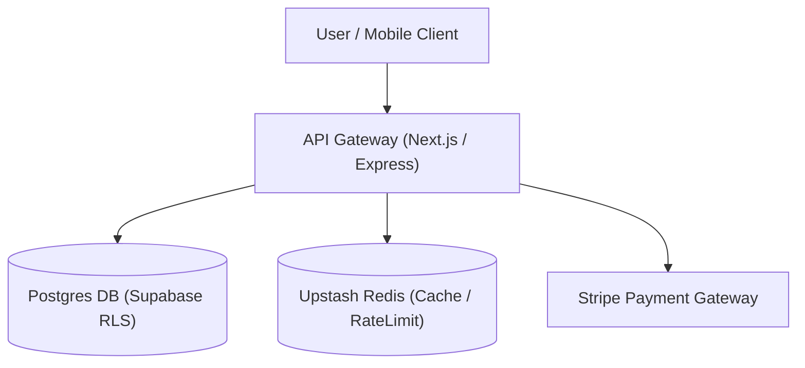
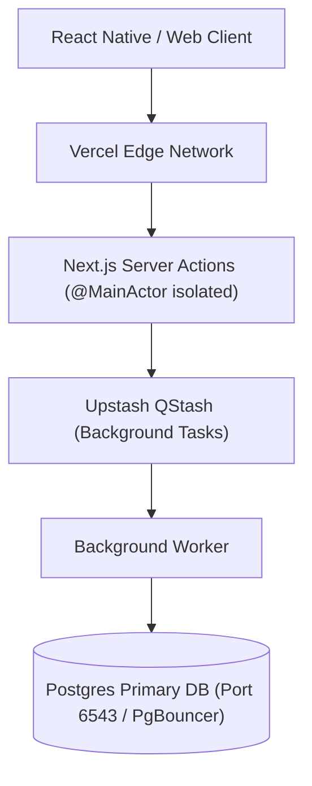
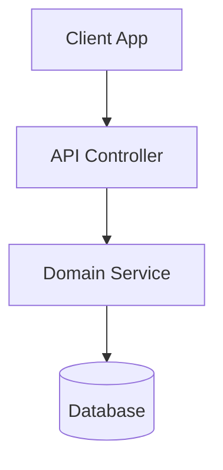

# Ultimate Planning & Architecture Workflow (10/10 Master Engine)

This workflow is the definitive 10/10 technical planning and architecture design system. It guarantees that software systems are thoroughly researched across the **Hexa-Engine** matrix, bounded by **NASA JPL** safety invariants and **Apple** frame budgets, validated against **Google SRE** checkpoints, structured via **Amazon PR/FAQ** and **C4 diagrams**, and executed through topologically sorted **DAG task decomposition** with zero race conditions.

```
                                [TECHNICAL FEATURE / REFACTOR INITIATIVE]
                                                    │
                         ┌──────────────────────────┴──────────────────────────┐
                         ▼                                                     ▼
            [HEXA-ENGINE RESEARCH MATRIX]                             [CAPACITY & SLO BUDGETING]
            ├─ 1. Tavily (Canonical Docs)                             ├─ QPS Headroom & DB Pools
            ├─ 2. Exa (Neural Code Patterns)                          ├─ Apple 0-Hang (<100ms) Threading
            ├─ 3. Linkup (Real-Time Grounding)                        ├─ NASA Loop Bounds & Scope
            ├─ 4. Jina AI (Deep Passages)                             └─ Latency Targets (p95/p99)
            ├─ 5. Firecrawl (Merged PRs)
            └─ 6. Bright Data (Anti-Bot Portal Data)
                         │
                         ▼
        ┌─────────────────────────────────────────────────────────────────────────────┐
        │                       ENTERPRISE DOCUMENT SELECTION                         │
        │  • RFC (Multi-Team) • ADR (Immutable) • Google Design Doc • Task Spec (DAG) │
        └──────────────────────────────────────┬──────────────────────────────────────┘
                                               ▼
                              [CROSS-CUTTING CHECKPOINTS (SRE)]
                    ┌──────────────────────────┬──────────────────────────┐
                    ▼                          ▼                          ▼
            ┌──────────────┐           ┌──────────────┐           ┌──────────────┐
            │ 🔒 SECURITY  │           │ 👁️ TELEMETRY │           │ 🛡️ RELIABLE  │
            │ RLS & Secrets│           │ OTel & Traces│           │ Flags & FMEA │
            └──────────────┘           └──────────────┘           └──────────────┘
                                               │
                                               ▼
                                 [DAG TASK DECOMPOSITION (TOPOSORT)]
                    Rank 1 (Parallel Schemas/Types) ──► Rank 2 (API Contracts)
                    ──► Rank 3 (Parallel Features/UI) ──► Rank 4 (E2E Tests & Verification)
```

---

## 🏛️ Iron Laws of Architecture & Planning

1. **No Big Bangs**: Every implementation step must be completable in 2–10 minutes. If a step takes longer, break it down further.
2. **Every Step Is Verifiable**: Every step MUST have a concrete, copy-pasteable terminal command (e.g. `npx prisma db pull`, `curl`, `npm test`) to verify completion.
3. **Plan Before Code**: For any change involving $> 2$ files, $> 1$ database table, or $> 1$ API endpoint, author a formal plan first.
4. **Dependencies First**: Topologically order steps so shared contracts, database migrations, and type definitions are built and verified before consumers.
5. **Rollback Is Part of the Plan**: Every plan MUST define exact rollback shell commands. "Revert the commit" is acceptable; "We'll figure it out" is an immediate rejection.
6. **No Speculative Abstractions (`ponytail` YAGNI)**: Zero premature interfaces, zero single-use abstract wrappers.
7. **Hexa-Engine Research Mandate**: Complex architecture decisions MUST evaluate findings across all 6 engines (Tavily + Exa + Linkup + Jina AI + Firecrawl + Bright Data) with an explicit 6-way comparison matrix before selecting the design target.
8. **NASA JPL Safety & Resource Budgets**:
   - Statically bounded loops (`attempts < MAX_ATTEMPTS`).
   - Function length budgeted at $\le 60$ LOC.
   - Zero dynamic heap allocation in high-frequency runtime loops.
9. **Apple Thread & Concurrency Budgets**:
   - 0-Hang invariant: zero disk I/O, heavy JSON parsing, or network calls on main UI thread ($< 100\text{ms}$).
   - 0-Hitch invariant: 120Hz ProMotion layout budget ($8.33\text{ms}$).
10. **Zero-Downtime Rollouts (Expand/Contract Pattern)**: Destructive schema changes must use the 3-phase Add $\rightarrow$ Dual-Write $\rightarrow$ Drop pattern.
11. **RFC 2119 Normative Precision**: All requirements must use `MUST`, `MUST NOT`, `SHOULD`, `SHOULD NOT`, and `MAY`.
12. **Mandatory Alternative Trade-Off Analysis**: Every design doc must evaluate $\ge 2$ alternative architectures with an explicit pros/cons matrix.

---

## 📚 Document Taxonomy & Selection Matrix

| Document Type | Primary Purpose | Scope & Lifetime | Key Companies | Target Audience |
|---|---|---|---|---|
| **RFC (Request for Comments)** | Org-wide proposal & consensus building | Multi-team / Strategic (Archived post-decision) | Uber, IETF, Rust, Stripe | Engineering org, Leadership |
| **ADR (Architectural Decision Record)** | Permanent immutable log of 1 architectural choice | Repository-scoped / Permanent (`docs/adr/`) | AWS, ThoughtWorks, GitHub | Current & future maintainers |
| **Design Doc (Google Style)** | Deep technical architecture & trade-off analysis | Project-scoped / Living doc during development | Google, Meta, Airbnb | Team leads, Peer reviewers |
| **Implementation Plan (Task Spec)** | Atomic, DAG-sequenced verifiable checklist | Task-scoped / Completed in 1–5 days | Stripe, Slack, Apple | Implementing engineers |

---

## 🛡️ Cross-Cutting Checkpoint Protocol (Google SRE Standard)

Every Design Doc and Implementation Plan MUST explicitly satisfy these 4 checkpoints:

1. **Security Checkpoint**:
   - Input validation & sanitization defined at public boundaries (Zod / JSON Schema).
   - Authentication & Authorization: Postgres Row-Level Security (RLS) policies and RBAC roles defined.
   - Zero hardcoded secrets, tokens, or private keys committed to git.
2. **Privacy & Data Compliance**:
   - PII data classification (Public / Internal / Confidential / Restricted).
   - Audit trail logging and GDPR/CCPA data retention/deletion lifecycles specified.
3. **Observability & Telemetry (OpenTelemetry)**:
   - Structured JSON logging with W3C `trace_id` and `span_id` context propagation.
   - Error rates, latency metrics, and SLI/SLO tracking thresholds defined.
4. **Reliability & Blast Radius (AWS/Netflix)**:
   - Timeouts, circuit breakers, and exponential backoff with full jitter configured on all external calls.
   - Fallback responses specified for degraded downstream microservices.

---

## 🛍️ Amazon Working Backwards PR/FAQ Framework

For complex or customer-facing initiatives, include a PR/FAQ section:

### 1. The Press Release (PR)
- **Headline:** 1-sentence product announcement written from the future launch date.
- **Summary:** Who is the customer, what problem is solved, and why is this solution superior to existing alternatives?
- **Customer Quote:** Testimonial statement illustrating the tangible benefit received.

### 2. Frequently Asked Questions (FAQ)
- **Customer FAQs:** Edge cases, backward compatibility, performance impact, pricing/limits.
- **Engineering FAQs:** Failure modes, operational overhead, rollback complexity, third-party dependency risks.

---

## 📐 C4 Model Visual System Architecture

Design docs MUST include Mermaid diagrams at the required abstraction level:

### Level 1: System Context Diagram


### Level 2: Container Diagram


---

## 📊 FMEA Risk Matrix & Blast Radius Containment

Calculate the **Risk Priority Number (RPN)** for all identified architectural failure modes:
$$\text{RPN} = \text{Severity (1--5)} \times \text{Likelihood (1--5)} \times \text{Detection Difficulty (1--5)}$$

| RPN Score | Risk Level | Mandatory Mitigation Required |
|---|---|---|
| **1 – 15** | Low Risk | Standard unit tests and local verification commands. |
| **16 – 35** | Moderate Risk | Staging dry-run, feature flag gating, integration test coverage. |
| **36 – 125** | High / Critical | Automated circuit breaker, `Expand/Contract` DB migration, canary rollout, instant rollback script. |

---

## 🚀 Topologically Sorted DAG Task Decomposition

Structure all multi-file implementation tasks into a Directed Acyclic Graph (DAG) by dependency rank to prevent race conditions during parallel subagent execution:

```
    ┌──────────────────────┐         ┌──────────────────────┐
    │ Task 1A: DB Schema   │         │ Task 1B: Type Defs   │  <-- Rank 1 (Parallel Read/Contract)
    └──────────┬───────────┘         └──────────┬───────────┘
               │                                │
               └────────────────┬───────────────┘
                                ▼
                    ┌──────────────────────┐
                    │ Task 2: API Contract │                    <-- Rank 2 (Sequential Core Boundary)
                    └──────────┬───────────┘
                                │
               ┌────────────────┴───────────────┐
               ▼                                ▼
    ┌──────────────────────┐         ┌──────────────────────┐
    │ Task 3A: Client UI   │         │ Task 3B: Server Hook │  <-- Rank 3 (Parallel Feature Execution)
    └──────────┬───────────┘         └──────────┬───────────┘
               │                                │
               └────────────────┬───────────────┘
                                ▼
                    ┌──────────────────────┐
                    │ Task 4: E2E QA Test  │                    <-- Rank 4 (Verification & Rollout)
                    └──────────────────────┘
```

### Agent Parallel Execution Rules
1. **Zero File-Race Rule:** Never assign two concurrent subagents in the same rank to modify the same file.
2. **Rank 1 Fan-Out:** Maximize rank 1 concurrency for schemas, contracts, and type stubs.
3. **Sequential Sync Gates:** Diamond merges must complete fully before launching downstream dependent feature ranks.

---

## 🔄 Zero-Downtime Database Migration Pattern (Expand/Contract)

```
Phase 1: EXPAND          Phase 2: TRANSITION       Phase 3: CONTRACT
┌──────────────┐         ┌──────────────┐         ┌──────────────┐
│ Add nullable │  ───►   │ Double-write │  ───►   │ Read new,    │
│ new column   │         │ old & new    │         │ drop old col │
└──────────────┘         └──────────────┘         └──────────────┘
```

1. **Expand Phase:** Add `new_column_name` as nullable. Old column remains untouched.
2. **Transition Phase:** Backend writes to both `old_column_name` and `new_column_name`. Background backfill script populates existing records.
3. **Contract Phase:** Reads switch to `new_column_name`. Once stable for 7 days, drop `old_column_name`.

---

## 📝 10/10 Implementation Plan Template

```markdown
# 📋 Technical Implementation Plan: [Feature Name]

## 1. Executive Summary & Goal
- **Primary Objective**: [1-2 sentences on what is being delivered and why]
- **Document Type**: [RFC / ADR / Google Design Doc / Implementation Plan]
- **Scope Metrics**: [N] Files | [Y/N] DB Schema | [Y/N] Public API | [Y/N] Auth/Billing

---

## 2. Hexa-Engine Research Comparison Matrix
| Dimension | Tavily | Exa | Linkup | Jina AI | Firecrawl | Bright Data | Selected Architecture |
|---|---|---|---|---|---|---|---|
| Approach | [Tavily] | [Exa] | [Linkup] | [Jina] | [Firecrawl] | [Bright Data] | [Hexa-Verified Path] |
| API Specs | [Tavily] | [Exa] | [Linkup] | [Jina] | [Firecrawl] | [Bright Data] | [Verified Standards] |
| Trade-Offs | [Tavily] | [Exa] | [Linkup] | [Jina] | [Firecrawl] | [Bright Data] | [Mitigated Path] |

---

## 3. Architecture & C4 Visual Flows


---

## 4. FMEA Risk Assessment & Mitigations
| Risk / Failure Mode | Severity (1-5) | Likelihood (1-5) | Detection (1-5) | RPN | Mitigation Strategy |
|---|---|---|---|---|---|
| [DB connection saturation] | 4 | 2 | 2 | 16 | PgBouncer pooler + connection_limit=1 |
| [Payment double-charge] | 5 | 2 | 1 | 10 | Mandatory UUIDv4 Idempotency-Key |

---

## 5. Topologically Sorted DAG Task Sequence

### Rank 1 (Parallel Contracts & Schemas)
- [ ] **Task 1A: Database Schema Migration**
  - **Files**: `prisma/schema.prisma`, `prisma/migrations/...`
  - **Action**: Add nullable column with index.
  - **Verify**: `npx prisma migrate dev --name add_feature_column`
  - **Rollback**: `npx prisma migrate resolve --rolled-back [migration_name]`

- [ ] **Task 1B: Shared Type Definitions**
  - **Files**: `src/types/feature.ts`
  - **Action**: Export request/response interfaces and Zod validation schemas.
  - **Verify**: `npx tsc --noEmit`
  - **Rollback**: `git checkout HEAD -- src/types/feature.ts`

### Rank 2 (Sequential API & Service Layer)
- [ ] **Task 2: Backend API Handler**
  - **Files**: `src/app/api/feature/route.ts`
  - **Action**: Implement POST endpoint with Zod validation and idempotency checking.
  - **Verify**: `npm run test -- test/api/feature.test.ts`
  - **Rollback**: `git checkout HEAD -- src/app/api/feature/route.ts`

### Rank 3 (Parallel Frontend UI & Client Integration)
- [ ] **Task 3A: UI Component View**
  - **Files**: `src/components/FeatureView.tsx`
  - **Action**: Scaffold component with React 19 Server Action hooks and skeleton states.
  - **Verify**: `npx playwright test test/e2e/feature.spec.ts`
  - **Rollback**: `git checkout HEAD -- src/components/FeatureView.tsx`

---

## 6. Pre-Merge & Rollout Verification Gate
- [ ] `npx tsc --noEmit` passes with 0 errors
- [ ] `npx eslint` passes with 0 warnings
- [ ] Unit & integration tests pass (`npm run test`)
- [ ] Expand/Contract DB migration verified reversible
- [ ] Feature flag toggle verified in Upstash Redis
```
