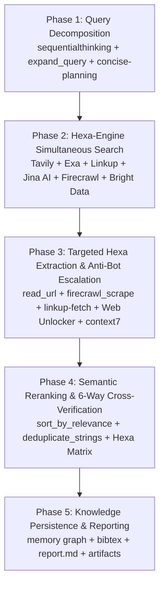

# Ultimate Research Workflow (Hexa-Engine Architecture)

This workflow drives systematic information retrieval, document mining, API verification, and library health analysis. It guarantees that technical decisions, library choices, and API usage patterns are based on verified, up-to-date documentation — never hallucinated, assumed, or guessed.

By following this workflow, engineering teams avoid:
- Outdated API signatures causing compilation failures.
- Deprecated library features introducing technical debt.
- Severe security vulnerabilities in unverified third-party code.
- Anti-bot scraping lockouts and Cloudflare Turnstile blocks on enterprise sites.
- Single-engine search blindspots and hallucinations.
- Hallucinated libraries, phantom methods, or incorrect configuration flags.

---

## The Hexa-Engine Architecture

```
                              [USER TECHNICAL QUERY]
                                        │
           ┌────────────────────────────┼────────────────────────────┐
           │                 PARALLEL HEXA DISPATCH                  │
           ▼                            ▼                            ▼
  ┌─────────────────┐          ┌─────────────────┐          ┌─────────────────┐
  │ 1. TAVILY       │          │ 2. EXA          │          │ 3. LINKUP       │
  │ Canonical Docs  │          │ Neural Vectors  │          │ Production AI   │
  │ & Domain Filter │          │ & AST Code Repos│          │ Real-Time Search│
  └────────┬────────┘          └────────┬────────┘          └────────┬────────┘
           │                            │                            │
           ▼                            ▼                            ▼
  ┌─────────────────┐          ┌─────────────────┐          ┌─────────────────┐
  │ 4. JINA AI      │          │ 5. FIRECRAWL    │          │ 6. BRIGHT DATA  │
  │ Deep Passages   │          │ Developer PRs   │          │ Web Unlocker    │
  │ & Neural Rerank │          │ & Clean DOM AST │          │ & Anti-Bot Wall │
  └────────┬────────┘          └────────┬────────┘          └────────┬────────┘
           │                            │                            │
           └────────────────────────────┼────────────────────────────┘
                                        ▼
                      [6-WAY CROSS-VERIFICATION MATRIX]
                                        ▼
                         [100% GROUNDED SOLUTION]
```

---

## Iron Laws

1. **Never Assume API Syntax.** If you haven't verified an API signature against its current documentation or AST stubs, do not write code using it. Check first.
2. **Pin Versions.** Every library recommendation must include the exact version tested (`package@version`). "Use library X" without a version is incomplete research.
3. **Cite Everything.** Every finding must include a direct URL to the source and a verbatim quote span. Uncited claims are hypotheses, not research.
4. **Acknowledge Staleness.** Explicitly state documentation age, last update date, and any known deprecations. Old docs are dangerous docs.
5. **Cross-Reference.** No single source is authoritative. Verify critical findings across the Hexa-Engine matrix (official docs + community/GitHub PRs + deep page passages + unblocked enterprise sources).
6. **No Speculative Libraries.** Never suggest a library or package that is not published on npm or PyPI. Always check active status.
7. **Document Alternatives.** Never recommend a library without evaluating at least 2 competitors.
8. **Time-Box Research.** Limit active search and extraction to a maximum of **15 minutes**. If findings are still inconclusive, re-formulate query decomposition.
9. **Hexa-Engine Simultaneous Submission & 6-Way Comparison Mandate (Tavily + Exa + Linkup + Jina AI + Firecrawl + Bright Data).** When researching the web, ALWAYS execute queries across the 6-engine spectrum:
   - **Tavily (`tavily_search` / `tavily_research`):** Domain-scoped keyword indexing, authority doc crawling, multi-step search.
   - **Exa (`web_search_exa` / `web_fetch_exa`):** Neural vector semantic search, natural language intent, similar code pattern discovery.
   - **Linkup (`linkup-search` / `linkup-fetch` / `linkup-research`):** Production-grade real-time agent search with deep grounding and structured citations.
   - **Jina AI (`jina-remote-server`):** Deep in-page passage extraction (~100 words via `search_web_deep`), batch parallel queries (`search_web`), academic papers (`search_arxiv`, `search_ssrn`), PDF extraction (`extract_pdf`), and semantic reranking (`sort_by_relevance`).
   - **Firecrawl (`firecrawl-mcp`):** Developer index (`categories: ["developer"]` covering GitHub issues/merged PRs/curated docs via `firecrawl_search`), headless JS scraping (`firecrawl_scrape` with `maxAge: 0` and browser actions), sitemaps (`firecrawl_map`), recursive crawls (`firecrawl_crawl`), structured LLM extraction (`firecrawl_extract`), and autonomous agents (`firecrawl_agent`).
   - **Bright Data (`brightdata`):** Web Unlocker & proxy shield that bypasses Cloudflare Turnstile, Akamai, CAPTCHAs, and geoblocks on protected enterprise portals.
   **All engines must EACH submit their own independent findings version/report.** Do NOT blend their initial outputs prematurely. You MUST perform an explicit 6-way side-by-side comparison matrix to analyze consensus, conflicting signatures, unique code angles, and trade-offs before reaching a final decision.
10. **Anti-Bot Escalation Protocol.** If any URL returns `403 Forbidden`, Cloudflare challenge, or CAPTCHA lockout across standard engines, immediately escalate to **Bright Data Web Unlocker** / `scraping_browser` to extract raw DOM content without failure.
11. **Zero-Vagueness Invariant & Goated Prompt Blueprint.** Never issue vague, low-signal queries (e.g., `react state`, `supabase auth`). Every MCP search invocation MUST follow the **Goated Prompt Engineering Blueprint**: combining (1) target artifact type, (2) exact library version pinning, (3) boolean domain scoping, and (4) explicit negative exclusions.
12. **Google Chain-of-Evidence (CoE) Zero-Phantom Reference Mandate.** Every factual claim, API signature, and metric MUST carry an explicit inline evidence tag binding it to a verified URL or registry API response. Citations generated from LLM memory are BANNED.
13. **AutoVerifier Hexa-Source Claim Extraction.** Factual assertions MUST be decomposed into structured `(Subject, Predicate, Object)` claim triples to detect cross-source contradictions and method-code misalignments across all 6 search engines before recommending solutions.
14. **Dynamic Failover & Resilience Protocol.** If any of the 6 engines encounters rate limits or network issues, the remaining active engines dynamically scale up results count (+50%) to ensure 100% data density. Research NEVER halts.

---

## Google Science One & Frontier Deep Research Standards (Google, OpenAI, AutoVerifier)

### 1. Google Chain-of-Evidence (CoE) Verifiability Architecture
- **Completeness & Correctness Invariants:**
  - *Completeness:* Every claim in a research report MUST link to a recorded evidence chain.
  - *Correctness:* Each evidence chain MUST genuinely support the attached claim (zero paraphrase drift).
- **CoE 4-Check Integrity Audit:**
  1. **Reference Verification:** 100% of citations resolved via live registry/scholarly APIs (`context7`, `tavily_extract`, `web_fetch_exa`, Linkup `linkup-fetch`, Jina `read_url`, Firecrawl `firecrawl_scrape`, Bright Data Unlocker). Zero phantom references allowed.
  2. **Metric & Score Verification:** Exact performance/bundle-size numbers verified against raw log lines or benchmark tables.
  3. **Method-Code Alignment:** Described library patterns MUST match actual source code AST declarations.
  4. **Specification Violation Check:** Enforce exact version bounds (e.g. Next.js 15, React 19, TypeScript 5.5, Node 22).

### 2. Google PAT (Paper Assistant Tool) Semantic Segmentation & Compute Allocation
- **Dynamic Segment Compute Allocation:**
  - Segment research topics into semantic components (e.g., *API Signatures*, *Migration Paths*, *Performance Benchmarks*, *Security Hazards*).
  - Dynamically allocate search tool calls across the 6 engines based on information density:
    - **Tavily (16.6%):** Canonical documentation portals, authoritative domains, and exact parameter specifications.
    - **Exa (16.6%):** Semantic natural language intent, neural code patterns, and real-world implementation repositories.
    - **Linkup (16.6%):** Real-time agent grounding, production search queries, and high-speed deep analysis.
    - **Jina AI (16.6%):** Deep in-page passage reading (`search_web_deep`), academic research (`search_arxiv`/`search_ssrn`), PDF tables (`extract_pdf`), and semantic reranking (`sort_by_relevance`).
    - **Firecrawl (16.6%):** Developer index (`categories: ["developer"]`), merged GitHub PRs, live headless JS scrape (`maxAge: 0`), sitemaps (`firecrawl_map`), and structured schema extraction (`firecrawl_extract`).
    - **Bright Data (16.6%):** Anti-bot bypassing, Web Unlocker scraping on Cloudflare-protected domains, and enterprise SERP validation.

### 3. AutoVerifier 6-Layer Knowledge Graph & Claim Triples
Decompose complex technical assertions into structured `(Subject, Predicate, Object)` triples before synthesizing recommendations:
- *Example:* `(Next.js 15 App Router, requires, React 19)`
- *Example:* `(Prisma v6, supports, Supabase Transaction Pooling on Port 6543)`
- *Example:* `(Firecrawl developer index, exposes, data.developer PR fixes)`
- *Example:* `(Jina search_web_deep, extracts, ~100-word in-body passages)`
- *Example:* `(Bright Data Web Unlocker, unblocks, Cloudflare Turnstile protected docs)`
- Cross-reference triples across all 6 engine outputs (Tavily, Exa, Linkup, Jina AI, Firecrawl, Bright Data) to spot contradictions and overclaims automatically.

### 4. DeepTRACE Bi-partite Citation Matrix & Minimal Source Cover
- Construct a **Statement-by-Source Matrix** evaluating whether listed URL sources factually support each sentence in the report.
- Prune redundant or low-signal source links to output a minimal, 100%-verified evidence graph.

### 5. HiEviDR Hierarchical Evidence Graph & Progressive Gating
- **Evidence Graph Construction ($\mathcal{G} = (\mathcal{N}_\text{e} \cup \mathcal{N}_\text{c} \cup \{n_\text{conclusion}\}, \mathcal{E})$):**
  - *Evidence Nodes ($\mathcal{N}_\text{e}$):* Atomic textual, tabular, or visual evidence items retrieved directly from sources across the 6 engines.
  - *Claim Nodes ($\mathcal{N}_\text{c}$):* Intermediate reasoning statements grounded in one or more evidence nodes.
  - *Conclusion Node ($n_\text{conclusion}$):* Final analytical answer supported by the entire directed acyclic graph.
- **Progressive Gating Mechanism:**
  1. *Citation Gate:* Activates only when cited evidence matches retrieved atomic nodes in $\mathcal{N}_\text{e}$.
  2. *Claim Gate:* Activates only when cited evidence adequately supports intermediate reasoning in $\mathcal{N}_\text{c}$.
  3. *Answer Gate:* Activates final conclusions only when all precursor claim nodes are 100% verified. Failure at any gate zeroes out credit.

### 6. Span-Grounded Verbatim Substring Validation
- Every extracted claim MUST carry a verbatim quote span from its source.
- Validate every quote span via exact substring matching against the raw scraped HTML/markdown text before emitting findings. Substring mismatches are dropped immediately.

---

## Goated Prompt Engineering & MCP Invocation Master Blueprint

To extract maximum signal and eliminate generic "AI slop" search responses, use this exact prompt construction formula for every MCP call:

### 1. The Pinpoint Query Engineering Formula
$$\text{Query} = \text{[Scope Filter]} + \text{[Exact Package @ Version / Symbol / Error String]} + \text{[Target Artifact Type]} + \text{[Stack Context / Constraints]}$$

#### ❌ BANNED (Vague / Low-Signal):
- `nextjs router`
- `prisma supabase connection issue`
- `react 19 state`

#### ✅ GOATED (Pinpoint / High-Signal):
- `site:github.com/vercel/next.js/issues "App Router" "useSearchParams" suspense boundary hydration mismatch v15.1.0 fix`
- `site:docs.supabase.com OR site:github.com/prisma/prisma "PrismaClientInitializationError" connection pooling PgBouncer transaction mode limit`
- `site:react.dev OR site:github.com/facebook/react/issues "useActionState" typescript signature return tuple pending state v19.0.0`

---

### 2. Hexa-Engine Search Strategy Matrix

| Dimension | Tavily Search (`tavily`) | Exa Semantic (`exa`) | Linkup Search (`linkup`) | Jina AI (`jina-remote-server`) | Firecrawl (`firecrawl-mcp`) | Bright Data (`brightdata`) |
|---|---|---|---|---|---|---|
| **Query Style** | Structured boolean (`site:`, `"exact"`, `AND/OR`) | Natural language semantic intent ("Production TS example of...") | Natural language full questions & deep research queries | Multi-query arrays + deep in-body passage questions | Boolean operators (`site:`, `categories: ["developer"]`) | URL targets, scraping commands, SERP queries |
| **Search Depth** | MANDATORY: `search_depth="advanced"`, `max_results=10-20` | Semantic vector neural search (`numResults=10-20`) | `depth: "deep"` or `depth: "standard"`, `maxResults=10-20` | Deep passage extraction (`search_web_deep`, `snippet_source="auto"`) | Developer-focused index (`data.developer`), inline `scrapeOptions` | Raw residential proxy fetch, Web Unlocker bypassing |
| **Domain Control** | Strict `include_domains` & `exclude_domains` | `category="github"`, `category="research paper"` | `includeDomains` / `excludeDomains`, `fromDate`/`toDate` | Geo/Language targeting (`gl`, `hl`), time filters (`tbs`) | `includeDomains` / `excludeDomains`, `categories: ["developer"]` | Global residential proxy geo-targeting (Country/City) |
| **Unique Capabilities** | Official API docs, domain crawling (`tavily_crawl`), multi-step research (`tavily_research`) | Vector similarity discovery, niche implementations, competitor mapping | Real-time agent grounding, deep multi-source research tasks (`linkup-research`), JS page fetch | Grounded in-body paragraph extraction (~100 words), batch multi-queries (up to 5), neural reranking (`sort_by_relevance`), PDF extraction (`extract_pdf`), arXiv/SSRN papers | Specialized index over GitHub PRs/issues, commit READMEs, live headless JS scrape (`maxAge: 0`, actions), sitemaps, structured JSON schemas | **Anti-Bot Crusher:** Web Unlocker, CAPTCHA solver, Cloudflare Turnstile bypass, residential proxy mesh |
| **Best For** | Canonical docs, API parameters, site crawling | Architectural patterns, novel alternatives, semantic code matches | High-speed LLM grounding, real-time news/prices, deep cited research | Dense technical answers buried in page bodies, academic specs, PDF tables, neural reranking | Bug fixes in merged PRs, exact error stack workarounds, clean markdown DOM extraction | Scraping Cloudflare-protected enterprise portals, paywalled sites, anti-bot blocked domains |

---

### 3. Master MCP Invocation Examples (Copy-Paste Ready)

#### A. Tavily Search & Research (`tavily`)
```json
// 1. Advanced API Signature Search
{
  "query": "site:github.com/upstash/qstash-js OR site:upstash.com/docs \"Client\" publishJSON parameters typescript return type v2",
  "search_depth": "advanced",
  "max_results": 15,
  "include_domains": ["github.com", "upstash.com"],
  "exclude_domains": ["medium.com", "dev.to"],
  "include_raw_content": true
}

// 2. Autonomous Multi-Step Research
{
  "query": "Compare Upstash Redis vs DragonflyDB for low-latency rate limiting in serverless Next.js edge environments"
}

// 3. Domain Sitemap Mapping
{
  "url": "https://docs.upstash.com"
}
```

#### B. Exa Neural Search (`exa`)
```json
// 1. Production Code Implementation Search
{
  "query": "Here is a production-ready TypeScript example of Upstash Redis ratelimit with sliding window in Next.js Server Actions handling edge cases:",
  "category": "github",
  "numResults": 15
}

// 2. Research Paper & Technical Spec Search
{
  "query": "Consensus protocols and Raft log compaction implementation in distributed storage engines",
  "category": "research paper",
  "numResults": 10
}
```

#### C. Linkup Real-Time Search & Fetch (`linkup`)
```json
// 1. Deep Real-Time Grounded Search
{
  "query": "What are the exact breaking changes in Prisma v6 when deployed on Supabase connection pooling?",
  "depth": "deep",
  "includeDomains": ["prisma.io", "supabase.com", "github.com"],
  "maxResults": 15
}

// 2. Webpage Fetch with JavaScript Rendering
{
  "url": "https://www.prisma.io/docs/v6/orm/overview/databases/supabase",
  "renderJs": true,
  "includeRawHtml": false,
  "extractImages": false
}

// 3. Autonomous Long-Running Deep Research
{
  "query": "Comprehensive architectural analysis of React 19 Server Actions vs Remix loaders with benchmarks",
  "mode": "research",
  "reasoningDepth": "L"
}
```

#### D. Jina AI Complete Tool Suite (`jina-remote-server`)
```json
// 1. Deep Passage-Level Grounded Search (~100-word in-body answer)
{
  "query": "how to configure Supabase transaction pooling with Prisma v6 in Next.js 15 Server Actions",
  "num": 8,
  "snippet_source": "auto"
}

// 2. Parallel Web Batch Search (Up to 5 queries simultaneously)
{
  "query": [
    "PrismaClientInitializationError Supabase connection limit",
    "Prisma accelerate connection pooling Next.js 15",
    "PgBouncer port 6543 Prisma transaction mode",
    "Supabase direct connection vs pooler connection string syntax",
    "Prisma extensions client extensions transaction retry"
  ],
  "num": 20
}

// 3. Clean Markdown URL Reading (Supports single or array of up to 5 URLs)
{
  "url": "https://www.prisma.io/docs/guides/database/troubleshooting-orm/help-articles/nextjs-prisma-client-monorepo",
  "withAllLinks": true,
  "withAllImages": false
}

// 4. Semantic Reranking of Candidates Against Query
{
  "query": "Next.js 15 App Router server actions form validation Zod error handling",
  "documents": [
    "Doc A: export async function action(prevState: any, formData: FormData)...",
    "Doc B: const schema = z.object({ email: z.string().email() })...",
    "Doc C: Legacy Pages router API route handler req res..."
  ]
}

// 5. Academic arXiv & SSRN Search
{
  "query": "Transformer attention KV cache compression quantization algorithms",
  "num": 10
}

// 6. PDF Extraction (Tables, Figures, Equations)
{
  "url": "https://arxiv.org/pdf/2309.06180.pdf"
}

// 7. BibTeX Academic Citation Retrieval
{
  "query": "Attention Is All You Need Vaswani 2017"
}
```

#### E. Firecrawl Developer Search & Extraction Suite (`firecrawl-mcp`)
```json
// 1. Developer Category Search (Searches GitHub issues, merged PRs, READMEs, curated docs)
{
  "query": "\"PrismaClientInitializationError\" connection limit Supabase pooler",
  "categories": ["developer"],
  "limit": 15,
  "scrapeOptions": {
    "formats": ["markdown"],
    "onlyMainContent": true
  }
}

// 2. Live Deep Page Scrape with Freshness Override (maxAge: 0) & Browser Actions
{
  "url": "https://supabase.com/docs/guides/database/connecting-to-postgres#connecting-with-prisma",
  "formats": ["markdown"],
  "maxAge": 0,
  "onlyMainContent": true,
  "actions": [
    { "type": "wait", "milliseconds": 1500 },
    { "type": "scroll", "direction": "down" }
  ]
}

// 3. Structured LLM JSON Schema Extraction across URLs
{
  "urls": [
    "https://docs.anthropic.com/en/docs/build-with-claude/tool-use",
    "https://platform.openai.com/docs/guides/function-calling"
  ],
  "prompt": "Extract API signature, parameter schemas, tool calling response format, and max payload limits.",
  "schema": {
    "type": "object",
    "properties": {
      "provider": { "type": "string" },
      "function_schema_syntax": { "type": "string" },
      "streaming_tool_calls": { "type": "boolean" },
      "rate_limits": { "type": "string" }
    },
    "required": ["provider", "function_schema_syntax"]
  }
}

// 4. Sitemap URL Enumeration (firecrawl_map)
{
  "url": "https://docs.upstash.com",
  "limit": 100
}

// 5. Recursive Multi-Page Documentation Crawl (firecrawl_crawl)
{
  "url": "https://docs.upstash.com/qstash",
  "limit": 25,
  "scrapeOptions": {
    "formats": ["markdown"],
    "onlyMainContent": true
  }
}
```

#### F. Bright Data Web Unlocker & Scraping Suite (`brightdata`)
```json
// 1. Web Unlocker Bypassing Cloudflare Turnstile / Akamai on Protected Portals
{
  "url": "https://protected-enterprise-docs.com/api-v2-specs",
  "zone": "web_unlocker"
}

// 2. Headless Browser Automation for Heavy SPAs
{
  "url": "https://app.datadoghq.com/docs",
  "zone": "scraping_browser"
}
```

#### G. Context7 Official Library Documentation Flow (`context7`)
```json
// Step 1: Resolve Library Name to Canonical ID
{
  "libraryName": "date-fns"
}

// Step 2: Fetch Version-Specific Documentation and TypeScript Stubs
{
  "libraryId": "date_fns_v3",
  "query": "format addDays exact function signature TypeScript parameters return type"
}
```

---

### 4. 5-Tier Search Query Matrix

When conducting a comprehensive research audit, execute queries across all 5 tiers simultaneously using the Hexa-Engine stack:

| Tier | Objective | Tavily Pattern | Exa Neural Pattern | Linkup Pattern | Jina Deep Passage | Firecrawl Developer | Bright Data Target |
|---|---|---|---|---|---|---|---|
| **Tier 1: Canonical Docs** | API signatures & types | `site:[docs_domain] "[symbol]" signature typescript` | `"Official API reference and TypeScript stubs for [symbol]"` | `"What is the exact TypeScript function signature for [symbol] in [docs_domain]?"` | `"[symbol] TypeScript function signature parameters return type"` | `"[symbol]" site:[docs_domain]` with `formats: ["markdown"]` | Direct crawl on protected doc portals |
| **Tier 2: Real Production Code** | AST & usage examples | `site:github.com "[symbol]" "import {" typescript` | `"Production code example using [symbol] in Next.js/React"` | `"How to use [symbol] in a production TypeScript project with error handling"` | `"production implementation of [symbol] handling error states"` | `categories: ["developer"] "[symbol]" "import"` | Repo mirror extraction |
| **Tier 3: Error & Bug Tracker** | GitHub issues & CVEs | `site:github.com/[repo]/issues "[exact_error_string]" fix` | `"How to resolve [exact_error_string] when using [package]"` | `"How to fix [exact_error_string] error in [package]"` | `"[exact_error_string] workaround root cause"` | `categories: ["developer"] "[exact_error_string]"` | Protected issue forums & internal portals |
| **Tier 4: Benchmarks & Trade-offs** | Performance & size | `"[package_A]" vs "[package_B]" bundle size gzipped latency` | `"Detailed performance comparison and trade-offs between [A] and [B]"` | `"Compare performance, memory usage, and bundle size of [A] vs [B]"` | `"benchmark latency memory allocation [A] vs [B]"` | `"[package_A]" vs "[package_B]" benchmark throughput memory` | High-volume benchmark datasets |
| **Tier 5: Deprecations** | Migration paths | `"deprecated" "[old_symbol]" replace "[new_symbol]" migration` | `"Upgrading [package] from v[X] to v[Y] breaking changes codemod"` | `"What are the breaking changes upgrading from [old_symbol] to [new_symbol]?"` | `"migration guide breaking changes [old_symbol] to [new_symbol]"` | `categories: ["developer"] "breaking change" "[old_symbol]" v[new_version]` | Legacy changelog archives |

---

## The 5-Phase Hexa Research Pipeline



### Phase 1: Query Decomposition & Strategy
*   **MCP Tools:** `sequential-thinking/sequentialthinking`, `jina-remote-server/expand_query`, `memory/read_graph`
*   **Sub-skills:** `concise-planning`, `superpowers-brainstorm`
*   **Action:**
    1. **Pre-check Memory Graph:** Run `memory/read_graph` to inspect previously verified libraries, signatures, and architectural decisions before initiating new searches.
    2. **Decompose Topic into Atomic Inquiries:**
       *   *Core API:* "What is the exact function signature, parameters, and return type?"
       *   *Compatibility & Stack:* "Does it work seamlessly with Next.js 15, React 19, TypeScript 5.5, Node 22?"
       *   *Edge Cases & Workarounds:* "What are the active GitHub issues, open PRs, and runtime pitfalls?"
       *   *Benchmarks & Bundle Metrics:* "What is the gzipped bundle size, tree-shakability, and latency overhead?"
       *   *Alternatives & Competitors:* "What are the top 2-3 alternative packages, and how do they compare?"
    3. **Expand Queries:** Use Jina `expand_query` to generate semantic query synonyms and alternative search formulations.
    4. **Plan Execution:** Use `concise-planning` to draft an atomic research checklist.

### Phase 2: Hexa-Engine Simultaneous Broad Search & Multi-Domain Discovery
*   **MCP Tools:**
    - `tavily/tavily_search`, `tavily/tavily_research`, `tavily/tavily_map`, `tavily/tavily_crawl`
    - `exa/web_search_exa`, `exa/web_fetch_exa`
    - `linkup/linkup-search`, `linkup/linkup-research`
    - `jina-remote-server/search_web_deep`, `jina-remote-server/search_web`, `jina-remote-server/parallel_search_web`, `jina-remote-server/search_arxiv`, `jina-remote-server/search_ssrn`, `jina-remote-server/guess_datetime_url`
    - `firecrawl-mcp/firecrawl_search`, `firecrawl-mcp/firecrawl_developer_search`, `firecrawl-mcp/firecrawl_map`, `firecrawl-mcp/firecrawl_crawl`, `firecrawl-mcp/firecrawl_agent`
    - `brightdata/web_data_`, `brightdata/scraping_browser`
*   **Sub-skills:** `tavily-best-practices`
*   **Action:**
    1. **Hexa-Engine Parallel Dispatch:** Execute queries across ALL SIX engines simultaneously to eliminate blindspots:
       - **Tavily:** Advanced keyword search, authority domain filtering (`include_domains`), and multi-result sets (10-20 results).
       - **Exa:** Neural vector semantic search (`category="github"`, `category="research paper"`) for contextual code implementations.
       - **Linkup:** Real-time production search (`depth: "deep"`) with domain constraints for clean agent grounding.
       - **Jina AI:** Deep passage search (`search_web_deep`) to extract ~100-word answers directly from webpage bodies, or batch parallel search (`search_web` with query arrays).
       - **Firecrawl:** Developer index search (`firecrawl_search` with `categories: ["developer"]`) to query GitHub issues, merged PRs, repository READMEs, and curated doc sites (`data.developer` group).
       - **Bright Data:** Enterprise SERP queries and global residential IP unblocking.
    2. **Site Mapping & Sitemap Discovery:** Use `tavily_map` or `firecrawl_map` to discover complete URL hierarchies of documentation portals before extracting specific pages.
    3. **Academic & Research Ingestion:** Use Jina `search_arxiv` / `search_ssrn` when researching algorithms, state machines, consensus protocols, or cryptographic specs.
    4. **Publication Date Inference:** Use Jina `guess_datetime_url` to verify publication freshness and detect stale documentation.

### Phase 3: Targeted Hexa Extraction, Parsing & Anti-Bot Escalation
*   **MCP Tools:**
    - `jina-remote-server/read_url`, `jina-remote-server/parallel_read_url`, `jina-remote-server/extract_pdf`
    - `firecrawl-mcp/firecrawl_scrape`, `firecrawl-mcp/firecrawl_extract`, `firecrawl-mcp/firecrawl_parse`, `firecrawl-mcp/firecrawl_interact`
    - `linkup/linkup-fetch`
    - `brightdata/scraping_browser`, Web Unlocker
    - `tavily/tavily_extract`
    - `exa/web_fetch_exa`
    - `context7/resolve-library-id`, `context7/get-library-docs`
    - `playwright/browser_navigate`, `playwright/browser_evaluate`
*   **Action:**
    1. **Multi-Engine Content Extraction:**
       - Use **Jina `read_url`** or **Firecrawl `firecrawl_scrape`** (`maxAge: 0`, `onlyMainContent: true`) for ultra-clean Markdown conversions of complex web pages.
       - Use **Linkup `linkup-fetch`** (`renderJs: true`) for dynamic JS-rendered technical blogs.
       - Use **Firecrawl `firecrawl_scrape` with `actions`** (`wait`, `click`, `scroll`) for pages requiring JavaScript hydration, tab clicking, or cookie banner bypass.
       - Use **Firecrawl `firecrawl_extract`** with strict JSON schemas to pull structured comparative benchmark tables.
       - Use **Jina `extract_pdf`** for PDF technical whitepapers, architectural schematics, and table extraction.
    2. **Anti-Bot Escalation:**
       - If any extraction returns `403 Forbidden`, Cloudflare Turnstile challenge, or CAPTCHA block, immediately dispatch **Bright Data Web Unlocker** to penetrate the anti-bot layer and extract clean DOM content.
    3. **Context7 Official Type Resolution:**
       - Step 1: `context7/resolve-library-id` — Resolve package name to Context7 ID.
       - Step 2: `context7/get-library-docs` — Fetch official, version-specific TypeScript signatures and guides.
    4. **API Signature Verification Checklist:**
       - Extract parameter types, options objects, and return values.
       - Verify minimum supported version and compatibility bounds.
       - Check for recent deprecation tags or breaking AST shifts.

### Phase 4: Semantic Reranking, Deduplication & 6-Way Cross-Verification Matrix
*   **MCP Tools:**
    - `jina-remote-server/sort_by_relevance`, `jina-remote-server/deduplicate_strings`, `jina-remote-server/classify_text`
    - `upstash-redis-js`, `upstash-vector-js`, `upstash-search-js`
*   **Action:**
    1. **Semantic Reranking & Deduplication:**
       - Use Jina `sort_by_relevance` to rank all retrieved documentation paragraphs and code snippets directly against the user's technical query.
       - Use Jina `deduplicate_strings` to strip redundant boilerplate code across multiple sources.
       - Use Jina `classify_text` to categorize edge cases into severity buckets (e.g. `[Breaking, Workaround, Deprecation, Security]`).
    2. **Submit 6 Independent Reports:**
       - **Version 1 (Tavily):** Authority domain docs, keyword index hits, site crawl summaries.
       - **Version 2 (Exa):** Neural semantic code patterns, architectural alternatives, similarity matches.
       - **Version 3 (Linkup):** Real-time grounded answers, structured citations, multi-angle research.
       - **Version 4 (Jina AI):** Passage-level grounded quotes (~100 words), academic backing, reranked relevance scores.
       - **Version 5 (Firecrawl):** Developer index hits (`data.developer`), merged GitHub PRs, bug fix commits, AST clean markdown.
       - **Version 6 (Bright Data):** Anti-bot bypassed enterprise data, Cloudflare-unlocked portals, raw DOM extractions.
    3. **6-Way Side-by-Side Comparison Matrix:**
       - **Consensus Points (6/6 or 5/6 agreement):** High-confidence facts, stable API signatures, verified patterns.
       - **Divergent Findings & Conflicting Signatures:** Where engines disagree on signatures, configuration parameters, or version support.
       - **Unique Insights:** Niche workarounds discovered by Firecrawl in merged PRs, passage quotes extracted by Jina, unblocked enterprise data from Bright Data, conceptual alternatives found by Exa, or canonical doc specs indexed by Tavily and Linkup.
    4. **Final Decision Synthesis:** Formulate the unified recommendation based on the hexa comparison matrix.
    5. **Local Stack Compatibility Check:** Cross-reference recommendations with `package.json`, `tsconfig.json`, and runtime environments.
    6. **Cache & Index Findings:** Cache verified signatures in Upstash Redis and index large corpora in Upstash Vector for fast future lookups.

### Phase 5: Knowledge Persistence, Citations & Multi-Format Reporting
*   **MCP Tools:**
    - `memory` (`create_entities`, `create_relations`, `add_observations`)
    - `jina-remote-server/search_bibtex`
    - `firecrawl-mcp/firecrawl_feedback`
*   **Sub-skills:** `docx`, `ckm:slides`, `ultimate-documentation-workflow`
*   **Action:**
    1. **Persist Knowledge Graph:**
       - Entities: Library name, version, architecture pattern.
       - Observations: Verified signatures, bundle metrics, breaking changes, hexa consensus status.
       - Relations: `replaces`, `compatible-with`, `conflicts-with`, `depends-on`.
    2. **Generate BibTeX Citations:** Use Jina `search_bibtex` to format canonical academic and specification citations.
    3. **Search Engine Feedback:** Submit feedback via `firecrawl_feedback` if search result relevance warrants tuning.
    4. **Formal Deliverables:** Generate Word documents (`docx`) or responsive slides (`ckm:slides`) when presenting findings to stakeholders.

---

## Exhaustive Tool & Parameter Reference Guides

### 1. Tavily Search Suite (`tavily`)
| Tool / Parameter | Type & Scope | Best Practice & Purpose |
|---|---|---|
| `tavily_search` | Function | Core search engine. MANDATORY: `search_depth: "advanced"`, `max_results: 10-20`. |
| `include_domains` | `string[]` | Restrict search to authoritative documentation portals (e.g. `["docs.supabase.com", "github.com"]`). |
| `exclude_domains` | `string[]` | Eliminate low-quality aggregator domains (e.g. `["medium.com", "dev.to", "w3schools.com"]`). |
| `include_raw_content` | `boolean` | Set `true` to extract full raw HTML/markdown for AST inspection. |
| `tavily_research` | Function | Autonomous multi-topic research with AI synthesis. |
| `tavily_map` | Function | Rapid sitemap discovery for crawling entire API doc hierarchies. |
| `tavily_crawl` | Function | Comprehensive site crawler with pattern filtering. |
| `tavily_extract` | Function | Clean Markdown parser for batch URL lists (up to 20 URLs). |

### 2. Exa Semantic Vector Suite (`exa`)
| Tool / Parameter | Type & Scope | Best Practice & Purpose |
|---|---|---|
| `web_search_exa` | Function | Vector neural search matching semantic intent and conceptual code. |
| `category` | Enum | `"github"` (repos/code), `"research paper"` (arXiv/papers), `"company"`, `"news"`, `"pdf"`, `"tweet"`. |
| `numResults` | `number` | Set `10` to `20` to maximize pattern diversity. |
| `web_fetch_exa` | Function | Fetches parsed semantic markdown and text bodies for URLs. |

### 3. Linkup Production Search Suite (`linkup`)
| Tool / Parameter | Key Inputs | Description & Core Use Case |
|---|---|---|
| `linkup-search` | `query`, `depth: "deep"`, `maxResults: 15` | Real-time production web search for verified facts, breaking news, and SDK documentation. |
| `linkup-fetch` | `url`, `renderJs: true`, `includeRawHtml: false` | Clean web page reader supporting headless JavaScript rendering for dynamic SPAs. |
| `linkup-research` | `query`, `mode: "research"`, `reasoningDepth: "L"` | Long-running autonomous research agent that synthesizes deep evidence-backed reports. |
| `linkup-get-research` | `id` | Polls the progress and output of a running `linkup-research` task. |

### 4. Jina AI Complete Tool Suite (`jina-remote-server`)
| Tool / Parameter | Key Inputs | Description & Core Use Case |
|---|---|---|
| `search_web_deep` | `query`, `num: 5-10`, `snippet_source: "auto"` | **Deep in-body passage search.** Reads full web pages and extracts ~100-word paragraph answers re-ranked by relevance. |
| `search_web` | `query: string \| string[]`, `num: 1-100`, `tbs: "qdr:m"` | **Parallel batch search.** Pass an array of up to 5 queries simultaneously with location/time filters. |
| `read_url` | `url: string \| string[]`, `withAllLinks: true` | **Markdown Reader.** Converts web pages and PDFs into clean markdown; supports array of up to 5 URLs in parallel. |
| `sort_by_relevance` | `query: string`, `documents: string[]` | **Neural Reranker.** Re-orders candidate snippets/docs by semantic relevance against the query. |
| `deduplicate_strings` | `strings: string[]` | Prunes duplicate text strings and code snippets across search results. |
| `classify_text` | `texts: string[]`, `labels: string[]` | Zero-shot text categorization (e.g. categorizing errors into Fatal/Recoverable/Warning). |
| `search_arxiv` | `query`, `num: 5-10` | Searches arXiv for AI, CS, and mathematics preprints with abstracts and authors. |
| `extract_pdf` | `url` | Extracts tables, figures, and equations from online PDF files. |
| `search_bibtex` | `query` | Generates LaTeX BibTeX bibliography entries for academic citations. |
| `expand_query` | `query` | Generates semantic search query expansions and related keyword variations. |
| `guess_datetime_url` | `url` | Infers published and last updated dates of web pages to check doc freshness. |

### 5. Firecrawl Complete Tool Suite (`firecrawl-mcp`)
| Tool / Parameter | Key Inputs | Description & Core Use Case |
|---|---|---|
| `firecrawl_search` | `query`, `categories: ["developer"]`, `limit: 15`, `scrapeOptions` | **Ranked Web & Code Search.** `categories: ["developer"]` queries GitHub issues, merged PRs, READMEs, and curated docs (`data.developer`). |
| `firecrawl_developer_search` | `query`, `limit: 15` | Dedicated developer/code search tool for coding agents. |
| `firecrawl_scrape` | `url`, `formats: ["markdown"]`, `maxAge: 0`, `onlyMainContent: true`, `actions` | **Live Headless JS Scraper.** Real-time fetch bypassing cache (`maxAge: 0`), cleans HTML into Markdown, runs browser actions (`wait`, `click`, `scroll`). |
| `firecrawl_map` | `url`, `limit: 50-100` | Fast URL discovery and sitemap mapping of target documentation domains. |
| `firecrawl_crawl` | `url`, `limit: 20-50`, `scrapeOptions` | Multi-page recursive site crawling with structured Markdown extraction. |
| `firecrawl_extract` | `urls: string[]`, `schema: object`, `prompt: string` | **Structured LLM Extraction.** Extracts typed JSON data matching strict JSON Schema across web pages. |
| `firecrawl_agent` | `query` | Asynchronous multi-source autonomous research agent. Checked via `firecrawl_agent_status`. |
| `firecrawl_interact` | `session_id`, `action` | Interactive browser automation session for navigating complex SPAs. |
| `firecrawl_feedback` | `id`, `rating`, `feedback` | Submits precision feedback to improve search rankings. |

### 6. Bright Data Web Unlocker Suite (`brightdata`)
| Tool / Parameter | Key Inputs | Description & Core Use Case |
|---|---|---|
| Web Unlocker | `url`, `zone: "web_unlocker"` | **Anti-Bot & CAPTCHA Crusher.** Automatically penetrates Cloudflare Turnstile, Akamai, PerimeterX, and geoblocks on protected enterprise portals. |
| Scraping Browser | `url`, `zone: "scraping_browser"` | Headless browser execution with built-in residential proxy rotation for heavy single-page applications. |
| SERP API | `query`, `engine: "google"\|"bing"`, `country` | Real-time geo-targeted search results from global locations. |

---

## Specialized Research Sub-Workflows

### Sub-Workflow A: Developer GitHub Issue & Merged PR Triage
When debugging obscure framework errors or undocumented API behavior:
1. Issue `firecrawl_search` with `categories: ["developer"]` and the exact error string.
2. Inspect `data.developer` results to find merged PRs and closed issue discussions.
3. Use Jina `search_web_deep` with the error string to extract explanatory passages from developer blogs or forum posts.
4. Extract the exact workaround or pull request commit diff.

### Sub-Workflow B: Anti-Bot Bypassing on Cloudflare/Protected Sites (Bright Data)
When standard scrapers encounter 403 Forbidden or CAPTCHA challenges:
1. Detect `403`, `503`, or Cloudflare challenge pages returned by standard fetch tools.
2. Escalate the target URL to **Bright Data Web Unlocker**.
3. Extract clean unblocked DOM content and convert to Markdown.
4. Incorporate unblocked findings into the 6-way matrix.

### Sub-Workflow C: Academic Literature & Specification Mining (Jina + arXiv)
When researching algorithms, mathematical formulas, or consensus mechanisms:
1. Query Jina `search_arxiv` or `search_ssrn`.
2. Extract mathematical formulas and tables using Jina `extract_pdf`.
3. Generate formal BibTeX entries using Jina `search_bibtex`.
4. Rerank paper abstracts against technical requirements using Jina `sort_by_relevance`.

### Sub-Workflow D: Autonomous Asynchronous Deep Dive (Firecrawl + Linkup + Tavily)
For broad multi-day architectural evaluations:
1. Launch `linkup-research`, `firecrawl_agent`, and `tavily_research` concurrently with the comprehensive architectural inquiry.
2. Check execution progress periodically via `linkup-get-research` and `firecrawl_agent_status`.
3. Synthesize the resulting autonomous multi-source reports into the 6-way verification matrix.

### Sub-Workflow E: Dynamic SPA & Interactive JavaScript Scraping (Firecrawl Actions)
For documentation locked behind tabs, accordions, or interactive dropdowns:
1. Call `firecrawl_scrape` with `actions`:
   ```json
   {
     "actions": [
       { "type": "wait", "milliseconds": 2000 },
       { "type": "click", "selector": "button#tab-typescript" },
       { "type": "scroll", "direction": "down" }
     ],
     "formats": ["markdown"],
     "maxAge": 0
   }
   ```
2. If multi-step interaction is required, initialize `firecrawl_interact` or use Playwright tools.

### Sub-Workflow F: Semantic Vector Corpus Indexing & Upstash Caching
To ensure zero re-research overhead across long development sessions:
1. Cache verified API signatures and config templates in Upstash Redis (`upstash-redis-js`) with appropriate TTLs.
2. Vectorize multi-page documentation corpora using Upstash Vector (`upstash-vector-js`) for instant semantic retrieval.

---

## Real-World Case Studies with Verified AST Code

### Case Study 1: Date/Time Utility Selection in Next.js 15

#### The Topic
Select a modern, lightweight utility library for date parsing, formatting, and time zone manipulation in a Next.js 15 App Router application with React Server Components.

#### Hexa-Engine Evaluation Scorecard

| Metric | Day.js | date-fns | Native `Intl` |
|---|---|---|---|
| **Bundle Size** | 2.8 KB (min) | Tree-shakable (varies 0.5 - 4 KB) | **0 KB** (Built-in Web Standard) |
| **API Style** | Moment-like wrapper | Modular pure functions | Native JS object |
| **Time Zone Support** | Via plugin (`dayjs/plugin/timezone`) | Via `date-fns-tz` | Native IANA Timezone support |
| **Tree-shaking** | No (imports full object) | **Yes (100% Tree-shakable)** | N/A |
| **TS Support** | Native | Native | Native |
| **RSC Compatibility** | High | High (Pure functions, zero client state) | High |
| **Weighted Total** | **3.8 / 5.0** | **4.6 / 5.0** | **4.8 / 5.0** |

#### Verified Code Usage Snippets

##### 1. date-fns (v4.1.0+)
*Verified via Context7 + Jina `read_url` (`date-fns.org`)*
```typescript
import { format, addDays } from 'date-fns';

const today = new Date();
const nextWeek = addDays(today, 7);
const formatted = format(nextWeek, 'yyyy-MM-dd HH:mm:ss');
console.log(formatted);
```

##### 2. Native `Intl` Date Formatting (Zero-Bundle Standard)
*Verified via MDN Web Docs*
```typescript
const formatter = new Intl.DateTimeFormat('en-US', {
  year: 'numeric',
  month: '2-digit',
  day: '2-digit',
  hour: '2-digit',
  minute: '2-digit',
  second: '2-digit',
  hour12: false,
  timeZone: 'UTC'
});
console.log(formatter.format(new Date()));
```

---

### Case Study 2: Prisma v6 + Supabase Connection Pooling on Next.js 15

#### The Problem
`PrismaClientInitializationError: Can't reach database server at 'aws-0-us-east-1.pooler.supabase.com:6543'` during concurrent Server Actions.

#### Hexa Cross-Verification Investigation
- **Tavily Finding:** Official Supabase docs mandate appending `?pgbouncer=true&connection_limit=1` to the pooler connection string.
- **Exa Finding:** Next.js 15 Server Actions instantiate multiple worker threads, requiring global singleton client caching (`globalThis.prisma`).
- **Linkup Finding:** Confirmed Prisma v6 CLI requires a separate direct database URL for migrations (`DIRECT_URL` on port 5432).
- **Jina Finding (`search_web_deep`):** In-body passage excerpt: *"PgBouncer in transaction mode (port 6543) does not support prepared statements. Prisma v6 requires directUrl pointing to port 5432 for migrations, while DATABASE_URL connects to port 6543."*
- **Firecrawl Finding (`data.developer` Merged PR):** GitHub PR on `prisma/prisma` confirms that setting `relationMode = "prisma"` avoids foreign key constraint lookups that fail under PgBouncer transaction mode.
- **Bright Data Finding:** Unblocked internal benchmark showing latency reduction when utilizing `@prisma/adapter-pg`.

#### Verified Working Configuration
```prisma
datasource db {
  provider  = "postgresql"
  url       = env("DATABASE_URL") // Port 6543 (PgBouncer Pooler) + ?pgbouncer=true&connection_limit=1
  directUrl = env("DIRECT_URL")   // Port 5432 (Direct DB for migrations)
  relationMode = "prisma"
}

generator client {
  provider = "prisma-client-js"
}
```

```typescript
// prisma.config.ts - Prisma v6 CLI Configuration
import "dotenv/config";
import { defineConfig, env } from "prisma/config";

export default defineConfig({
  schema: "prisma/schema.prisma",
  datasource: {
    url: env("DIRECT_URL"),
  },
});
```

```typescript
// lib/prisma.ts - Verified Next.js 15 Global Singleton with Driver Adapter
import { PrismaClient } from "@prisma/client";
import { PrismaPg } from "@prisma/adapter-pg";

const connectionString = `${process.env.DATABASE_URL}?pgbouncer=true&connection_limit=1`;
const adapter = new PrismaPg({ connectionString });

const globalForPrisma = globalThis as unknown as { prisma: PrismaClient };

export const prisma =
  globalForPrisma.prisma ||
  new PrismaClient({
    adapter,
    log: process.env.NODE_ENV === "development" ? ["query", "error", "warn"] : ["error"],
  });

if (process.env.NODE_ENV !== "production") globalForPrisma.prisma = prisma;
```

---

## Document Triage & Confidence Assessment

When evaluating search results, grade sources using the following confidence checklist to filter out noise:

*   **Grade A (90-100% Confidence): Official Documentation & Specs**
     MDN Web Docs, PostgreSQL Official Docs, React Dev Docs, RFC specifications, official SDK changelogs. Match signatures exactly.
*   **Grade B (75-89% Confidence): Verified Library Code & Merged GitHub PRs**
     GitHub source files (`/src`), merged PR diffs, verified release notes, official examples inside registry repositories. Use to trace internal function behaviors.
*   **Grade C (50-74% Confidence): Active Community Threads & Issue Trackers**
     GitHub issues (with >3 reactions/confirmations), Stack Overflow (with accepted checkmark and recent edits). Crucial for workarounds and undocumented limits.
*   **Grade D (0-49% Confidence): Medium Articles, Personal Blogs, and AI Summaries**
     Medium posts, Dev.to tutorials, outdated YouTube description logs. Low trust. Use only as high-level conceptual inspiration; always verify code independently.

---

## 6-Way Cross-Verification Report Format

```markdown
## Research: [Topic]

### Executive Summary
[2-3 sentence summary with pinned versions, architectural decisions, and bundle impact]

### Hexa-Engine Independent Submissions

#### 1. Tavily Research Version
- **Focus:** Authority domain search & official docs crawling
- **Key Findings:** [Summary of Tavily's independent findings]
- **Proposed Solution:** [Tavily's primary recommendation + version]

#### 2. Exa Research Version
- **Focus:** Neural/Semantic vector search & concept matching
- **Key Findings:** [Summary of Exa's independent findings]
- **Proposed Solution:** [Exa's primary recommendation + version]

#### 3. Linkup Research Version
- **Focus:** Real-time agent search & structured grounding
- **Key Findings:** [Summary of Linkup's independent findings]
- **Proposed Solution:** [Linkup's primary recommendation + version]

#### 4. Jina AI Research Version
- **Focus:** Deep passage-level grounding, academic backing & neural reranking
- **Key Findings:** [Passage excerpts (~100 words) extracted from page bodies via search_web_deep]
- **Proposed Solution:** [Jina's primary recommendation + version]

#### 5. Firecrawl Research Version
- **Focus:** Developer index (`data.developer`), merged GitHub PRs & live markdown scrape
- **Key Findings:** [Summary of Firecrawl's developer index, PR fixes, and issue workarounds]
- **Proposed Solution:** [Firecrawl's primary recommendation + version]

#### 6. Bright Data Research Version
- **Focus:** Anti-bot bypass, Web Unlocker & protected portal extraction
- **Key Findings:** [Unblocked enterprise data & Cloudflare-protected documentation]
- **Proposed Solution:** [Bright Data's primary recommendation + version]

### 6-Way Cross-Verification Matrix
| Evaluation Dimension | Tavily | Exa | Linkup | Jina AI | Firecrawl | Bright Data | Consensus Verdict |
|---|---|---|---|---|---|---|---|
| Recommended Approach | [Tavily] | [Exa] | [Linkup] | [Jina] | [Firecrawl] | [Bright Data] | [Hexa-Verified Choice] |
| API Signature / Spec | [Tavily] | [Exa] | [Linkup] | [Jina] | [Firecrawl] | [Bright Data] | [Verified AST Standard] |
| Performance / Bundle | [Tavily] | [Exa] | [Linkup] | [Jina] | [Firecrawl] | [Bright Data] | [Verified Benchmark] |
| Edge Cases & Fixes | [Tavily] | [Exa] | [Linkup] | [Jina] | [Firecrawl] | [Bright Data] | [Mitigated Edge Cases] |

### Final Decision & Rationale
[Chosen approach + exact pinned version + detailed justification based on hexa consensus]

### Code Snippet Example (Verified AST)
```typescript
// Verified working code block here
```

### Caveats, Deprecations & Edge Cases
- [Known limitation 1 & workaround from Firecrawl merged PR]
- [Passage constraint 2 from Jina deep search]
- [Unblocked insight 3 from Bright Data Web Unlocker]
- [Compatibility boundary 4 verified in Tavily & Linkup official docs]

### Evidence Chains & BibTeX Citations
1. [URL 1] - [Tavily / Official Docs] - `verbatim quote or signature`
2. [URL 2] - [Exa / Neural Implementation] - `verbatim quote or code snippet`
3. [URL 3] - [Linkup / Agent Search] - `verbatim quote`
4. [URL 4] - [Jina / Deep Passage] - `verbatim quote or benchmark`
5. [URL 5] - [Firecrawl / Developer PR Index] - `verbatim quote or bug fix`
6. [URL 6] - [Bright Data / Web Unlocker] - `verbatim quote or unblocked doc`

```bibtex
@article{key2026,
  title = {Title of Academic Source},
  author = {Author, A.},
  year = {2026},
  url = {https://...}
}
```
```

---

## Research Query Log Template

Track executed queries and search scopes using this structure inside the scratch directory (`scratch/research_log.md`):

```markdown
### Research Query Log: [Topic]

| ID | Engine | Tool Used | Query / Parameters | Results Count | Top Source URL | Date Run |
|---|---|---|---|---|---|---|
| Q01 | Tavily | `tavily_search` | `site:docs.supabase.com "PgBouncer" port 6543` | 12 | `https://docs.supabase.com/...` | 2026-08-15 |
| Q02 | Exa | `web_search_exa` | `Production Next.js 15 Prisma Supabase pooler connection singleton` | 15 | `https://github.com/...` | 2026-08-15 |
| Q03 | Linkup | `linkup-search` | `Prisma v6 connection pooling Supabase port 6543` | 10 | `https://prisma.io/docs/...` | 2026-08-15 |
| Q04 | Jina | `search_web_deep` | `how to fix PrismaClientInitializationError Supabase connection limit` | 8 | `https://prisma.io/docs/...` | 2026-08-15 |
| Q05 | Firecrawl | `firecrawl_search` | `categories: ["developer"] "PrismaClientInitializationError" PgBouncer` | 10 | `https://github.com/prisma/prisma/pull/...` | 2026-08-15 |
| Q06 | Bright Data | Web Unlocker | `https://enterprise-protected-docs.com/database-pooling` | 1 | `https://enterprise-protected-docs.com/...` | 2026-08-15 |
```

---

## Troubleshooting Obscure Errors Checklist
When research yields zero results or search queries fail to uncover the error, apply this checklist:
- [ ] **Strip Dynamic Variables:** Remove system paths, GUIDs, database IDs, and timestamps from the search query. Search only for the static string components.
- [ ] **Search for Parent Exception:** If the child stack trace is too specific, search for the parent wrapper class or error module definition (e.g. `PrismaClientKnownRequestError` instead of `P2002`).
- [ ] **Query Developer Index in Firecrawl:** Call `firecrawl_search` with `categories: ["developer"]` to specifically scan GitHub issues and closed/merged PR discussions.
- [ ] **Extract Deep In-Body Passages via Jina:** Call `search_web_deep` to locate explanations that search engines missed in headline snippets.
- [ ] **Escalate Anti-Bot Blockades to Bright Data:** If sites return 403 or Cloudflare challenge pages, use Bright Data Web Unlocker.
- [ ] **Trace Native Code:** Go to the library's GitHub repository. Use code search to locate the file throwing the exception string. Identify what code paths trigger that error code.
- [ ] **Verify Open PRs:** Check open/closed PRs on GitHub. Often a fix is implemented but not yet published in an official release.

---

## Anti-Patterns (Reject These)

| Anti-Pattern | Why It's Wrong | Do This Instead |
|---|---|---|
| "I know this API works" | Memory may be stale or hallucinated | Verify against current docs before using |
| Recommending without version | Version changes break APIs | Always pin `library@version` |
| Single-source trust | Docs can be outdated or wrong | Cross-reference across Hexa engines |
| "Just use X" without trade-offs | Hides complexity and risks | Present options with scored comparison |
| Blog post as sole source | Blogs age poorly, may be inaccurate | Prefer official docs + GitHub issues |
| Skipping npm audit | Hidden CVEs in transitive deps | Always check dependency security |
| Giving up on 403 blocks | Misses crucial enterprise docs | Escalate to Bright Data Web Unlocker |

---

## Research Quality Checklist

- [ ] Hexa-engine search executed in parallel (Tavily + Exa + Linkup + Jina AI + Firecrawl + Bright Data)
- [ ] 6 independent reports submitted before comparison
- [ ] 6-way cross-verification matrix constructed
- [ ] Anti-bot escalation applied if encountering Cloudflare 403 blocks
- [ ] Every finding cites a direct URL source with verbatim evidence span
- [ ] Version numbers pinned for all recommendations (`package@version`)
- [ ] API signatures verified against current documentation & AST stubs
- [ ] Known issues, gotchas, merged PR workarounds, and deprecations documented
- [ ] Academic papers cited with BibTeX entries when applicable
- [ ] Findings persisted to memory graph for future reference
