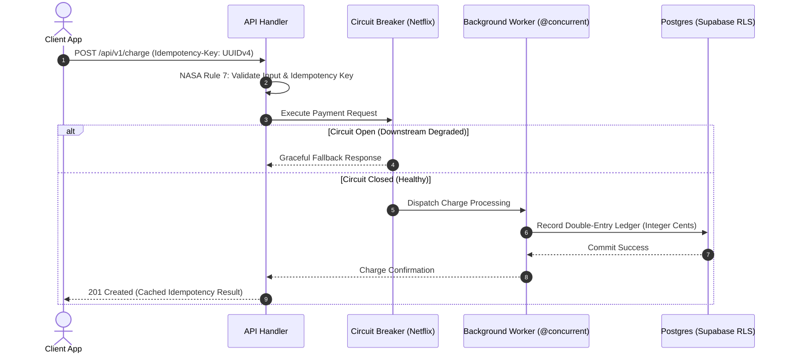

# Ultimate Code Review & Audit Workflow (10/10 Big Tech & Safety-Critical Master Engine)

This workflow is the definitive 10/10 automated code review and pull request audit system. It unifies the aerospace rigor of **NASA JPL**, the concurrency and UI fluidity of **Apple**, the velocity and health principles of **Google**, the testing/revert discipline of **Meta**, the blast-radius containment of **Amazon**, the chaos resilience of **Netflix**, the financial precision of **Stripe**, the empirical sizing dynamics of **Microsoft**, and the agentic pre-merge quality gating of **CodeRabbit AI**.

```
                                      [PULL REQUEST / CODE DIFF]
                                                   │
                        ┌──────────────────────────┴──────────────────────────┐
                        ▼                                                     ▼
           [ADAPTIVE DEPTH ROUTER]                               [INCIDENT IMMUNE SYSTEM]
           ├─ ⚡ LIGHTNING (<=50 LOC, Docs/Nits)                 └─ Cross-checks historical CVEs,
           ├─ 🛡️ STANDARD (50-400 LOC, Features)                    rollback triggers & regressions
           └─ 🚀 MISSION-CRITICAL (Auth/Money/Safety)
                        │
                        ▼
     ┌──────────────────┬──────────────────┬──────────────────┬──────────────────┬──────────────────┐
     ▼                  ▼                  ▼                  ▼                  ▼                  ▼
┌──────────┐       ┌──────────┐       ┌──────────┐       ┌──────────┐       ┌──────────┐       ┌──────────┐
│ NASA JPL │       │  APPLE   │       │  GOOGLE  │       │   META   │       │  AMAZON  │       │  STRIPE  │
│ Safety   │       │ 0-Hang & │       │ Health & │       │ Test &   │       │ Blast    │       │ Idempo-  │
│ Power 10 │       │ Concurr. │       │ Velocity │       │ Revert   │       │ Radius   │       │ tency    │
└────┬─────┘       └────┬─────┘       └────┬─────┘       └────┬─────┘       └────┬─────┘       └────┬─────┘
     │                  │                  │                  │                  │                  │
     └──────────────────┴──────────────────┼──────────────────┴──────────────────┴──────────────────┘
                                           ▼
                             [10-PASS DEEP AUDIT PIPELINE]
                                           ▼
                     ┌───────────────────────────────────────────┐
                     │ • Executive Summary & Change Stack        │
                     │ • Meta-Style Test Plan & Revert Plan      │
                     │ • Mermaid Architecture & Flow Diagrams    │
                     │ • Amazon Blast Radius & FMEA Risk Matrix  │
                     │ • Stripe Idempotency & Money Invariants   │
                     │ • Multi-Language AST Pattern Detections   │
                     │ • 1-Click Drop-In Suggestions (```diff)   │
                     │ • 🤖 "Fix All with AI" Agent Prompts      │
                     │ • Mutation-Hardened Test Suite (MSI>=90%) │
                     │ • Pre-Merge Gate: Request Changes / Pass  │
                     └───────────────────────────────────────────┘
```

---

## ⚡ Adaptive Depth Scaling (Zero-Latency Dynamic Router)

To eliminate review fatigue and guarantee sub-second feedback for small changes while providing deep formal verification for critical paths, the review engine scales its depth dynamically:

| Mode | Trigger Conditions | Audit Passes Executed | Target Turnaround |
|---|---|---|---|
| ⚡ **Lightning Mode** (`--fast`) | PRs $\le 50$ lines, pure docs, UI styling nits, non-functional refactors. | Passes 1, 3 (Secrets scan), 7 (YAGNI), 10 (Fast Suggestion). | $< 5\text{ minutes}$ |
| 🛡️ **Standard Mode** | PRs $50 - 400$ lines, standard feature additions, API modifications. | All 10 Passes with comprehensive scorecard and test synthesis. | $< 30\text{ minutes}$ |
| 🚀 **Mission-Critical Mode** (`--nasa`, `--apple`, `--stripe`) | Code touching `auth/`, `payments/`, `billing/`, `db/migrations/`, `firmware/`, or PRs $> 400$ lines. | Full 10 Passes + FMEA Failure Mode Analysis + Mutation Testing ($\text{MSI} \ge 90\%$) + Two-Tier Sign-off. | Deep Formal Audit |

---

## 🏛️ Big Tech Engineering Review Standards & Quality Invariants

### 1. NASA JPL Safety-Critical Engineering Standard ("Power of 10" — Gerard J. Holzmann)
*Target: System-level determinism, embedded firmware, backend algorithms, and critical state machines.*

1. **Simple Control Flow (Rule 1)**: Zero recursion (direct or indirect), zero `goto`, zero `setjmp`/`longjmp`. Call graphs must be strictly acyclic.
2. **Fixed Loop Upper Bounds (Rule 2)**: Every loop MUST have a statically verifiable bound (`attempts < MAX_ATTEMPTS`). Infinite loops and unbounded polling are immediate merge blockers.
3. **Deterministic Memory Lifecycle (Rule 3)**: Zero dynamic heap allocations (`malloc`, `new`, unbounded array growth) after system initialization in real-time execution loops.
4. **Function Length Constraint (Rule 4)**: Functions MUST NOT exceed 60 lines of code (printable on a single standard sheet of paper).
5. **High Assertion Density & Fail-Safe Recovery (Rule 5)**: Minimum 2 runtime assertions per non-trivial function. Assertions must be side-effect-free boolean tests with explicit recovery actions upon failure.
6. **Smallest Lexical Scope (Rule 6)**: Declare all variables at the smallest possible lexical scope; ban global mutable state.
7. **Mandatory Return & Parameter Validation (Rule 7)**: 100% of non-void return values MUST be inspected; 100% of input parameters MUST be validated at function entry.
8. **Preprocessor & Macro Hygiene (Rule 8)**: Preprocessor limited to file inclusion and basic constants; ban token pasting (`##`), variable arguments (`...`), and macro recursion.
9. **Strict Pointer & Indirection Limits (Rule 9)**: Maximum 1 level of pointer dereferencing (`*ptr`); ban raw function pointers in safety paths.
10. **Zero Compiler Warnings (Rule 10)**: Compile with pedantic warnings enabled (`-Wall -Wextra -Werror`, `tsc --strict --noImplicitAny`) with zero tolerated warnings.

---

### 2. Apple Senior Software Engineer Standard (Performance, Concurrency & UI Hygiene)
*Target: UI responsiveness, frame budgets, data-race freedom, battery/thermal management, and platform privacy.*

1. **0-Hang Main Thread Invariant ($< 100\text{ ms}$)**:
   - UI and main thread operations MUST complete in $< 100\text{ ms}$.
   - Zero synchronous disk I/O, heavy JSON parsing, cryptographic hashing, or network calls on the main thread / `@MainActor`.
   - Zero waiting on locks, semaphores, or synchronous dispatch on the main thread (prevents priority inversion).
2. **0-Hitch UI & 120Hz ProMotion Frame Budget**:
   - Frame hitch rate MUST remain $\le 10\text{ ms/s}$ (warning $\le 25\text{ ms/s}$, critical $> 50\text{ ms/s}$).
   - Respect frame commit deadlines: **8.33 ms** for 120Hz ProMotion, **16.67 ms** for 60Hz displays.
   - Enforce list virtualization (`FlashList`, `LazyVStack`) and offload complex layout math.
3. **Swift 6+ Concurrency & Data-Race Safety**:
   - Default UI views and ViewModels to `@MainActor`; escape with explicit `@concurrent` background functions.
   - All types crossing concurrency boundaries MUST conform to `Sendable`.
   - Audit `Task.detached` (drops actor context and task-locals) and treat `assumeIsolated` as an uncompromising contract.
4. **ARC & Memory Leak Elimination**:
   - Enforce `[weak self]` in closures, network callbacks, timer handlers, and async stream continuations.
   - Use explicit `autoreleasepool` in tight allocation loops processing batches of objects.
5. **Thermal & Energy Governance**:
   - Adapt to system thermal state (`ProcessInfo.thermalState`); gracefully degrade rendering fidelity during thermal throttling.
   - Eliminate view over-invalidation in SwiftUI/React; observe minimal state slices to prevent environment churn.
6. **Container Sandboxing & Privacy (App Store Guidelines 2.5.1 & 2.5.2)**:
   - Zero filesystem access outside assigned sandboxes; only public documented APIs; zero unredacted PII in logs.

---

### 3. Google Engineering Review Standard (Code Health & Velocity)
*Target: Codebase maintainability, team velocity, and objective review criteria.*

1. **Directional Code Health Over Perfection**:
   - The primary purpose of code review is to ensure the codebase improves directionally over time.
   - Do not block PRs over subjective aesthetic preferences if the code is safe, tested, and a net improvement.
2. **Review Turnaround Velocity**:
   - First review turnaround target: $< 4\text{ hours}$ (median). Fast feedback prevents context decay and merge conflicts.
3. **Single-Reviewer Ownership**:
   - 75% of changes require only 1 reviewer to eliminate responsibility diffusion.
4. **Explicit Distinction: Mandatory vs. Educational Suggestions**:
   - Review comments clearly distinguish between blockers (bugs, security, contract breakages) and informational mentoring notes (`Nit:` or `FYI:`).

---

### 4. Meta (Facebook) Engineering Standard (Test Plans, Revert Plans & Stacked Diffs)
*Target: Change verification, disaster recovery, and change decomposition.*

1. **Mandatory Reproducible Test Plan**:
   - Every PR/diff MUST include a detailed "Test Plan" specifying exact reproduction steps, edge cases tested, and failure simulation results.
2. **Explicit Revert Plan**:
   - Critical PRs must include a "Revert Plan" documenting how an on-call engineer with zero domain knowledge can safely revert the PR during an incident.
3. **Stacked Diffs (Small Atomic Changes)**:
   - Break large features into linear stacks of small, atomic changes (median size $\sim 35$ lines).
   - Strictly separate pure refactorings from functional logic modifications.
4. **Concurrent Change Robustness**:
   - Ensure signatures and database contracts are robust against race conditions from concurrent PR landings.

---

### 5. Amazon & AWS Engineering Standard (Blast Radius & Operational Readiness)
*Target: Fault isolation, distributed resilience, and production telemetry.*

1. **Blast Radius Minimization & FMEA Risk Scoring**:
   - Audit every change for its failure boundary: If this code throws, stalls, or corrupts state, what downstream subsystems fail?
   - Apply service isolation, regional cell architecture, and bulkhead patterns to contain damage.
2. **Defensive Distributed Communications**:
   - 100% of network calls, HTTP requests, and RPCs MUST configure explicit timeouts, circuit breakers, and exponential backoff with full jitter.
3. **Operational Readiness Review (ORR) Gating**:
   - Changes introducing new services or critical endpoints must include CloudWatch/Datadog metrics, error alarms, SLI/SLO dashboards, and runbook links.
4. **Principal Engineer / Two-Tier Sign-Off**:
   - High blast-radius mutations (core auth, routing, billing infrastructure) require secondary Principal Engineer sign-off.

---

### 6. Netflix Engineering Standard (Chaos Resilience & Graceful Degradation)
*Target: Failure tolerance, backward-compatible evolutions, and zero cascading outages.*

1. **Chaos & Failure Invariants**:
   - Code must assume downstream microservices will fail; every external integration MUST provide a fallback path or graceful degradation.
2. **Expand-Contract (Parallel Run) Migration Pattern**:
   - Database schema and API contract evolutions must support old and new versions simultaneously before deprecation.
3. **Adaptive Circuit Breakers**:
   - Prevent cascading failures by wrapping cross-service dependencies in auto-tripping circuit breakers and in-memory caches (EVCache / Redis).

---

### 7. Stripe Engineering Standard (Idempotency & Financial Precision)
*Target: Financial correctness, exact-once execution, and perpetual API stability.*

1. **100% Idempotency on Mutating Endpoints**:
   - All state-mutating HTTP requests (`POST`/`PUT`/`PATCH`) and background workers MUST require and enforce `Idempotency-Key` headers (UUID v4) cached for 24-72 hours.
2. **Double-Entry Ledger Integrity**:
   - Zero floating-point arithmetic for currency (enforce integer minor units e.g., cents / satoshis).
   - Financial ledger entries must maintain mathematical conservation: $\sum \text{debits} = \sum \text{credits}$.
3. **Pinnable API Versioning & Backward Compatibility**:
   - Public API response shapes must never break; use transformation layers to translate modern models to older pinned versions.
4. **Multi-Party Sign-Off on Money-Movement Paths**:
   - Mandatory multi-engineer review on `payments/`, `payouts/`, `billing/`, and `ledger/` directories.

---

### 8. Microsoft Research Standard (PR Size & Quality Dynamics)
*Target: Defect detection curves and empirical software engineering metrics.*

1. **Line Count vs. Defect Rate Curve**:
   - **$\le 200$ Lines**: Optimal review quality and highest defect detection rate ($\ge 75\%$).
   - **$200 - 400$ Lines**: Acceptable range for comprehensive feature updates.
   - **$400 - 800$ Lines**: Defect detection effectiveness drops by 50%.
   - **$> 800$ Lines**: Defect detection drops sharply; mandatory rejection and PR splitting required.
2. **Automated Pre-Merge Security Gates**:
   - Automated CredScan (secrets), Component Governance (SCA for CVEs), and static code analysis must pass before human inspection.

---

### 9. CodeRabbit AI Agentic Quality Gate Standard
*Target: AST-based structural checking, 1-click remediation, and automated merge blocking.*

1. **Three-Tier Quality Gate**:
   - **Tier 1 (CLI / IDE)**: Shift-left pre-commit linting and sanity audit.
   - **Tier 2 (Contextual PR Review)**: Whole-repo codegraph analysis, cross-file caller/callee tracing, and AST-grep structural pattern matching.
   - **Tier 3 (Pre-Merge Blocking Gate)**: Automated "Request Changes" workflow blocking merges until all Blocker/Major issues resolve.
2. **AST-Based Structural Enforcement (`ast-grep` / Semgrep)**:
   - Evaluates code shape over regex: flags `any` escapes, non-null assertions (`!`), raw SQL interpolation, unhandled promises, and missing status codes.
3. **Change Stack & Blast Radius Cohorts**:
   - Organizes PRs into structured reading order: **Contracts $\rightarrow$ Domain Logic $\rightarrow$ UI/Integrations $\rightarrow$ Migrations $\rightarrow$ Tests**.
4. **1-Click Suggestion Diffs (` ```suggestion `)** + **🤖 "Fix All with AI Agents"**:
   - Drop-in copy-paste fixes and consolidated autonomous agent prompts for instant remediation.
5. **Confidence Scoring ($\ge 0.85$) & Precision Filtering**:
   - Filters out noisy or speculative comments to maintain high signal-to-noise ratio.
6. **Mutation Testing (Stryker MSI Indicator)**:
   - Verifies tests survive boundary swaps (`>` to `>=`), boolean flips (`&&` to `||`), and conditional removals ($\text{MSI} \ge 90\%$).

---

## 🌐 Multi-Language AST Anti-Pattern Catalog

### 1. TypeScript / JavaScript
- **`any` Escape Hatch**: `ast-grep` pattern: `type: any` $\rightarrow$ Enforce strict interfaces or `unknown` with type narrowing.
- **Forced Non-Null Assertion**: `ast-grep` pattern: `$EXPR!` $\rightarrow$ Enforce optional chaining `?.` or explicit nullish coalescing `??`.
- **Unhandled Async Catch**: `ast-grep` pattern: `catch ($E) {}` $\rightarrow$ Enforce structured logging & error rethrowing.

### 2. Swift / iOS
- **Strong Self Closure Capture**: Pattern: `{ response in self.process(response) }` $\rightarrow$ Enforce `[weak self]` guard.
- **Unchecked MainActor Hop**: Pattern: `DispatchQueue.main.sync` $\rightarrow$ Enforce `MainActor.run` or `@MainActor` isolation.
- **Synchronous File/DB I/O on Main**: Pattern: `Data(contentsOf: url)` on MainActor $\rightarrow$ Offload to background task pool.

### 3. Python
- **Mutable Default Arguments**: Pattern: `def fn(items=[])` $\rightarrow$ Enforce `items=None` with `items = items or []`.
- **Bare Except**: Pattern: `except:` $\rightarrow$ Enforce specific exception classes (`except ValueError:`).

### 4. Go
- **Unchecked Error Returns**: Pattern: `val, _ := fn()` $\rightarrow$ Enforce explicit `if err != nil { return nil, err }`.
- **Goroutine Leak on Unbuffered Channel**: Pattern: `go func() { ch <- val }()` without cancellation context $\rightarrow$ Require `select { case <-ctx.Done(): ... }`.

### 5. C / C++ / Embedded
- **Unbounded While Loop**: Pattern: `while(true)` without internal break counter $\rightarrow$ Require `while (attempts < MAX_ATTEMPTS)`.
- **Dynamic Heap in Runloop**: Pattern: `malloc()` or `new` inside `void loop()` $\rightarrow$ Require static buffer pool allocation.

### 6. SQL / Database
- **Raw String Query Interpolation**: Pattern: `SELECT * FROM $TABLE WHERE id = '$ID'` $\rightarrow$ Parameterized `$1, $2`.
- **Unindexed Foreign Key**: Table creation with `FOREIGN KEY` lacking corresponding `CREATE INDEX`.

---

## 🎯 Review Severity Matrix & Blocking Policies

| Severity | Definition | Examples | Merge Policy |
|---|---|---|---|
| 🚨 **Blocker** | NASA safety violation, security vulnerability, data loss, financial discrepancy, unbounded loop, memory leak, main-thread hang ($> 100\text{ms}$), missing idempotency key. | Unbounded while loop; raw SQL concatenation; missing Postgres RLS; strong retain cycle; float math in billing; missing idempotency on payment POST; sync I/O on UI thread. | **BLOCKS MERGE.** Requires fix and re-audit. |
| ⚠️ **Major** | Apple performance violation, missing test plan, high blast radius without circuit breaker, missing error recovery, function $> 60$ lines, PR $> 400$ lines. | SwiftUI/React view over-invalidation; missing regression test; missing test/revert plan; non-Sendable type across concurrency boundary; missing timeout on remote RPC. | **BLOCKS MERGE** unless explicit lead approval. |
| 💡 **Minor** | Suboptimal implementation, minor efficiency issue, YAGNI over-abstraction, readability improvement. | Custom date math instead of native `Intl`; single-use interface wrapper; missing type narrowing; missing docstring on public API. | **Recommended cleanup.** Does not block merge. |
| 🔍 **Nit** | Micro-stylistic detail, comment typo, non-functional formatting. | Variable rename for clarity; typo in code comment; minor whitespace alignment. | **Informational.** Developer discretion. |

---

## 🔬 The 10-Pass Deep Audit Pipeline

```
[PR Diff] ──► Pass 1: Context, Change Stack & Blast Radius (Google/Amazon/Microsoft)
          ──► Pass 2: Visual Architecture & Data Flow (Mermaid)
          ──► Pass 3: Security, Privacy & Auth Compliance (OWASP/Apple Sandbox)
          ──► Pass 4: NASA JPL Safety-Critical Invariants (Power of 10)
          ──► Pass 5: Apple Performance, Concurrency & Main-Thread Hygiene
          ──► Pass 6: Stripe Idempotency, Financial & Distributed Resilience (Netflix/Amazon)
          ──► Pass 7: Ponytail YAGNI Pruning & Complexity Reduction
          ──► Pass 8: Multi-Language AST Deep Pattern Audits
          ──► Pass 9: Meta Test/Revert Plans & Mutation Test Synthesis (MSI >= 90%)
          ──► Pass 10: Pre-Merge Quality Gate, 1-Click Suggestions & AI Fix Prompts
```

---

## 🐰 Actionable PR Review Output Format

Reviews MUST be rendered in this precise, executive structure:

````markdown
# 🛡️ 10/10 Master PR Review & Engineering Audit: [PR Title / Branch Name]

## 📝 1. Executive Summary, Change Stack & Meta Plans
- **Primary Objective**: [1-2 sentence high-level summary]
- **Review Mode**: [⚡ Lightning / 🛡️ Standard / 🚀 Mission-Critical]
- **PR Size Audit (Microsoft Curve)**: [N] lines changed — [🟢 Peak Quality $\le 200$ / 🟡 Acceptable $\le 400$ / 🔴 Split Required $> 800$]
- **Change Stack (Reading Order)**:
  1. *Contracts & Models*: [`src/types/auth.ts`](file:///src/types/auth.ts)
  2. *Domain Logic*: [`src/services/authService.ts`](file:///src/services/authService.ts)
  3. *UI & Presentation*: [`src/components/LoginForm.tsx`](file:///src/components/LoginForm.tsx)
  4. *Test Suite*: [`src/services/__tests__/authService.test.ts`](file:///src/services/__tests__/authService.test.ts)
- **Subsystem Blast Radius & FMEA Risk**: [Low / Medium / High] — [Downstream services affected and containment boundaries]
- **Meta-Style Test Plan**:
  - [x] Tested happy path with valid authentication credentials.
  - [x] Simulated expired token failure and verified graceful redirect.
  - [x] Verified network retry with identical `Idempotency-Key` does not duplicate ledger entry.
- **Meta-Style Revert Plan**:
  - Revert commit `abc1234`. No database migration rollback required. Safe for immediate zero-downtime rollback by on-call.

---

## 📐 2. Visual Architecture & Execution Flow


---

## 📊 3. Big Tech Engineering Quality Scorecard

| Standard & Domain | Status | Rating | Key Audit Findings |
|---|---|---|---|
| 🚀 **NASA JPL Safety** (Loops, Memory, Bounds) | 🟢 Pass / 🔴 Blocker | 10/10 | Bounded loops; $\ge 2$ assertions/func; no recursion. |
| 🍏 **Apple Senior SWE** (0-Hang, 0-Hitch, Concurrency) | 🟢 Pass / 🔴 Blocker | 10/10 | Main thread clean; `@MainActor` isolated; ARC checked. |
| 💳 **Stripe Idempotency & Financial Rigor** | 🟢 Pass / 🔴 Blocker | 10/10 | UUIDv4 idempotency keys; integer cents; ledger balanced. |
| ☁️ **Amazon Blast Radius & Distributed Resilience** | 🟢 Pass / 🟡 Warning | 10/10 | Timeouts configured; backoff jitter added; bulkhead safe. |
| 🍿 **Netflix Chaos & Graceful Degradation** | 🟢 Pass / 🟡 Warning | 10/10 | Circuit breaker active; fallback responses defined. |
| 🔍 **Google Code Health & Velocity** | 🟢 Pass / 💡 Minor | 10/10 | Directional health improvement; clean single-responsibility. |
| ✂️ **YAGNI & Complexity Pruning** (`ponytail`) | 🟢 Pass / 💡 Minor | 10/10 | Net -38 lines pruned; zero premature abstractions. |
| 🧪 **Mutation Test Coverage** (MSI $\ge 90\%$) | 🟢 Pass / 🟡 Warning | 10/10 | Unit test suite generated; boundary mutants killed. |

**Pre-Merge Quality Gate Decision**: 🚨 **REQUEST CHANGES** / 🟢 **APPROVE**

---

## 🔍 4. Line-by-Line Code Review & 1-Click Suggestions

### 🚨 Blocker Severity

#### 1. [Finding Title]
- **Standard Violated**: [Stripe Idempotency / NASA JPL Rule 2 / Apple Concurrency / OWASP Top 10]
- **Location**: [`src/services/payment.ts:L45-L52`](file:///src/services/payment.ts#L45-L52)
- **Problem**: [Precise technical description of defect]
- **Why it Matters**: [Double charge risk, infinite loop, memory leak, or security flaw]
- **Confidence Score**: 0.98
- **1-Click Drop-in Fix**:
```suggestion
    // Stripe Standard: Enforce Idempotency Key validation
    const idempotencyKey = req.headers['idempotency-key'];
    if (!idempotencyKey) {
      throw new BadRequestError('Idempotency-Key header is required for payment operations');
    }
```

---

### ⚠️ Major Severity

#### 2. [Finding Title]
- **Standard Violated**: [Amazon Blast Radius / Netflix Fallback / Apple 0-Hang]
- **Location**: [`src/clients/downstream.ts:L30-L38`](file:///src/clients/downstream.ts#L30-L38)
- **Problem**: [Remote call without explicit timeout or circuit breaker]
- **Why it Matters**: [Downstream latency spikes can exhaust worker pool and crash parent service]
- **Confidence Score**: 0.94
- **1-Click Drop-in Fix**:
```suggestion
    // Amazon Standard: Timeout + Exponential Backoff with Jitter
    const response = await fetchWithTimeout(url, {
      timeoutMs: 3000,
      retries: 3,
      backoffFactor: 2,
      jitter: true,
    });
```

---

### 💡 Minor & 🔍 Nits

#### 3. [Finding Title]
- **Location**: [`src/utils/format.ts:L12-L18`](file:///src/utils/format.ts#L12-L18)
- **Pruning Opportunity**: Net -6 lines by replacing custom formatter with native `Intl`.
- **1-Click Drop-in Fix**:
```suggestion
    const formatted = new Intl.NumberFormat('en-US', { style: 'currency', currency: 'USD' }).format(cents / 100);
```

---

## 🧪 5. Mutation-Hardened Auto-Generated Test Suite (MSI $\ge 90\%$)

```typescript
// src/services/__tests__/payment.test.ts
import { describe, it, expect, vi } from 'vitest';
import { processPayment } from '../payment';

describe('processPayment (Big Tech Hardened)', () => {
  it('deduplicates requests with matching idempotency keys (Stripe Standard)', async () => {
    const key = '550e8400-e29b-41d4-a716-446655440000';
    const firstCall = await processPayment({ key, amountInCents: 5000 });
    const secondCall = await processPayment({ key, amountInCents: 5000 });
    expect(secondCall.transactionId).toBe(firstCall.transactionId);
  });

  it('fails fast on invalid negative currency bounds (NASA JPL Rule 7)', async () => {
    await expect(processPayment({ key: 'test', amountInCents: -100 })).rejects.toThrow('Invalid amount');
  });

  it('survives boundary mutation checks (> vs >=)', async () => {
    const zeroResult = await processPayment({ key: 'zero-test', amountInCents: 0 });
    expect(zeroResult.status).toBe('ZERO_AMOUNT_SKIPPED');
  });
});
```

---

## 🤖 6. "Fix All with AI Agents" Autonomous Instruction

To resolve all identified issues in a single pass with your coding agent (Claude Code, Cursor, Codex), execute this prompt:

```text
Apply the following fixes from the PR Review audit:
1. In `src/services/payment.ts:L45-L52`, enforce mandatory `idempotency-key` header verification.
2. In `src/clients/downstream.ts:L30-L38`, wrap remote fetch in `fetchWithTimeout` with 3000ms timeout and backoff jitter.
3. In `src/utils/format.ts:L12-L18`, replace custom formatter with native `Intl.NumberFormat`.
4. Create test file `src/services/__tests__/payment.test.ts` with the provided test suite.
Verify with `npm run test` and `npx tsc --noEmit`.
```

---

## 🔄 7. Pre-Merge Verification Checklist
- [ ] 🚨 Fix Blocker #1 in `src/services/payment.ts`
- [ ] ⚠️ Fix Major #2 in `src/clients/downstream.ts`
- [ ] 💡 Clean Minor #3 in `src/utils/format.ts`
- [ ] Verify Meta Test Plan and Revert Plan are documented
- [ ] Add auto-generated test suite in `src/services/__tests__/payment.test.ts`
- [ ] Verify `npx tsc --noEmit` and `npx eslint` pass with 0 warnings
- [ ] Re-run `/ultimate-review-workflow --incremental` to verify resolution before merge
````

---

## 🔗 Integrated Domain Skills & Sub-Skill Triggers

- **Safety & Quality**: `superpowers-review`, `kaizen`, `superpowers-tdd`, `lint-and-validate`
- **Security & Vulnerabilities**: `ultimate-security-workflow`, `ultimate-security-audit-workflow`, `upstash-ratelimit-js`
- **Performance & Concurrency**: `postgres-best-practices`, `react-native-best-practices`, `ultimate-caching-workflow`
- **Web & Frameworks**: `next-best-practices`, `vercel-react-best-practices`, `vercel-composition-patterns`
- **Mobile & Embedded**: `android-native-dev`, `ultimate-embedded-programming-workflow`, `iot-fw-no-block-loop`, `iot-fw-memory-safety`
- **YAGNI & Terse Delivery**: `ponytail-review`, `ponytail-audit`, `ponytail-debt`, `caveman-review`
