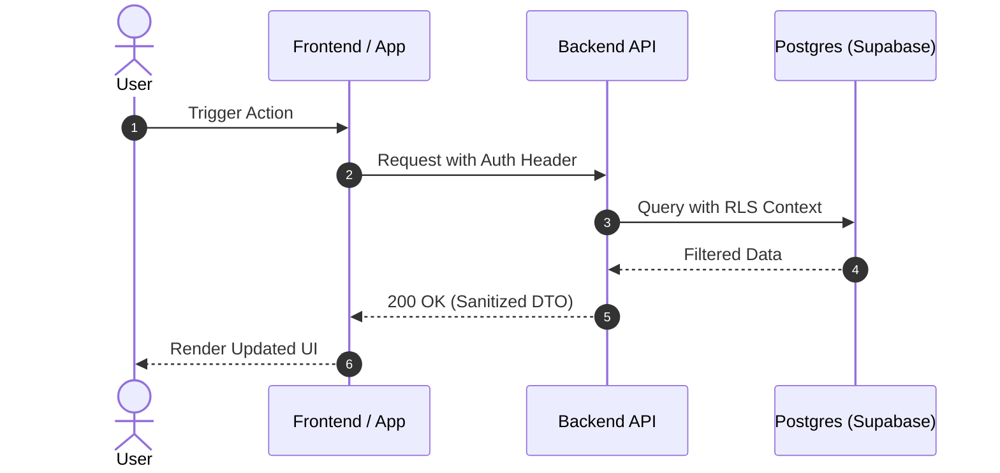

# Ultimate Code Review & Audit Workflow (CodeRabbit-Style AI PR Reviewer)

This workflow drives comprehensive, systematic code quality audits and pull request reviews matching the capabilities of an enterprise AI PR reviewer like CodeRabbit. It generates executive summaries, visual sequence/flowchart diagrams (Mermaid), 1-click copy-paste GitHub diff suggestions (` ```suggestion `), automated unit test suites for modified logic, deep code-smell & security vulnerability checks, and multi-pass audits while strictly pruning over-engineering or speculative complexity (`ponytail` YAGNI).

---

## CodeRabbit Review Traits & Emulation Directives

This workflow enables the AI assistant to natively emulate all core review traits and methodologies of CodeRabbit AI without requiring any external CodeRabbit installation, service, or integration:

### Core Review Traits to Emulate

1. **Contextual Subsystem Intelligence**: The reviewer analyzes full workspace context, imported type definitions, database schemas, and API contracts—not just isolated diff lines—to ensure changes do not break downstream dependents.
2. **High Signal-to-Noise Ratio**: Prioritizes actual bugs, security vulnerabilities, memory leaks, performance bottlenecks, and architectural flaws over trivial nitpicks. Categorizes all feedback strictly into Blocker, Major, Minor, and Nit severity buckets.
3. **1-Click Copy-Paste Fixes**: Every reported issue must provide a drop-in replacement code block formatted in standard GitHub ` ```suggestion ` syntax so developers can apply fixes with one click.
4. **Visual Architecture Diagrams**: Automatically generates visual Mermaid sequence or flowchart diagrams for PRs introducing multi-step execution flows, API changes, or state transitions.
5. **Proactive Unit Test Generation**: Automatically generates runnable unit/integration test suites (Jest/Vitest/TDD) covering untested changed code paths.
6. **Incremental Review Awareness**: Supports incremental diff auditing (`/incremental`) to review changes made since the previous review pass.
7. **Relentless YAGNI & Security Auditing**: Combines OWASP Top 10 security scanning (SQLi, XSS, RLS, Secret Leaks) with `ponytail` YAGNI complexity pruning (eliminating single-use abstractions and over-engineering).

---

## Iron Laws of Code Review

1. **Safety First.** Any code touching security, authentication, authorization (Postgres RLS policies), data mutations, financial logic, or hardware controls must undergo rigorous double-check verification. A security vulnerability or risk of data corruption is an immediate blocking review failure.
2. **Prune Speculative Complexity.** If the code implements an abstraction, class, helper, or generic interface for a "future feature" not requested in current requirements, reject it. Apply `ponytail` YAGNI relentlessly.
3. **Zero Unhandled Errors.** Empty catch blocks or silent failures are immediate blockers. Every exception must be handled, logged with structured context, or propagated intentionally.
4. **Demand & Generate Test Coverage.** Logic changes and bug fixes must include unit or integration tests verifying the behavior. If tests are missing, identify uncovered code paths and generate tests automatically.
5. **Constructive & 1-Click Actionable Feedback.** Review comments must state: (1) line location & severity, (2) root problem, (3) rationale/impact, and (4) a concrete ` ```suggestion ` code block to fix it.
6. **Zero Lint and Type Errors.** Code must compile cleanly and pass type checks before review completion. Never approve code with active TS errors or compiler warnings.
7. **No Hardcoded Configurations or Credentials.** Environment variables must be validated at startup. Fail fast on misconfigured runtime settings or exposed secrets.
8. **Directional Code Health Improvement (Google Standard).** Approve changes that clearly improve overall code health. Do not block PRs over subjective preferences or perfectionism if the code is safe, tested, and an net improvement.
9. **Strict Line Budget & Size Bounds (Microsoft Standard).** Ideal PR size is $\le 200$ lines of code. PRs between 200–400 lines are acceptable; PRs $> 400$ lines trigger an automatic splitting recommendation; PRs $> 800$ lines MUST be rejected and broken into smaller logical PRs to preserve review quality.
10. **Observable & Enforceable Quality Gates (CodeRabbit Standard).** Review instructions and checks MUST be specific, measurable, and path-scoped (reading workspace `AGENTS.md`, `.cursorrules`, `CLAUDE.md`, `GEMINI.md`). Vague feedback like "make it cleaner" is banned.

---

## Industry Code Review & Quality Assurance Standards (Google, Meta, Microsoft, CodeRabbit)

### 1. Google Engineering Review Core Principles
- **Code Health Over Perfection:** The goal of code review is NOT to reach perfection before merging; it is to ensure the codebase improves directionally over time.
- **Velocity First:** Reviews MUST be completed promptly (< 4 hours median turnaround). High-velocity, small PRs prevent developer blocking and context degradation.
- **Single-Reviewer Efficiency:** 75% of changes at Google require only 1 reviewer to eliminate "responsibility diffusion" (where multiple reviewers assume others checked the details).

### 2. Microsoft Research PR Size & Reviewer Matrix
- **Line Count vs. Defect Rate:**
  - **< 200 lines:** Peak review quality and highest bug detection rate.
  - **200–400 lines:** Acceptable range for feature changes.
  - **400–800 lines:** Review effectiveness drops by 50%.
  - **> 800 lines:** Defect detection drops sharply; mandatory split required.
- **Nudgebot Automated Reminders:** Automated ping/follow-ups reduce review latency by ~7% with 73% positive developer satisfaction.

### 3. CodeRabbit Pre-Merge Quality Gate Architecture
- **Measurable Rule Enforcer:**
  - Vague instructions (*"write clean code"*) fail.
  - Measurable constraints (*"functions MUST NOT exceed 40 lines", "all async calls MUST wrap in try/catch"*) succeed.
- **Path-Scoped Custom Checks (`.coderabbit.yaml`):**
  - Path-specific rules for controllers, DB migrations, and API contracts.
  - Graduated enforcement: **Warning Mode** for new rules $\rightarrow$ **Error Mode** for strict merge blocking.
- **Guideline Auto-Detection:**
  - Automatically loads and enforces `AGENTS.md`, `.cursorrules`, `CLAUDE.md`, `GEMINI.md` across directory trees.
- **Multi-Repository Cross-Boundary Analysis:**
  - Automatically analyzes cross-repo dependencies, API breaking changes, type mismatches, and contract drift across linked repositories (`owner/repo#123` or `@branch-name`).
- **Continuous Repository-Wide SAST & SCA Integration:**
  - Ingests check annotations from top SAST and SCA tools (Semgrep, SonarCloud, Codacy, Snyk) directly into PR review threads, enforcing daily CVE database rescans.

### 4. Uber uReview Multi-Stage AI Assistant & Confidence Filtering Engine
- **Pluggable Multi-Assistant Review Pipeline:**
  1. **Standard Assistant:** Detects functional logic bugs, off-by-one bounds, unhandled nulls, and race conditions.
  2. **Best Practices Assistant:** Enforces semantic conventions checkable only via LLM (e.g. semantic `Time` objects over raw integer primitives, explicit locale parameters).
  3. **AppSec Assistant:** Targets application-level vulnerabilities, OWASP Top 10 vectors, and dataflow leaks.
- **Post-Processing & High-Precision Filter:**
  - Secondary grading prompt computes a **Confidence Score (0.0–1.0)** for every review comment.
  - Semantic similarity deduplication merges overlapping suggestions.
  - Categories with historically high false-positive rates are automatically suppressed to preserve developer trust (> 75% usefulness rate invariant).

### 5. AST-Based Structural Pattern Analysis (Uber NEAL & Semgrep Standard)
- **Syntax-Tree Pattern Matching Over Fragile Regex:**
  - Evaluate code structures via Abstract Syntax Tree (AST) node matching instead of line regex.
  - **Forbidden Patterns:**
    - Forced unwrapping / unsafe casts (`as any`, `!`).
    - Synchronous I/O or expensive calls executed inside constructors or initializers.
    - `String.toLowerCase()` or `String.toUpperCase()` invoked without an explicit `Locale` parameter (`Locale.US`).
    - Raw string formatting used for SQL execution or shell commands.

### 6. Mutation Testing & Test Reliability Audit (Stryker & Infection Standard)
- **Mutation Score Indicator (MSI):**
  $$\text{MSI} = \frac{\text{Killed Mutants}}{\text{Total Mutants}} \times 100\%$$
- **Mutation Verification Rules:**
  - Code coverage shows which lines executed; mutation testing verifies whether test assertions actually check logic.
  - Test suites MUST kill mutants introduced by:
    - Relational boundary swaps (`>` mutated to `>=`, `<` mutated to `<=`).
    - Logical operator flips (`&&` mutated to `||`).
    - Conditional removals (`if (condition)` mutated to `if (true)` or `if (false)`).
    - Return value mutations (`return val` mutated to `return null` or `return void`).

### 7. Code Provenance & Chain of Custody Audit (Stripe & Uber Standard)
- **Immutable Code Lineage Checks:**
  - Verify every landed commit carries cryptographic identity attestations (signed commits).
  - Enforce multi-party code review on sensitive paths (`auth/`, `payments/`, `security/`, `db/migrations/`).
  - Run Software Composition Analysis (SCA) on all new 3rd-party dependencies before merge.

### 8. OWASP Source-to-Sink Dataflow Security Engine
- **Inter-Functional Dataflow Tracing:**
  - Track user-controlled inputs (**Sources**: `req.body`, `req.params`, `searchParams`, `headers`) through execution paths down to sensitive operations (**Sinks**: `db.query`, `eval`, `exec`, `dangerouslySetInnerHTML`, `res.redirect`).
  - Flag any path where a **Source** reaches a **Sink** without an explicit boundary sanitizer or parameterized statement.

---

## Code Review Rubric & Severity Matrix

### Severity Levels

| Severity | Definition | Examples | Required Action |
|---|---|---|---|
| 🚨 **Blocker** | Critical defect, security flaw, data loss risk, memory leak, or crash condition. | Unparameterized SQL; missing RLS policy; infinite render loop; hardcoded API keys; blocking main thread loop. | **Must be fixed before merging.** |
| ⚠️ **Major** | Missing tests, architectural violation, poor API contract design, high complexity. | Large UI component without breakdown; missing tests for core logic; custom date formatter replacing standard API. | **Strong recommendation to fix before merge.** |
| 💡 **Minor** | Inefficient implementation, readability improvements, minor styling issues. | Unnecessary helper wrapper; minor layout shift; missing type safety on non-critical return types. | **Highly recommended cleanup.** |
| 🔍 **Nit** | Micro-stylistic tweaks, typos in comments, or trivial formatting preferences. | Typos in comments; variable rename for clarity; minor spacing preference. | **Informational; does not block merge.** |

---

### Evaluation Rubric

| Category | High Quality | Low Quality (Flag These) |
|---|---|---|
| **Correctness** | Validates boundaries; handles empty/null/undefined; checks types strictly. | Silently ignores failures; off-by-one errors; implicit casting; unhandled promises. |
| **Complexity** | Short functions; shallow nesting; composition patterns; minimal abstractions. | Deeply nested conditionals; giant "god" files; redundant layers of abstractions. |
| **Security** | Sanitizes user inputs; parameterizes SQL queries; checks RLS; hides secrets in env. | Raw SQL interpolation; client-side security checks; hardcoded API keys; raw eval/shell. |
| **Performance** | Batch fetches data; lazy-loads large assets; indexes join columns; avoids re-renders. | N+1 queries; blocking main-thread operations; duplicate state in React; unindexed lookups. |
| **Testing** | Focuses on behavior; covers edge cases and failure paths; deterministic runs. | Happy-path only; brittle implementation assertions; zero tests for logic modifications. |
| **UX & Design** | Fluid motion; layout stability; WCAG contrast; safe touch targets; clean skeletons. | Full-screen spinners; layout shifts; unstyled elements; custom scroll hijacking. |

---

## The 8-Pass Deep Audit Pipeline

### Pass 1: Context Triage & Executive Summary
*   **Sub-skills:** `superpowers-review`, `concise-planning`
*   **MCP Tools:** `sequential-thinking/sequentialthinking`
*   **Action:**
    1. Understand the PR's purpose: read the ticket/PR description and match it against acceptance criteria.
    2. Identify the modified boundaries: does it touch database schemas, API contracts, public endpoints, or auth logic?
    3. Run a quick count of changed files and lines to assess review complexity.
    4. Run `sequentialthinking` to map out how changes in one subsystem ripple into dependent subsystems.

### Pass 2: Visual Architecture & Data Flow Diagramming (Mermaid)
*   **Action:**
    1. Identify complex logic pathways, state machines, API interactions, or multi-service request flows modified in the PR.
    2. Render a clean **Mermaid Sequence Diagram** or **Flowchart** visualizing the updated lifecycle, data transformation, or execution flow.
    3. Ensure diagram labels are concise and use valid Mermaid syntax.

### Pass 3: Security, Privacy & Auth Compliance Audit
*   **Sub-skills:** `ultimate-security-workflow`, `ultimate-security-audit-workflow`
*   **Action:**
    1. **SQL Injection Check:** Ensure no string concats, template literals, or dynamic strings are executed as queries.
    2. **Authorization Enforcement:** Confirm role-based permissions are enforced at the backend/database layer (e.g. Postgres RLS), not just hidden in the frontend UI.
    3. **Input Sanitization:** Check for XSS vectors. All client input must be sanitized before storing or rendering raw HTML.
    4. **Secrets Leaks:** Scan files for hardcoded API keys, private tokens, passwords, or credentials. Everything must load from environment variables.

### Pass 4: Correctness, Logic Integrity & Boundary Safety Audit
*   **Sub-skills:** `superpowers-review`, `systematic-debugging`
*   **Action:**
    1. Scan modified functions for logical flaws. Verify:
       *   **Boundary conditions:** Empty inputs, max limits, arrays of size 0 or 1.
       *   **Null / Undefined:** Safe navigation (`?.`) or explicit guard clauses (`??`).
       *   **Error Handling:** Ensure catch blocks don't swallow errors; trace if exceptions propagate safely.
       *   **Async Operations:** Unhandled promise rejections, missing `await` keywords, or concurrent operations causing race conditions.
    2. Review React component trees using `vercel-react-best-practices` and `next-best-practices` (e.g., RSC/Client split, correct hooks dependencies, zero layout shifts).

### Pass 5: Complexity Pruning & YAGNI Hunt (`ponytail` Review)
*   **Sub-skills:** `ponytail-review`, `ponytail-audit`, `ponytail-debt`, `ponytail`, `kaizen`, `composition-patterns`
*   **Action:**
    1. Apply `ponytail-review` to hunt down over-engineering:
       *   Identify generic interfaces implemented by only a single class.
       *   Flag wrapper components or utility layers that only delegate calls without adding value.
       *   Scan for configuration objects prepared for "future use-cases."
    2. **Platform Replacement Check:** Find custom logic that can be replaced with standard library features or native APIs:
       *   *Example:* Custom date math replaced with native `Intl` or simple JS date operations.
       *   *Example:* Custom state management replaced with React Context or compound components using `vercel-composition-patterns`.
    3. **Line Reduction Metric:** Calculate and propose simplification metrics:
       `Pruning Opportunity: Net -<N> lines by removing [abstraction] and inlining logic.`

### Pass 6: Performance, Memory & Resource Safety
*   **Sub-skills:** `postgres-best-practices`, `react-native-best-practices`, `ultimate-caching-workflow`, `upstash-ratelimit-js`
*   **Action:**
    1. **Database performance:** Ensure foreign keys and columns in `WHERE` / `ORDER BY` / `JOIN` statements are indexed.
    2. **Avoid N+1 queries:** Propose joins or DataLoader-style batch fetching instead of querying inside loops.
    3. **React Performance:** Verify heavy computations are memoized using `useMemo`. Check that state isn't unnecessarily duplicated, triggering render storms.
    4. **Mobile Performance:** Check that react-native animations execute on the UI thread using Reanimated. Avoid blocking the JS thread with heavy sync calculations.
    5. **Rate Limiting:** Ensure heavy resource endpoints are rate-limited using `upstash-ratelimit-js`.

### Pass 7: Automated Test Assessment & Unit Test Generation
*   **Sub-skills:** `superpowers-tdd`, `ultimate-testing-workflow`
*   **Action:**
    1. Review the accompanying test files:
       *   Are there tests for the new/modified logic?
       *   Do tests check both happy paths and failure conditions?
       *   Are mock boundaries placed correctly (e.g., mocking external APIs, not database internals)?
       *   Are tests deterministic, or do they rely on system time/random values?
    2. **Auto-Generate Unit Tests:** Produce complete, runnable test snippets (using Jest, Vitest, or framework equivalent) covering happy paths, edge cases, and failure modes for any untested functions modified in the diff.

### Pass 8: Tech-Stack Checklists & CodeRabbit Formatting
*   **Sub-skills:** `caveman-review`, `lint-and-validate`
*   **Action:**
    1. Run technology-specific checklist audits.
    2. Format findings using CodeRabbit 1-click ` ```suggestion ` blocks.
    3. Keep natural language feedback structured, executive, and direct.
    4. Run `lint-and-validate` to ensure there are zero type or lint errors before outputting review.

---

## Detailed Technology Checklists

### 1. Web, React & Next.js
*   [ ] **Server vs. Client Components:** Are React Server Components (RSC) utilized by default? Are Client Components (`"use client"`) only introduced at interactive leaves?
*   [ ] **Hydration Warnings:** Are dynamic values (e.g., dates, locales, local storage) wrapped in client-only checks or dynamic imports to avoid hydration mismatches?
*   [ ] **Metadata:** Does the page use `generateMetadata` correctly?
*   [ ] **Image Optimization:** Are images utilizing the next-gen `<Image>` tag with explicit sizes to prevent CLS?
*   [ ] **Effect Cleanup:** Do all effects return cleanup functions (e.g., `clearInterval`, event listener removals, subscription cancellations)?

### 2. Mobile (React Native & Android)
*   [ ] **UI Thread Animation:** Are all animations delegated to the native UI thread (e.g., using `useNativeDriver: true` or Reanimated)?
*   [ ] **List Rendering:** Are large lists rendered via virtualized wrappers (e.g. `FlashList` or `FlatList`)?
*   [ ] **Memory Management:** Are event handlers properly cleaned up in native modules?
*   [ ] **Safe Areas:** Does the UI wrap content in safe area providers to prevent notch overlap?
*   [ ] **Ref Marker Animation:** Are live GPS coordinates updated via component `ref` methods rather than triggering 60 FPS React state re-renders?

### 3. Database (Postgres & Supabase)
*   [ ] **RLS Security:** Is Row Level Security (RLS) enabled on all new tables containing user data?
*   [ ] **Index Coverage:** Are foreign keys, join keys, and filter fields fully indexed?
*   [ ] **Explicit Columns:** Does the code avoid `SELECT *` in favor of defined fields?
*   [ ] **Constraint-driven logic:** Are data boundaries secured via `CHECK` or `FOREIGN KEY` constraints?

### 4. Security & Authentication
*   [ ] **Input Escaping:** Are inputs fully escaped to prevent XSS?
*   [ ] **CSRF Protection:** Are API routes secured against Cross-Site Request Forgery?
*   [ ] **Secure Cookies:** Are cookies containing JWTs or session tokens marked `HttpOnly`, `Secure`, and `SameSite`?
*   [ ] **Secrets Isolation:** No private credentials hardcoded or exposed to the frontend browser context.

### 5. Embedded / Hardware Firmware (ESP32 / C++)
*   [ ] **No-Block Loop:** Is the main `loop()` strictly free of `delay()` calls? Are state machines driven by `millis()` checks?
*   [ ] **Heap Safety:** Is standard `String` dynamic allocation avoided in continuous loops in favor of fixed `char[]` stack buffers and `snprintf`?
*   [ ] **Actuator Protection:** Do solenoids and motors have hard-coded timer cutoffs (e.g. 5000ms max activation) to prevent thermal overload?
*   [ ] **Photo-First Invariant:** Is photo capture completed before solenoid unlock triggers?

---

## Code Smells & Refactoring Patterns

### 1. Boolean Flag Proliferation
*   **The Smell:** A function or component accepting multiple boolean flags, leading to exponential combination complexities.
*   **Bad Code:**
    ```typescript
    interface ButtonProps {
      isPrimary?: boolean;
      isSecondary?: boolean;
      isDanger?: boolean;
      isWarning?: boolean;
      isSuccess?: boolean;
    }
    ```
*   **Good Code:**
    ```typescript
    interface ButtonProps {
      variant?: 'primary' | 'secondary' | 'danger' | 'warning' | 'success';
    }
    ```

### 2. Nesting Depth (Arrow Anti-Pattern)
*   **The Smell:** Nested loops and conditionals that drift horizontally, making the logic difficult to trace.
*   **Bad Code:**
    ```typescript
    function processUser(user) {
      if (user) {
        if (user.isActive) {
          if (user.permissions) {
            if (user.permissions.includes('admin')) {
              // logic here
            }
          }
        }
      }
    }
    ```
*   **Good Code:**
    ```typescript
    function processUser(user) {
      if (!user || !user.isActive) return;
      if (!user.permissions?.includes('admin')) return;
      
      // logic here
    }
    ```

### 3. Missing Dependency Array Items
*   **The Smell:** React hooks (`useEffect`, `useCallback`, `useMemo`) that list empty dependencies when utilizing outer-scope mutable variables.
*   **Bad Code:**
    ```typescript
    const fetchData = useCallback(() => {
      console.log(userId);
    }, []); // userId is missing
    ```
*   **Good Code:**
    ```typescript
    const fetchData = useCallback(() => {
      console.log(userId);
    }, [userId]);
    ```

---

## Security Vulnerability Signatures

### 1. SQL Injection (SQLi)
*   **Vulnerable:**
    ```typescript
    const query = `SELECT * FROM users WHERE id = '${userId}'`;
    await db.execute(query);
    ```
*   **Secure:**
    ```typescript
    const query = `SELECT * FROM users WHERE id = $1`;
    await db.execute(query, [userId]);
    ```

### 2. Cross-Site Scripting (XSS)
*   **Vulnerable:**
    ```jsx
    <div dangerouslySetInnerHTML={{ __html: userInput }} />
    ```
*   **Secure:**
    ```jsx
    <div>{userInput}</div> // Auto-escaped by React
    // Or if HTML is required:
    <div dangerouslySetInnerHTML={{ __html: DOMPurify.sanitize(userInput) }} />
    ```

### 3. Missing Authorization Check (BOPA/IDOR)
*   **Vulnerable:**
    ```typescript
    // Endpoint deletes items strictly by ID without verifying the caller owns it
    app.delete('/api/items/:id', async (req, res) => {
      await db.items.delete(req.params.id);
      res.sendStatus(200);
    });
    ```
*   **Secure:**
    ```typescript
    app.delete('/api/items/:id', async (req, res) => {
      const item = await db.items.find(req.params.id);
      if (item.ownerId !== req.user.id) return res.sendStatus(403);
      await db.items.delete(req.params.id);
      res.sendStatus(200);
    });
    ```

---

## TypeScript Safety & Static Checking

### 1. The `any` Escape Hatch
*   **The Smell:** Using `any` bypasses static analysis and leads to silent runtime crashes when API structures change.
*   **Bad Code:**
    ```typescript
    function handleResult(data: any) {
      return data.result.user.name;
    }
    ```
*   **Good Code:**
    ```typescript
    interface UserResult {
      result: {
        user: {
          name: string;
        }
      }
    }
    function handleResult(data: UserResult) {
      return data.result.user.name;
    }
    ```

### 2. Non-Null Assertions
*   **The Smell:** Using the `!` assertion operator tells the compiler to ignore potential null/undefined checks, which results in `TypeError: Cannot read properties of null` at runtime.
*   **Bad Code:**
    ```typescript
    const name = user!.profile!.firstName;
    ```
*   **Good Code:**
    ```typescript
    const name = user?.profile?.firstName ?? 'Guest';
    ```

---

## Git & PR Cleanliness Guidelines

### 1. Atomic Commits
*   Ensure changes are broken into small, logical increments. Prohibit single commits containing multiple unrelated feature updates (e.g. "fixes map and updates auth dependencies").
*   Enforce Conventional Commits styling:
    *   `feat(scope): add real-time GPS tracking`
    *   `fix(scope): resolve null coordinate error in map layout`
    *   `docs(scope): update ADR for caching strategy`

### 2. Dependency Changes
*   Check that any changes to `package.json` are accompanied by lockfile updates (`package-lock.json` or `pnpm-lock.yaml`).
*   Audit newly introduced packages: check bundle impact, active maintainer health, and license type. Prohibit non-MIT/non-Apache licenses in production libraries.

---

## Sub-Skill Checklists & Reference Templates

### 1. Complexity Pruning Check (`ponytail`)
*   **YAGNI Enforcements:**
    *   No empty interfaces or single-use abstractions.
    *   No helper/wrapper methods that add zero transformation or logging value.
    *   Ensure configuration properties are used immediately in active code paths.
*   **Code Base Minimization:** Identify custom utility code that replicates native JS operations (such as array maps, date formatting, and string padding) and recommend native standard API replacements.

### 2. Code Review Checklist Categories (`superpowers-review`)
*   **Correctness:** Check edge/empty inputs, null/undefined navigation checks, catch-block recovery validation.
*   **Security:** Verify parameters are not vulnerable to SQL injection, check for hardcoded secrets, and confirm auth checks occur on the server side.
*   **Tests:** Verify regression coverage exists for any bugfix.

### 3. Next.js Routing & Action Boundaries (`next-best-practices`)
*   **Server Actions Authorization:** Confirm Server Actions validate authentication status *inside* the function block. Never trust client context implicitly:
    ```typescript
    // Server action check inside use server function
    "use server";
    export async function updateRecord(id: string, payload: unknown) {
      const session = await getSession();
      if (!session || session.role !== 'admin') throw new Error('Unauthorized');
      await db.update(id, payload);
    }
    ```
*   **Async Params Checklist:** Verify dynamic layouts/pages await `params` and `searchParams` properties.

### 4. Terse Feedback Delivery (`caveman-review`)
*   Keep comments concise and direct: state the line, point out the exact code smell, and suggest the fix directly without conversational filler.

### 5. Automated Review Scripting Check (`lint-and-validate`)
*   **Static Analysis Harness:** Run custom linters or shell checkers locally to parse modifications before human review:
    ```javascript
    // Script: scripts/lint-diff.js
    const { execSync } = require('child_process');
    
    // Extract modified TS files from active git branch
    const files = execSync('git diff --name-only origin/main')
      .toString()
      .split('\n')
      .filter(f => f.endsWith('.ts') || f.endsWith('.tsx'));
      
    if (files.length > 0) {
      console.log(`Running strict verification on ${files.length} modified files...`);
      execSync(`npx eslint ${files.join(' ')} --max-warnings=0`, { stdio: 'inherit' });
      execSync(`npx tsc --noEmit`, { stdio: 'inherit' });
    } else {
      console.log('No modified TypeScript files found to lint.');
    }
    ```

---

## Actionable Review Output Template (CodeRabbit Format)

When providing review feedback, format the output strictly using this structure:

````markdown
# 🐰 PR Review & Audit Report: [PR / Branch Name]

## 📝 Executive Summary
- **Primary Intent**: [1-2 sentences summarizing what this PR accomplishes]
- **Key Changes**:
  - [Component/Module 1]: [Brief summary of modification]
  - [Component/Module 2]: [Brief summary of modification]
- **Architectural Impact**: [Low / Medium / High] - [Brief explanation of subsystem impact]

---

## 📐 Visual Architecture & Data Flow


---

## 📊 PR Quality Scorecard

| Domain | Status | Rating | Notes |
|---|---|---|---|
| **Security & Auth** | 🟢 Pass / 🔴 Action Req | 9/10 | [Brief summary] |
| **Logic & Correctness** | 🟢 Pass / 🔴 Action Req | 8/10 | [Brief summary] |
| **Performance & Memory** | 🟢 Pass / 🔴 Action Req | 9/10 | [Brief summary] |
| **YAGNI & Complexity** | 🟢 Pass / 🔴 Action Req | 10/10 | [Brief summary] |
| **Test Coverage** | 🟡 Needs Tests | 6/10 | [Test generation provided below] |
| **UX & Accessibility** | 🟢 Pass / 🔴 Action Req | 9/10 | [Brief summary] |

---

## 🔍 Line-by-Line Code Review & Suggestions

### 🚨 Blocker Severity

#### 1. Unparameterized SQL Query risking SQL Injection
- **Location**: [`src/api/users.ts:L42-L45`](file:///src/api/users.ts#L42-L45)
- **Problem**: Template string interpolation directly injects `userId` into raw SQL query, allowing SQL injection attacks.
- **Why it Matters**: Malicious input in `userId` can bypass authentication or wipe database tables.
- **1-Click Suggestion**:
```suggestion
    const query = `SELECT id, name, email FROM users WHERE id = $1`;
    const result = await db.query(query, [userId]);
```

---

### ⚠️ Major Severity

#### 2. Re-render loop on high-frequency GPS coordinate updates
- **Location**: [`src/components/RiderMap.tsx:L88-L94`](file:///src/components/RiderMap.tsx#L88-L94)
- **Problem**: Storing live GPS position in React component state triggers 60 FPS re-renders of the entire map subtree.
- **Why it Matters**: Causes severe UI lag, dropped frames, and excessive battery drain on mobile clients.
- **1-Click Suggestion**:
```suggestion
    // Use ref to animate marker directly without state re-renders
    const markerRef = useRef<MarkerRef>(null);
    markerRef.current?.animateMarkerToCoordinate(nextCoordinate, 500);
```

---

### 💡 Minor Severity & 🔍 Nits

#### 3. Redundant helper function duplicating native Array API
- **Location**: [`src/utils/helpers.ts:L12-L18`](file:///src/utils/helpers.ts#L12-L18)
- **Problem**: Custom array flattening helper replaces native `Array.prototype.flat()`.
- **1-Click Suggestion**:
```suggestion
    const flatItems = items.flat();
```

---

## 🧪 Auto-Generated Unit Test Suite

The following unit tests cover untested functions modified in this PR:

```typescript
// src/api/__tests__/users.test.ts
import { validateAndFormatUser } from '../users';

describe('validateAndFormatUser', () => {
  it('should format valid user input correctly', () => {
    const input = { id: 'usr_123', email: 'test@example.com' };
    const result = validateAndFormatUser(input);
    expect(result).toEqual({ id: 'usr_123', email: 'test@example.com', isVerified: true });
  });

  it('should throw validation error on missing email', () => {
    const input = { id: 'usr_123', email: '' };
    expect(() => validateAndFormatUser(input)).toThrow('Invalid email');
  });

  it('should handle null or undefined input gracefully', () => {
    expect(() => validateAndFormatUser(null)).toThrow('User data required');
  });
});
```

---

## 🔄 Incremental Review & Next Steps
- [ ] Address **Blocker** item #1 (`src/api/users.ts`).
- [ ] Address **Major** item #2 (`src/components/RiderMap.tsx`).
- [ ] Add auto-generated test file `src/api/__tests__/users.test.ts`.
- Run `/incremental` after committing fixes for a fast secondary audit.
````

---

## Anti-Patterns to Reject

| Anti-Pattern | Why It's Wrong | What to Recommend |
|---|---|---|
| Empty `catch (e) {}` | Hides bugs, makes troubleshooting impossible | Log error, notify monitoring, or rethrow |
| Dynamic SQL generation | High risk of SQL injection | Use parameterized queries / Prisma placeholders |
| Nested component declarations | Component is recreated on every render | Extract component to module scope |
| "Todo: add tests later" | Postponed tests are never written | Write tests alongside implementation |
| Factory for single implementation | Premature abstraction, code bloat | Direct instantiation; refactor only when 2nd impl is needed |
| Client-side role validation | Client state can be tampered with | Enforce roles server-side / PostgreSQL RLS |
| Blocking async events in route handlers | Increases response latency | Push long-running tasks to background queue (QStash) |
| `delay()` in ESP32 `loop()` | Blocks CPU, causing drops in WiFi, MQTT, and keypad scanning | Non-blocking state machines using `millis()` timing checks |

---

## Sub-Skill Checklists & Reference Templates

### 1. Complexity Pruning Check (`ponytail`)
*   **YAGNI Enforcements:**
    *   No empty interfaces or single-use abstractions.
    *   No helper/wrapper methods that add zero transformation or logging value.
    *   Ensure configuration properties are used immediately in active code paths.
*   **Code Base Minimization:** Identify custom utility code that replicates native JS operations (such as array maps, date formatting, and string padding) and recommend native standard API replacements.

### 2. Code Review Checklist Categories (`superpowers-review`)
*   **Correctness:** Check edge/empty inputs, null/undefined navigation checks, catch-block recovery validation.
*   **Security:** Verify parameters are not vulnerable to SQL injection, check for hardcoded secrets, and confirm auth checks occur on the server side.
*   **Tests:** Verify regression coverage exists for any bugfix.

## Integrated Skill Matrix & Sub-Skill Triggers

This workflow integrates with and delegates to specialized domain skills across every layer of the tech stack:

### 1. Security, Auth & Vulnerability Audits
*   **`ultimate-security-workflow` & `ultimate-security-audit-workflow`**: Scans for OWASP Top 10 vulnerabilities, parameterized SQL enforcement, XSS escaping, CSRF protection, secure cookie flags, and IDOR/BOPA ownership checks.
*   **`upstash-ratelimit-js`**: Verifies rate limiting on sensitive API routes and mutation endpoints.

### 2. Database & Data Layer Integrity
*   **`supabase-postgres-best-practices` & `postgres-best-practices`**: Audits Postgres queries for EXPLAIN bottlenecks, missing foreign key indexes, unindexed `WHERE`/`ORDER BY` clauses, and strict Supabase Row Level Security (RLS) policies.
*   **`ultimate-database-workflow`**: Verifies database migration safety, additive schema evolution, explicit column selects, and transaction boundaries.

### 3. Web & Fullstack Frameworks
*   **`next-best-practices` & `vercel-react-best-practices`**: Verifies React Server Component (RSC) vs Client Component boundaries, Server Action authentication validation inside function bodies, dynamic route `params` awaiting, and hydration safety.
*   **`vercel-composition-patterns`**: Replaces prop-drilling and boolean flag proliferation with compound React component composition patterns.

### 4. Mobile & Native Application Performance
*   **`react-native-best-practices`**: Verifies Native UI thread animations (Reanimated), virtualized list keying (`FlashList`), safe area inset padding, and non-re-rendering marker ref handling.
*   **`android-native-dev`**: Audits Kotlin/Compose state hoisting, Material Design 3 accessibility, and lifecycle cleanup.

### 5. Embedded & IoT Firmware Safety
*   **`ultimate-embedded-programming-workflow` & `ultimate-iot-hardware-workflow`**: Enforces non-blocking `loop()` architecture (zero `delay()`), stack allocation over heap `String` usage, thermal timer cutoffs (5000ms solenoid limit), watchdog heartbeat monitoring, and the photo-first unlock security sequence.
*   **`iot-fw-no-block-loop` & `iot-fw-memory-safety`**: Scans C++ code for ISR safety, static memory pool sizing, and deadlock prevention.

### 6. UX, Design Systems & Accessibility
*   **`web-design-guidelines` & `ultimate-ux-workflow`**: Enforces WCAG 2.2 AA contrast ratios (4.5:1 body, 3:1 large text), keyboard focus rings, `aria-label` tags on icon buttons, minimum touch targets (44×44pt web/iOS, 48×48dp Android), and skeleton layout matching to prevent CLS layout shifts.
*   **`ui-ux-pro-max` & `ckm:ui-styling`**: Checks adherence to design system tokens, responsive grid layouts, and clean Tailwind/Radix UI usage.

### 7. Software Architecture & Clean Design
*   **`ultimate-architecture-workflow` & `ultimate-monorepo-workflow`**: Checks clean layer separation (presentation vs domain vs infrastructure), guards against circular dependencies, and enforces monorepo package boundary rules.

### 8. Testing & Quality Assurance
*   **`superpowers-tdd` & `ultimate-testing-workflow`**: Enforces test-driven verification for bug fixes, deterministic test mocks, and auto-generates runnable Jest/Vitest unit test suites for untested changed functions.

### 9. Code Minimization & Refactoring
*   **`ponytail-review`, `ponytail-audit`, `ponytail-debt`**: Hunts YAGNI over-engineering, single-use abstractions, and custom helper wrappers, outputting line-reduction metrics (`-<N>` lines).
*   **`kaizen` & `systematic-debugging`**: Drives continuous code improvement, error-proofing, and tracing upstream root causes over symptom patching.
*   **`caveman-review`**: Formats output in direct, high-impact, non-verbose natural language.
*   **`lint-and-validate`**: Executes strict type checking (`npx tsc --noEmit`) and linter checks (`npx eslint`) before completing review.

