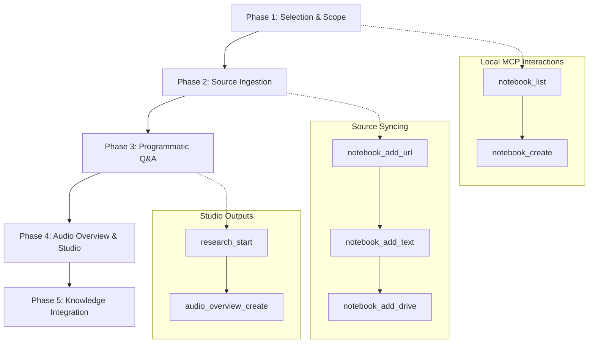
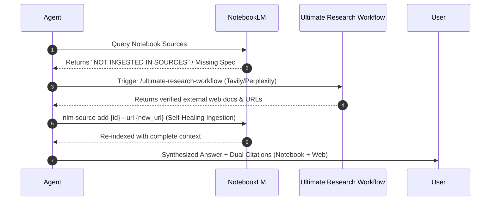

# Ultimate NotebookLM Workflow

This workflow drives systematic interaction with Google NotebookLM to build research repositories, ingest technical documentation, perform citation-backed queries, and automate studio-quality asset generation (such as audio summaries and guides). It connects local workspaces with cloud-based NotebookLM storage via standardized Model Context Protocol (MCP) tools.

By following this workflow, engineering teams avoid:
- Hallucinated answers based on generic search indexes or stale knowledge cutoffs.
- Manual browser copy-pasting of long log files, specs, and source documents.
- Disconnected research vaults that do not synchronize back to the main IDE codebase.
- Stale context windows by programmatically managing Google Drive document syncing.

---

## Iron Laws

1. **Verify Session Health First:** Always check the auth session using `nlm login --check` before executing heavy research tasks. If authentication fails, run `nlm login` to open browser authentication.
2. **Never Hardcode Notebook IDs:** Always query the active notebook list using `notebook_list` (or `nlm notebook list`) to resolve names to unique `notebook_id` strings dynamically. Notebook IDs can rotate or change across accounts.
3. **MANDATORY EXPLICIT CITATIONS:** EVERY answer derived from NotebookLM MUST cite its sources explicitly (Source Title, Source ID, Citation Index, and cited text snippet). Never present un-cited assertions.
4. **TANDEM RESEARCH FALLBACK:** If information is missing, incomplete, or marked "NOT FOUND IN SOURCES" in NotebookLM, AUTOMATICALLY activate `/ultimate-research-workflow` (Tavily, Perplexity, web search) to research external web documentation.
5. **SELF-HEALING INGESTION LOOP:** When `/ultimate-research-workflow` finds missing external documentation, immediately ingest those newly retrieved web URLs or markdown texts back into the NotebookLM notebook via `notebook_add_url` / `notebook_add_text` (`nlm source add`), closing the knowledge gap.
6. **Format Inputs Cleanly:** Clean source files (strip HTML layout wrappers, redundant CSS/JS styling, navigation headers, or large media elements) before ingestion to save NotebookLM context space and speed up ingestion.
7. **Name Things Consistently:** Give new notebooks and ingested sources clean, version-pinned titles (e.g. `INav GPS Telematics Spec v1.2`) to facilitate name-based lookups.
8. **Enforce Source Cleanliness:** Do not ingest files larger than 10MB or unsupported binary extensions. Stick to Text, Markdown, PDF, or raw web URLs.
9. **Trace Generation Status:** Audio overview generation takes time. Always poll/wait for studio generation tasks to complete before attempting retrieval.
10. **Stealth and headless configuration:** When running under automated environments, guarantee Playwright uses stealth configurations to avoid Google bot-detection blocks.
11. **Never skip local indexing:** Parallel to NotebookLM ingestion, copy critical findings to your local memory graph to ensure IDE agents retain search capabilities offline.

---

## The 5-Phase NotebookLM Pipeline



### Phase 1: Selection & Scope Mapping
*   **Action:**
    1. **Resolve Notebook Name:** Call `notebook_list` to fetch all available notebooks. Check if the target notebook (e.g., `"JC450 Dashcam"`) already exists.
    2. **Create if Missing:** If the notebook does not exist, call `notebook_create` with the desired name to provision a new project workspace.
    3. **Load Metadata:** Execute `notebook_get` with the target `notebook_id` to inspect current sources, count, and structure.
    4. Use `concise-planning` to outline exactly what documents will be ingested during this session.

### Phase 2: Universal Source Ingestion
*   **Action:**
    1. **Collect Sources:** Identify local files, web links, or documentation indices.
    2. **Ingest Web Content:** Use `notebook_add_url` to ingest web documentation, API references, or YouTube transcripts.
    3. **Ingest Workspace Context:** Read local configuration files or code briefs and upload them using `notebook_add_text` with clear title names.
    4. **Ingest Cloud Files:** If references sit in Google Docs or Sheets, call `notebook_add_drive` to sync from Google Drive.
    5. **Inspect State:** Run `notebook_describe` to verify that the sources have parsed successfully and are indexed.

### Phase 3: Programmatic Q&A & Research
*   **Action:**
    1. **Check Specific Sources:** Use `source_describe` to get key topics and summaries for a specific ingested source.
    2. **Launch Autonomous Research:** Run `research_start` to kick off deeper analytical query trees over multiple sources.
    3. **Import Research Findings:** Call `research_import` to convert synthesized research outputs directly into fresh, grounded notebook sources.

### Phase 4: Audio Overview & Studio Generation
*   **Action:**
    1. **Trigger Generation:** Call `audio_overview_create` passing the target `notebook_id`. This starts Google's dual-host podcast generator.
    2. **Monitor Process:** Since generating high-fidelity audio overviews takes time, monitor the task completion status.
    3. **Retrieve Link:** Save the generated audio link or transcript reference to share with the team.

### Phase 5: Knowledge Integration & Sync
*   **Action:**
    1. **Extract Transcripts:** Read key findings and summaries generated by the research tasks.
    2. **Save to Memory Graph:** Create entities for the notebook projects and save key observations (like API details, protocol schemas, and gotchas) to your local memory graph.
    3. **Maintain Workspace Logs:** Add research summaries to local markdown documentation in the project repository.

---

## Tool Routing & Execution Strategy (MCP vs CLI)

Use the appropriate tool execution path based on context and availability:

| Task | Preferred Method | Command / Tool Call |
|---|---|---|
| Check Auth Status | CLI | `nlm login --check` |
| Re-authenticate | CLI | `nlm login` |
| List Notebooks | MCP / CLI | `notebook_list` or `nlm notebook list` |
| Create Notebook | MCP / CLI | `notebook_create` or `nlm notebook create "{title}"` |
| Query Notebook | MCP / CLI | `research_start` or `nlm notebook query {id} "{question}" --json` |
| Focused Source Query | CLI | `nlm notebook query {id} "{question}" -s {source_ids}` |
| Multi-turn Follow-up | CLI | `nlm notebook query {id} "{question}" -c {conversation_id}` |

---

## High-Precision Prompt Engineering for NotebookLM

To get maximally grounded, structured, and hallucination-free answers from NotebookLM, use these proven query structures:

### 1. Schema & Parameter Extraction
> "Extract all configuration keys, data types, valid ranges, and default values for [FEATURE/MODULE] from the ingested sources. Format output strictly as a Markdown table with explicit source citations."

### 2. Comparative Analysis
> "Compare [COMPONENT_A] and [COMPONENT_B] across: 1) Architecture, 2) Protocol Payload, 3) Constraints, and 4) Error Handling based ONLY on ingested documentation."

### 3. Code/Config Generation
> "Generate a valid production-ready [JSON/YAML/Python] configuration snippet for [FEATURE]. Rely strictly on schema definitions in the sources. Do not invent unmentioned fields."

### 4. Strict Negative Scope (Zero Hallucination)
> "Answer [QUESTION] using ONLY uploaded documentation. If the information is missing or incomplete, explicitly state 'NOT INGESTED IN SOURCES' instead of inferring."

---

## Tandem Research & Citation Enforcement Protocol

### 1. Mandatory Citation Output Format
Every response generated from NotebookLM MUST include structured inline and summary citations:

```markdown
### Answer
[Grounded text derived directly from ingested sources]

### Citations & Evidence
- **[Source Title]** (`source_id: <id>`, Citation #`<num>`):
  > "[Exact cited text snippet extracted from source]"
```

### 2. Tandem Handoff Sequence (`NotebookLM` ↔ `Ultimate Research Workflow`)

When NotebookLM query returns missing data, incomplete specs, or `NOT INGESTED IN SOURCES`:



1. **Step 1 (Detect Gap):** Identify that NotebookLM sources lack the requested detail.
2. **Step 2 (Trigger Handoff):** Activate `/ultimate-research-workflow` using Web Search / `perplexity_ask` / `search_web`.
3. **Step 3 (Ingest Back to NotebookLM):** Add newly discovered web documentation to the active notebook using `nlm source add {id} --url {url}`.
4. **Step 4 (Final Synthesis):** Re-run query on NotebookLM to produce a unified, double-verified answer with full citations.

---

## Tool Parameter Reference Guide

When invoking NotebookLM MCP tools, configure the parameters precisely according to the API signatures below:

| MCP Tool Name | Required Parameters | Optional Parameters | Return Format |
|---|---|---|---|
| `notebook_list` | None | None | `Array<{ id: string, title: string, sourceCount: number }>` |
| `notebook_create` | `title: string` | None | `{ id: string, title: string }` |
| `notebook_get` | `notebook_id: string` | None | `{ id: string, sources: Array<{ id: string, title: string, type: string }> }` |
| `notebook_describe`| `notebook_id: string` | None | `{ summary: string, keyTopics: string[] }` |
| `notebook_add_url` | `notebook_id`, `url` | `title: string` | `{ success: boolean, sourceId: string }` |
| `notebook_add_text` | `notebook_id`, `text`, `title`| None | `{ success: boolean, sourceId: string }` |
| `source_describe` | `notebook_id`, `source_id` | None | `{ title: string, summary: string, keywords: string[] }` |
| `research_start` | `notebook_id`, `query` | `focusSources: string[]` | `{ outputText: string, citations: Array<{ sourceId: string, page: number }> }` |
| `audio_overview_create`| `notebook_id` | None | `{ downloadUrl: string, durationSeconds: number }` |

---

## Under the Hood: notebooklm-mcp-cli Setup & Auth

The recommended implementation is **`notebooklm-mcp-cli`** (Python package running via `uv` or global `uv tool install`). It exposes both the CLI binary `nlm` and the MCP server `notebooklm-mcp`.

### MCP Server Configuration (`mcp_config.json`)

```json
{
  "mcpServers": {
    "notebooklm": {
      "command": "notebooklm-mcp",
      "args": []
    }
  }
}
```
Or via `uvx`:
```json
{
  "mcpServers": {
    "notebooklm": {
      "command": "uvx",
      "args": ["--from", "notebooklm-mcp-cli", "notebooklm-mcp"]
    }
  }
}
```

### Authentication Flow (`nlm login`)
Authentication uses session cookies extracted via automated Chrome window:

1. **Perform initial login:**
   ```bash
   nlm login
   ```
2. **Check session health:**
   ```bash
   nlm login --check
   ```
3. **If profile conflict or stale lock occurs:**
   Remove stale profile directory `$env:USERPROFILE\.notebooklm-mcp-cli` (Windows) or `~/.notebooklm-mcp-cli` (macOS/Linux), then run `nlm login` again.

---

## Case Study: Constructing a Telematics Knowledge Base (JC450 Dashcam)

Here is a step-by-step example of how the workflow is executed to build a telematics repository:

### Step 1: Initialize Workspace
The agent lists notebooks and determines that `JC450 Telematics Specs` is missing. It triggers:
```json
// notebook_create
{
  "title": "JC450 Telematics Specs"
}
```
*Result:* Returns `notebook_id: "nb_9876543210"`.

### Step 2: Ingest local configuration briefs
The local engineering briefing `jc450_brief.md` contains CRC-16 schemas and binary layouts. The agent uploads it:
```json
// notebook_add_text
{
  "notebook_id": "nb_9876543210",
  "title": "JC450 Binary Protocol Brief v1.0",
  "text": "The protocol uses CRC-16/X-25 (Polynomial: 0x1021, Init: 0xFFFF)..."
}
```

### Step 3: Ingest cellular specs from external standard
The device relies on Concox standard parameters. The agent adds the official manual URL:
```json
// notebook_add_url
{
  "notebook_id": "nb_9876543210",
  "url": "https://docs.pilot-gps.com/concox-gt06-protocol",
  "title": "GT06 Protocol Specification Guide"
}
```

### Step 4: Run queries against the compiled library
The developer asks: *"Does the JC450 support RTMP video pulls, and which camera channels map to which indexes?"*
The agent triggers:
```json
// research_start
{
  "notebook_id": "nb_9876543210",
  "query": "RTMP live streaming configuration and channel ID mapping"
}
```
*Result:* NotebookLM searches the exact documents uploaded, returns the channel index mapping (e.g. 1 = Front, 2 = Cabin/DMS) and references the exact paragraph in `JC450 Binary Protocol Brief v1.0`.

---

## Troubleshooting & Error Recovery Matrix

| Issue | Cause | Action |
|---|---|---|
| **`WinError 183` / Profile Lock** | Stale Chrome profile directory left over | Remove `$env:USERPROFILE\.notebooklm-mcp-cli` folder in terminal, then run `nlm login`. |
| **Authentication Invalid** | Expired session cookies | Run `nlm login` in terminal, complete Google login flow in browser. |
| **Command Timeout (>120s)** | Querying large notebook (100+ sources) | Filter query using specific sources `-s {source_ids}` or increase timeout `--timeout 300`. |
| **No Such Command** | Incorrect CLI syntax | Use `nlm notebook query {id} "{question}"` or `nlm notebook list`. |
| **Selector / UI Mismatch** | Google updated NotebookLM web UI | Run `uv tool upgrade notebooklm-mcp-cli` to update to latest version. |

---

## Anti-Patterns Matrix

| Anti-Pattern | Why It's Bad | Correct Action |
|---|---|---|
| **Bulk uploading HTML pages** | Pulls in navbar, footer, and sidebar links, causing garbage responses. | Use clean markdown extraction (e.g. Web Extraction Tool) before uploading. |
| **Writing code from memory** | APIs and protocol structures can be highly specific (e.g. CRC-16 variations). | Run a grounded query using `research_start` to get the exact syntax. |
| **Overlapping namespaces** | Mixing frontend code docs with hardware telemetry specs in one notebook. | Maintain dedicated, separate notebooks for different domains/codebases. |
| **Ignoring local memory graph** | If you don't save findings locally, you re-run expensive queries. | Log key details in the local Persistent Project Memory / Scratchpad server after research. |

---

## Research output logging template
When writing summaries of NotebookLM research back to the codebase or artifacts directory, use the following layout:

```markdown
# NotebookLM Research Log: [Topic Name]
**Notebook ID:** `nb_[id]`
**Last Synced:** [YYYY-MM-DD HH:MM]

## Sources Reference
- **[Source Title 1]** ([ID]): [Brief summary of the source scope]
- **[Source Title 2]** ([ID]): [Brief summary of the source scope]

## Key Findings
### 1. [Subject Area A]
*   **Grounded Answer:** [Answer text]
*   **Direct Citations:** [Source Title 1, Page 12]

### 2. [Subject Area B]
*   **Grounded Answer:** [Answer text]
*   **Direct Citations:** [Source Title 2, Line 45]

## Action Items for Codebase
- [ ] Implement configuration update `X` in file `Y`
- [ ] Add regression test matching spec parameters `Z`
```

---

## Multi-Account & Profile Management (`nlm profile`)

When managing multiple Google accounts (e.g., `work`, `personal`, `client_project`), use `nlm` profile switching:

```bash
# Login to a specific profile
nlm login --profile work

# Check authentication for specific profile
nlm login --check --profile work

# List available profiles
nlm login list

# Switch active profile globally
nlm login switch work

# Run query against a specific profile
nlm notebook query {id} "{question}" --profile work
```

---

## Complete `nlm` CLI Reference Matrix

| Subcommand | Description | Full Example |
|---|---|---|
| `nlm login` | Login & capture session cookies | `nlm login --profile work` |
| `nlm login --check` | Verify session health & list count | `nlm login --check` |
| `nlm notebook list` | List all available notebooks | `nlm notebook list -j` |
| `nlm notebook create` | Provision a new notebook | `nlm notebook create "INav Specs v2"` |
| `nlm notebook query` | Chat with notebook sources | `nlm notebook query {id} "What is AFCS?"` |
| `nlm notebook query -s` | Chat filtered by specific sources | `nlm notebook query {id} "Spec" -s src_123` |
| `nlm notebook query -c` | Continue multi-turn conversation | `nlm notebook query {id} "Explain line 2" -c conv_456` |
| `nlm source list` | List sources in a notebook | `nlm source list {notebook_id}` |
| `nlm source add` | Ingest web link or text file | `nlm source add {notebook_id} --url https://...` |
| `nlm studio create` | Generate studio assets (Audio/FAQ) | `nlm studio create audio {notebook_id}` |

---

## Studio Asset Generation Pipeline (Audio Overviews & Study Guides)

NotebookLM Studio allows generating podcast-style Audio Overviews, Briefing Docs, FAQs, and Study Guides:

### 1. Generating Audio Overviews (Dual-Host Podcast)
```bash
# Trigger Audio Overview generation
nlm studio create audio {notebook_id}
```
*   *Note:* Audio generation runs asynchronously on Google servers (typically 2-4 minutes).
*   *Output:* Returns download URL and stream metadata.

### 2. Generating Briefing Docs & Study Guides
```bash
# Generate structured study guide
nlm studio create study-guide {notebook_id}

# Generate FAQ document
nlm studio create faq {notebook_id}
```

---

## Pre-processing & Source Ingestion Rules

To maximize context accuracy and prevent token rejection (413 Payload Too Large):

1. **Document Sanitization:**
   - Convert PDF/DOCX to plain Markdown before `notebook_add_text`.
   - Strip base64 image strings, inline SVGs, and raw binary streams.
   - Limit individual text uploads to under 2MB per payload.

2. **Batch Upload Automation:**
   - Group related files logically (e.g., `Hardware Specs`, `API Contracts`, `DB Schemas`).
   - Assign semantic titles with version tags (e.g. `[V1.4] Telematics Protocol`).

3. **Google Drive Sync Maintenance:**
   - When Google Docs/Sheets sources are updated in the cloud, trigger `source_sync_drive` to force NotebookLM re-indexing.

---

## CI/CD & Automated Pipeline Integration

To run NotebookLM verification in CI/CD build scripts or automated agents:

```bash
# Set non-interactive mode and profile via env vars
export NOTEBOOKLM_PROFILE="ci_runner"
export NOTEBOOKLM_HEADLESS="true"

# Verify auth status non-interactively
nlm login --check --json || exit 1

# Execute grounded query and export JSON report
nlm notebook query {notebook_id} "Verify schema compliance" --json > report.json
```

---

## Local Memory Graph Integration (Persistent Project Memory / Scratchpad)

Parallel to cloud storage, persist extracted observations into the local memory graph so offline IDE agents retain lookup capability:

```json
// Example: Storing extracted NotebookLM findings to local memory
{
  "entities": [
    {
      "name": "iNAV PH Telematics",
      "entityType": "SystemArchitecture",
      "observations": [
        "Uses VT800 & NavX hardware tracking units",
        "Portal accessible via www.inav.ph cloud service",
        "Provides L1-L3 Automated Fare Collection Systems (AFCS)",
        "Configured for Globe APN: internet.globe.com.ph"
      ]
    }
  ]
}
```

---

## Advanced Query Pattern Library

Use these query patterns depending on the technical research domain:

### 1. Protocol & Binary Frame Parsing
```text
Extract frame header bytes, start/stop delimiters, checksum algorithms, and field offset byte lengths for [PROTOCOL_NAME]. List all message IDs in a Markdown table.
```

### 2. Microservice Boundary & API Contracts
```text
List all endpoints, HTTP methods, request headers, payload structures, and expected response codes defined across all ingested API specification documents.
```

### 3. Architecture Decision Audit (ADR)
```text
Identify all explicit design trade-offs, performance limitations, and architectural constraints documented for [COMPONENT]. Summarize risk mitigations.
```

### 4. Database Schema & Migration Rules
```text
Extract table names, primary keys, foreign key constraints, index definitions, and data column types. Output valid SQL migration DDL script format.
```

---

## Quality Checklist

- [ ] Run `nlm login --check` to guarantee authentication state is green.
- [ ] Clear trailing spaces and format text inputs cleanly before calling `notebook_add_text`.
- [ ] Save the returned `source_id` after successful ingestion to track source health.
- [ ] Cross-reference the citations returned in `research_start` to confirm they exist in the raw source files.
- [ ] Add version stamps (e.g. `[v2.1.0]`) to notebook titles.
- [ ] Re-run `notebook_describe` after massive source changes to verify indexing.
- [ ] Persist all extracted protocol parameters or system configurations to the local `memory` graph.
